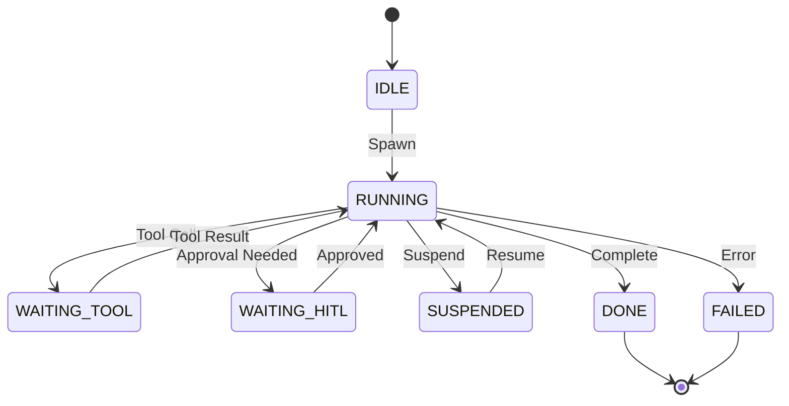

# Agent Identity & Registry (`std/agent`)

**Module Path:** `github.com/vyuvaraj/pranor/agent`  
**Introduced:** Phase 91 (Sprint V2.91.5)

---

## Overview

Pranor Agent (`std/agent`) elevates AI Agents from opaque scripts to **first-class security principals**. It provides a declarative `AgentSpec` registry, active `AgentHandle` tracking, and a thread-safe runtime state machine.

---

## Runtime State Machine

An agent instance moves through deterministic state transitions:



---

## Data Structures

```go
type AgentState int

const (
    StateIdle AgentState = iota
    StateRunning
    StateWaitingTool
    StateWaitingHITL
    StateSuspended
    StateDone
    StateFailed
)

type AgentSpec struct {
    ID           string       `json:"id"`
    Name         string       `json:"name"`
    Version      string       `json:"version"`
    Description  string       `json:"description"`
    Capabilities []string     `json:"capabilities"` // Allowed capability IDs
    Memory       MemoryConfig `json:"memory"`
    Budget       BudgetConfig `json:"budget"`
}

type AgentHandle struct {
    Spec      AgentSpec
    State     AgentState
    SessionID string
    ExecCtx   *execctx.ExecutionContext
    UpdatedAt time.Time
}
```

---

## AgentRegistry API

```go
type AgentRegistry interface {
    Register(spec AgentSpec) error
    Lookup(agentID string) (AgentSpec, error)
    ListAll() []AgentSpec
    Spawn(ctx context.Context, ec *execctx.ExecutionContext, sessionID string) (*AgentHandle, error)
    UpdateState(handle *AgentHandle, state AgentState) error
    Suspend(handle *AgentHandle) error
    Resume(handle *AgentHandle) error
    Terminate(handle *AgentHandle, state AgentState) error
}
```

---

## Usage Example

```go
import (
    "context"
    "github.com/vyuvaraj/pranor/agent"
    "github.com/vyuvaraj/pranor/agent/api"
    "github.com/vyuvaraj/pranor/core/pkg/execctx"
)

// Register Agent Spec
agent.Register(api.AgentSpec{
    ID:           "support-bot",
    Name:         "Support Agent",
    Capabilities: []string{"pool.query", "notify.send"},
})

// Spawn instance bound to ExecutionContext
ec := execctx.New(ctx, "acme-corp", "support-bot", "user-123")
handle, err := agent.Spawn(ctx, ec, "session-88")
```
