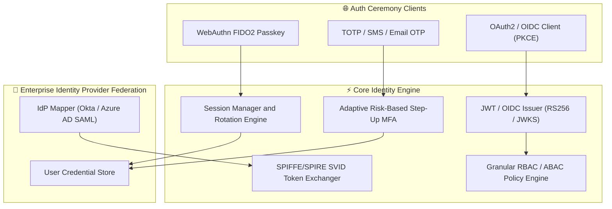
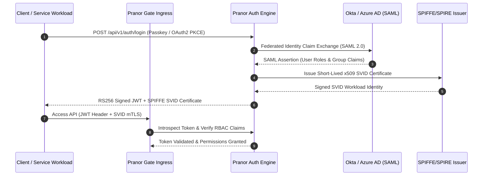

# Pranor Auth — Identity & Access Management

**Version:** 1.0.0  
**Module Path:** `github.com/vyuvaraj/pranor/auth`  
**Default Port:** 8098  
**License:** AGPL-3.0 (OSS) / Enterprise License (EE with Adaptive MFA & Federation)

---

## Overview

Pranor Auth is the centralized authentication, authorization, and identity management service for the Pranor ecosystem. It provides OAuth2/OIDC provider functionality, WebAuthn/FIDO2 passkey login, adaptive multi-factor authentication, JWT issuance with automatic key rotation, RBAC/ABAC policy enforcement, session management, and SCIM provisioning.

Pranor Auth can run as:
- A **standalone binary** with local user store and JWT signing
- An **integrated module** within the Pranor ecosystem with mTLS, OTel tracing, tenant isolation, and federated IdP support

---

## Key Features

| Feature | Description |
|---------|-------------|
| **OAuth2/OIDC Provider** | Full Authorization Code (PKCE), Client Credentials, Refresh Token flows with JWKS endpoint |
| **WebAuthn/FIDO2 Passkeys** | Hardware keys, biometric authenticators, cross-device synced passkeys |
| **JWT Issuance & Rotation** | RS256/ES256 signed tokens with automatic JWKS key rotation via KMS |
| **Adaptive MFA** | TOTP, SMS OTP, Email OTP, Magic Links with risk-based step-up challenges |
| **RBAC/ABAC** | Hierarchical roles, granular permissions, tenant-scoped policy enforcement |
| **Session Management** | Secure session tokens with rotation, device tracking, and bulk invalidation |
| **Social Login** | OAuth2 social provider integration (Google, GitHub, etc.) |
| **Credential Stuffing Detection** | Real-time detection of credential stuffing attacks |
| **SCIM Provisioning** | SCIM v2 user lifecycle management for enterprise directory sync |
| **SPIFFE/SPIRE Exchange** | Workload identity attestation via short-lived x509 SVID certificates |

---

## Architecture



### Workload Identity Exchange & Authentication Sequence Flow



### Ecosystem Cross-Module Integration

Pranor Auth establishes zero-trust identity across all platform components:

- **Pranor Gate**: Enforces route-level JWT signature checks, SAML attribute mapping, and SPIFFE/SPIRE workload authentication.
- **Pranor Secret**: Uses authenticated user identities to authorize access to encrypted vault keys and environment secret maps.
- **Pranor Notify**: Triggers multi-factor authentication (MFA) Email/SMS one-time passcodes during step-up login ceremonies.
- **Pranor Console**: Managed via Auth RBAC roles, granting workspace administrators granular cluster control plane privileges.

---

## Installation & Deployment

### Binary

```bash
cd pranor/auth
go build -o pranor-auth .
./pranor-auth --port 8098
```

### Docker

```bash
docker run -p 8098:8098 ghcr.io/vyuvaraj/pranor-auth:latest
```

### As Part of Pranor Ecosystem

When running under the Pranor platform, Auth integrates automatically with Gate (JWT enforcement), Trace (OTel spans), Secret (key storage), and Console (dashboard visibility).

---

## Configuration

### Environment Variables

| Variable | Default | Description |
|----------|---------|-------------|
| `PORT` | `8098` | HTTP listener port |
| `PRANOR_AUTH_JWT_ALGORITHM` | `RS256` | JWT signing algorithm (`RS256` or `ES256`) |
| `PRANOR_AUTH_JWT_KEY_PATH` | — | Path to RSA/EC private key for JWT signing |
| `PRANOR_AUTH_SESSION_SECRET` | — | 32-byte secret for session token signing |
| `PRANOR_AUTH_MFA_TOTP_ISSUER` | `Pranor` | TOTP issuer name shown in authenticator apps |
| `PRANOR_AUTH_PRANOR_NOTIFY_URL` | — | Pranor Notify URL for email/SMS OTP delivery |
| `PRANOR_AUTH_OTEL_ENDPOINT` | — | OpenTelemetry collector URL |
| `PRANOR_AUTH_KMS_ROTATION_INTERVAL` | `24h` | KMS envelope key rotation interval |

### YAML Config (`auth.yaml`)

```yaml
port: "8098"
jwt_algorithm: "RS256"
jwt_key_path: "/keys/auth-signing.pem"
session_secret: "32-byte-random-secret-here"
mfa_totp_issuer: "Pranor"
notify_url: "http://pranor-notify:8094"
otel_endpoint: "http://pranor-trace:8090"
```

### CLI Flags

| Flag | Default | Description |
|------|---------|-------------|
| `--port` | `8098` | HTTP listen port |

---

## API Reference

**Base URL:** `http://localhost:8098`  
**API Version:** `/api/v1/` (recommended) or `/api/` (legacy)

### POST /api/auth/register

Register a new user.

**Request:**

```json
{
  "username": "alice",
  "password": "secure-password-123",
  "email": "alice@example.com"
}
```

**Response (201):**

```json
{
  "status": "success",
  "user_id": "usr-abc-123",
  "message": "User registered successfully"
}
```

---

### POST /api/auth/login

Authenticate a user and receive a JWT.

**Request:**

```json
{
  "username": "alice",
  "password": "secure-password-123"
}
```

**Response (200):**

```json
{
  "token": "eyJhbGciOiJSUzI1NiIs...",
  "expires_at": "2026-08-01T11:00:00Z",
  "user_id": "usr-abc-123"
}
```

---

### POST /api/auth/passkey/register/challenge

Begin WebAuthn passkey registration ceremony.

**Request:**

```json
{
  "user_id": "usr-abc-123"
}
```

**Response (200):**

```json
{
  "challenge": "base64-encoded-challenge",
  "rp": { "name": "Pranor", "id": "pranor.net" },
  "user": { "id": "usr-abc-123", "name": "alice" }
}
```

---

### POST /api/auth/passkey/login/challenge

Begin WebAuthn authentication ceremony.

**Request:**

```json
{
  "username": "alice"
}
```

**Response (200):**

```json
{
  "challenge": "base64-encoded-challenge",
  "allowCredentials": [{ "id": "cred-xyz", "type": "public-key" }]
}
```

---

### POST /api/auth/mfa/setup

Set up MFA for a user (TOTP, SMS, or Email).

**Request:**

```json
{
  "user_id": "usr-abc-123",
  "method": "totp"
}
```

**Response (200):**

```json
{
  "secret": "JBSWY3DPEHPK3PXP",
  "qr_code_url": "otpauth://totp/Pranor:alice?secret=JBSWY3DPEHPK3PXP&issuer=Pranor"
}
```

---

### POST /api/auth/mfa/step-up

Request adaptive MFA step-up based on risk signals.

**Request:**

```json
{
  "user_id": "usr-abc-123",
  "context": {
    "ip": "203.0.113.42",
    "device_fingerprint": "fp-new-device",
    "action": "high-value-transfer"
  }
}
```

**Response (200):**

```json
{
  "step_up_required": true,
  "risk_score": 78,
  "required_factors": ["totp"],
  "reason": "new_device_detected"
}
```

---

### GET /.well-known/jwks.json

JSON Web Key Set for token verification.

**Response (200):**

```json
{
  "keys": [
    {
      "kty": "RSA",
      "kid": "key-2026-08",
      "use": "sig",
      "alg": "RS256",
      "n": "...",
      "e": "AQAB"
    }
  ]
}
```

---

### POST /api/auth/sessions/revoke

Invalidate all sessions for a user.

**Request:**

```json
{
  "user_id": "usr-abc-123"
}
```

**Response (200):**

```json
{
  "status": "success",
  "revoked_count": 3
}
```

---

### GET /healthz

Liveness probe.

```json
{"status":"ok"}
```

---

## Security

### Standalone Mode

In standalone mode, Pranor Auth uses a local user store with bcrypt-hashed passwords and issues self-signed JWTs. Configure `PRANOR_AUTH_SESSION_SECRET` for session signing.

### Ecosystem Mode (Full Auth Stack)

When running within the Pranor ecosystem, the full middleware chain activates:

1. **OTel Tracing** — every request gets a span
2. **Rate Limiting** — per-client request throttling
3. **CORS** — cross-origin request handling
4. **Max Body Size** — 10MB request body limit
5. **JWT Auth** — validates Bearer tokens
6. **Token Revocation** — checks revocation list
7. **Tenant Isolation** — multi-tenant namespace enforcement

### mTLS / SPIFFE

Enable mutual TLS for service-to-service authentication with SPIFFE SVID certificates. Auth issues short-lived x509 workload identities for zero-trust inter-service communication.

### KMS Key Rotation

Background KMS envelope key rotation runs on a configurable schedule (default: 24h). JWKS endpoints serve both current and previous keys during rollover for zero-downtime rotation.

---

## Observability

### Prometheus Metrics

| Metric | Type | Description |
|--------|------|-------------|
| `pranor_auth_logins_total` | Counter | Total login attempts (labeled by method, status) |
| `pranor_auth_mfa_challenges_total` | Counter | MFA challenges issued |
| `pranor_auth_token_issued_total` | Counter | JWTs issued |
| `pranor_auth_sessions_active` | Gauge | Currently active sessions |
| `pranor_auth_stuffing_blocks_total` | Counter | Credential stuffing attacks blocked |

### OpenTelemetry Tracing

Every authentication flow generates OTel spans:
- `auth.login` — full login ceremony
- `auth.mfa.verify` — MFA verification step
- `auth.token.issue` — JWT generation
- `auth.passkey.ceremony` — WebAuthn challenge/response

### Logging

Structured JSON logs with fields: `level`, `timestamp`, `trace_id`, `user_id`, `action`, `ip`, `risk_score`.

---

## Enterprise Edition

| Feature | OSS | EE |
|---------|:---:|:--:|
| Local user store & JWT issuance | ✓ | ✓ |
| TOTP/Email/SMS MFA | ✓ | ✓ |
| WebAuthn/FIDO2 Passkeys | ✓ | ✓ |
| Session management & revocation | ✓ | ✓ |
| RBAC roles & permissions | ✓ | ✓ |
| Social login (OAuth2 providers) | ✓ | ✓ |
| SCIM v2 provisioning | ✓ | ✓ |
| Adaptive Risk-Based MFA Step-Up | — | ✓ |
| Device Fingerprinting & Trusted Device Registry | — | ✓ |
| Per-Tenant OIDC Federation (Okta, Azure AD, Google) | — | ✓ |
| SPIFFE/SPIRE Workload Identity Exchange | — | ✓ |
| Credential Stuffing Detection Engine | — | ✓ |

---

## Operational Runbook

### Users cannot log in

1. Check `/healthz` endpoint is returning 200
2. Verify JWT signing key is accessible (`PRANOR_AUTH_JWT_KEY_PATH`)
3. Check logs for `auth.login` span errors
4. If MFA is failing, verify Pranor Notify connectivity for OTP delivery
5. Check rate limiter isn't blocking legitimate traffic

### JWT tokens rejected by downstream services

1. Verify JWKS endpoint (`/.well-known/jwks.json`) is accessible from downstream services
2. Check if key rotation occurred — downstream services may be caching stale keys
3. Ensure clock skew between Auth and consumer services is < 30 seconds
4. Check token hasn't been explicitly revoked via `/api/auth/sessions/revoke`

### High credential stuffing alerts

1. Monitor `pranor_auth_stuffing_blocks_total` metric
2. Review blocked IPs in logs
3. Consider enabling adaptive MFA step-up for all logins from flagged IPs
4. Integrate with upstream WAF for IP-level blocking

### KMS key rotation failures

1. Check KMS connectivity and credentials
2. Verify rotation interval configuration (`PRANOR_AUTH_KMS_ROTATION_INTERVAL`)
3. Monitor logs for `kms.rotation` errors
4. Manual key rotation: `POST /api/auth/rotate-keys`
