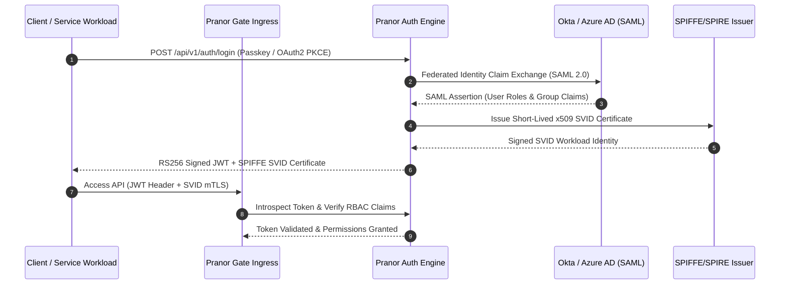

# Pranor Auth

```bash
# 5-Minute Auth Quickstart
curl -X POST http://localhost:8086/api/auth/register -d '{"username":"dev","password":"secretpassword"}'
curl -X POST http://localhost:8086/api/auth/login -d '{"username":"dev","password":"secretpassword"}'
# → Returns JWT token; pass header 'Authorization: Bearer <token>' to protected APIs
```

```bash
docker run -p 8086:8086 ghcr.io/vyuvaraj/pranor-auth:latest
```

`Pranor Auth` is the authentication and authorization service for the **Pranor** ecosystem. It provides passkey/WebAuthn login, adaptive MFA, OAuth2/OIDC provider functionality, JWT issuance and rotation, RBAC, and seamless integration with `Pranor Gate` for API-level enforcement.

---

## Table of Contents
- [Key Features](#key-features)
- [Architecture](#architecture)
- [API Endpoints](#api-endpoints)
- [Passkeys & WebAuthn](#passkeys--webauthn)
- [MFA & Adaptive Step-Up](#mfa--adaptive-step-up)
- [JWT & OAuth2/OIDC](#jwt--oauth2oidc)
- [RBAC](#rbac)
- [Pranor Gate Integration](#pranor-gate-integration)
- [Getting Started](#getting-started)

---

## Key Features

### 🔑 Passkeys & WebAuthn (FIDO2)
- **Passkey registration**: Register hardware security keys, biometric authenticators (Face ID, Touch ID, Windows Hello), and platform authenticators
- **WebAuthn authentication**: Full FIDO2/WebAuthn ceremony — challenge/response with attestation verification
- **Cross-device passkeys**: Synced passkeys via cloud keychains (iCloud Keychain, Google Password Manager)
- **Passkey management**: List, rename, and revoke registered passkeys per user

### 🔐 Session Management
- **Secure session tokens**: Cryptographically signed session tokens with configurable expiry
- **Automatic token rotation**: Sessions are silently rotated on each request within the rotation window — reduces token theft risk
- **Session invalidation**: Immediately invalidate all sessions for a user (e.g., on password change or security alert)
- **Device session tracking**: Track active sessions per device with last-seen timestamps

### 📱 Multi-Factor Authentication (MFA)
- **TOTP (Time-based OTP)**: Standard RFC 6238 TOTP — compatible with Google Authenticator, Authy, 1Password
- **SMS OTP**: Send one-time codes via SMS (configurable SMS provider)
- **Email OTP**: Send one-time codes via email (integrates with `Pranor Notify`)
- **Backup codes**: Generate and manage one-time recovery backup codes
- **MFA enforcement policies**: Enforce MFA per user group, per role, or per app

### 🎯 Adaptive MFA Step-Up (EE)
- **Risk-based authentication**: Dynamically require additional MFA factors based on risk signals (new device, unusual location, high-value transaction)
- **Configurable risk rules**: Define risk scoring rules (IP reputation, device fingerprint, behavioral anomaly)
- **Step-up on demand**: Applications can request MFA step-up mid-session for sensitive operations

### 🌐 OAuth2 & OIDC Provider
- **OAuth2 authorization server**: Full OAuth2 flow support — Authorization Code (with PKCE), Client Credentials, Refresh Token
- **OIDC identity provider**: OpenID Connect 1.0 — issues ID tokens with standard claims (`sub`, `email`, `name`, `picture`)
- **JWKS endpoint**: Standard `/.well-known/jwks.json` for token verification by downstream services
- **Dynamic client registration**: Register OAuth2 clients via API
- **Scope management**: Define custom scopes and map to RBAC roles

### 🎫 JWT Issuance & Validation
- **JWT issuance**: RS256/ES256 signed JWTs with configurable claims and expiry
- **JWT rotation**: Automatic signing key rotation with JWKS rollover period — zero-downtime key rotation
- **Token introspection**: RFC 7662 token introspection endpoint
- **Token revocation**: RFC 7009 token revocation — immediately invalidate any issued token

### 🏷️ Role-Based Access Control (RBAC)
- **Role definitions**: Create hierarchical roles with inheritance (e.g., `admin` → `editor` → `viewer`)
- **Permission assignment**: Assign granular permissions (e.g., `orders:read`, `orders:write`) to roles
- **User-role binding**: Assign roles to users, groups, or OAuth2 clients
- **Policy enforcement**: Pranor Auth validates role/permission on every API call when integrated with Pranor Gate

---

## Architecture

```mermaid
graph TD
    classDef client fill:#1e293b,stroke:#38bdf8,stroke-width:2px,color:#fff;
    classDef engine fill:#0f172a,stroke:#0d9488,stroke-width:2px,color:#fff;
    classDef storage fill:#1e1b4b,stroke:#6366f1,stroke-width:2px,color:#fff;
    classDef monitor fill:#1e293b,stroke:#64748b,stroke-width:1px,color:#fff;

    subgraph Clients ["🌐 Auth Ceremony Clients"]
        PasskeyClient["WebAuthn FIDO2 Passkey"] :::client
        MFAClient["TOTP / SMS / Email OTP"] :::client
        OIDCClient["OAuth2 / OIDC Client (PKCE)"] :::client
    end

    subgraph Core ["⚡ Core Identity Engine"]
        SessionMgr["Session Manager & Rotation Engine"] :::engine
        AdaptiveMFA["Adaptive Risk-Based Step-Up MFA<br/><i>(Enterprise EE)</i>"] :::engine
        JWTProvider["JWT / OIDC Issuer (RS256 / JWKS)"] :::engine
        RBACEngine["Granular RBAC / ABAC Policy Engine"] :::engine
        SPIFFEExchange["SPIFFE/SPIRE SVID Token Exchanger<br/><i>(Enterprise EE)</i>"] :::engine
    end

    subgraph IdentityStores ["💾 Enterprise Identity Provider Federation"]
        FederatedIdP["IdP Mapper (Okta / Azure AD SAML)"] :::storage
        UserStore["User Credential Store"] :::storage
    end

    PasskeyClient --> SessionMgr
    MFAClient --> AdaptiveMFA
    OIDCClient --> JWTProvider
    SessionMgr --> UserStore
    AdaptiveMFA --> UserStore
    JWTProvider --> RBACEngine
    FederatedIdP --> SPIFFEExchange
```

### Workload Identity Exchange & Authentication Sequence Flow



### Ecosystem Cross-Module Integration

Pranor Auth establishes zero-trust identity across all platform components:

- **Pranor Gate**: Enforces route-level JWT signature checks, SAML attribute mapping, and SPIFFE/SPIRE workload authentication.
- **Pranor Secret**: Uses authenticated user identities to authorize access to encrypted vault keys and environment secret maps.
- **Pranor Notify**: Triggers multi-factor authentication (MFA) Email/SMS one-time passcodes during step-up login ceremonies.
- **Pranor Console**: Managed via Auth RBAC roles, granting workspace administrators granular cluster control plane privileges.

---

## API Endpoints

| Method | Path | Description |
|--------|------|-------------|
| `POST` | `/api/v1/auth/passkey/register/begin` | Begin passkey registration (get challenge) |
| `POST` | `/api/v1/auth/passkey/register/finish` | Complete passkey registration |
| `POST` | `/api/v1/auth/passkey/login/begin` | Begin passkey authentication (get challenge) |
| `POST` | `/api/v1/auth/passkey/login/finish` | Complete passkey authentication |
| `POST` | `/api/v1/auth/mfa/setup` | Set up MFA for a user |
| `POST` | `/api/v1/auth/mfa/verify` | Verify an MFA code |
| `POST` | `/api/v1/auth/mfa/step-up` | Request MFA step-up (adaptive) |
| `POST` | `/api/v1/auth/token` | OAuth2 token endpoint |
| `GET` | `/api/v1/auth/authorize` | OAuth2 authorization endpoint |
| `GET` | `/.well-known/openid-configuration` | OIDC discovery document |
| `GET` | `/.well-known/jwks.json` | JSON Web Key Set for token verification |
| `POST` | `/api/v1/auth/token/introspect` | RFC 7662 token introspection |
| `POST` | `/api/v1/auth/token/revoke` | RFC 7009 token revocation |
| `POST` | `/api/v1/sessions/invalidate` | Invalidate all sessions for a user |
| `GET` | `/api/v1/sessions` | List active sessions for a user |
| `POST` | `/api/v1/rbac/roles` | Create a role |
| `GET` | `/api/v1/rbac/roles` | List roles |
| `POST` | `/api/v1/rbac/roles/{role}/permissions` | Assign permissions to a role |
| `POST` | `/api/v1/rbac/users/{id}/roles` | Assign roles to a user |
| `/healthz` | `GET` | Liveness probe |

---

## Passkeys & WebAuthn

```javascript
// Browser: Begin registration
const { challenge } = await fetch('/api/v1/auth/passkey/register/begin', {
  method: 'POST', body: JSON.stringify({ user_id: 'user-123' })
}).then(r => r.json());

const credential = await navigator.credentials.create({ publicKey: challenge });

// Finish registration
await fetch('/api/v1/auth/passkey/register/finish', {
  method: 'POST', body: JSON.stringify(credential)
});
```

---

## JWT & OAuth2/OIDC

Configure Pranor Gate to verify Pranor Auth JWTs:

```json
{
  "routes": [{
    "prefix": "/api/orders",
    "target": "http://orders:3000",
    "auth": {
      "type": "bearer",
      "jwks_url": "http://pranor-auth:8086/.well-known/jwks.json",
      "required_scope": "orders:read"
    }
  }]
}
```

---

## RBAC

```bash
# Create roles
curl -X POST http://pranor-auth:8086/api/v1/rbac/roles \
  -d '{"name": "admin", "permissions": ["orders:read", "orders:write", "orders:delete"]}'

# Assign role to user
curl -X POST http://pranor-auth:8086/api/v1/rbac/users/user-123/roles \
  -d '{"roles": ["admin"]}'
```

---

## Getting Started

```bash
docker run -p 8086:8086 \
  -e PRANOR_AUTH_JWT_SECRET=my-rsa-key.pem \
  -e PRANOR_AUTH_SESSION_SECRET=32-byte-random-secret \
  -e PRANOR_AUTH_PRANOR_NOTIFY_URL=http://pranor-notify:8091 \
  -e PRANOR_AUTH_OTEL_ENDPOINT=http://pranor-trace:4318 \
  ghcr.io/vyuvaraj/pranor-auth:latest
```

### Environment Variables

| Variable | Default | Description |
|----------|---------|-------------|
| `PRANOR_AUTH_PORT` | `8086` | HTTP listener port |
| `PRANOR_AUTH_JWT_ALGORITHM` | `RS256` | JWT signing algorithm (`RS256` or `ES256`) |
| `PRANOR_AUTH_JWT_KEY_PATH` | — | Path to RSA/EC private key for JWT signing |
| `PRANOR_AUTH_SESSION_SECRET` | — | 32-byte secret for session token signing |
| `PRANOR_AUTH_MFA_TOTP_ISSUER` | `Pranor` | TOTP issuer name shown in authenticator apps |
| `PRANOR_AUTH_PRANOR_NOTIFY_URL` | — | Pranor Notify URL for email OTP delivery |
| `PRANOR_AUTH_OTEL_ENDPOINT` | — | OpenTelemetry collector URL |

---

## Enterprise Edition (Planned)

| Feature | Tier |
|---------|------|
| Adaptive Risk-Based MFA Step-Up Engine | EE |
| Device Fingerprinting & Trusted Device Registry | EE |
| Per-Tenant OIDC Provider Federation (Okta, Azure AD, Google Workspace) | EE |
