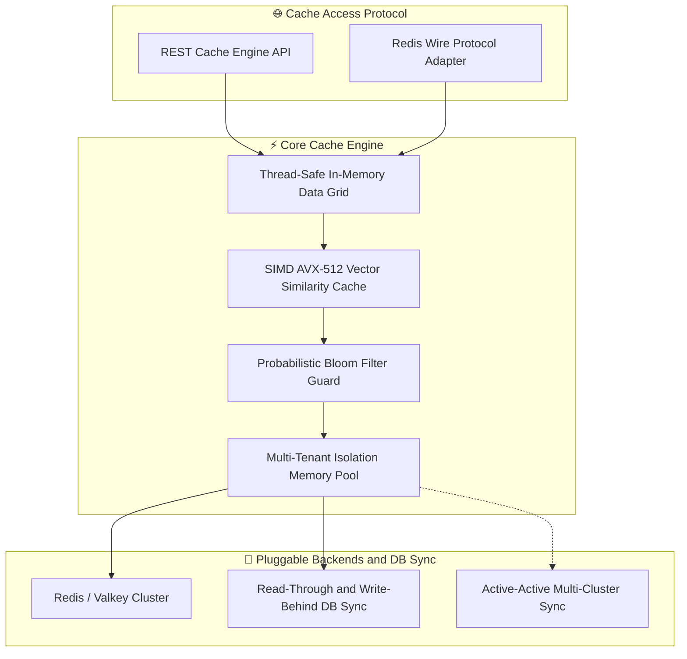
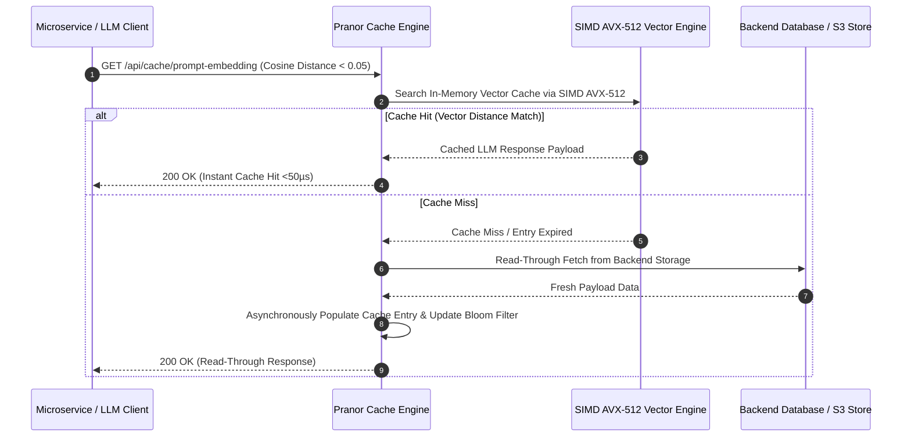

# Pranor Cache — Distributed Caching Engine

**Version:** 0.1.0  
**Module Path:** `github.com/vyuvaraj/pranor/cache`  
**Default Port:** 8086  
**License:** AGPL-3.0 (OSS) / Enterprise License (EE with TLS offload & SIMD vector cache)

---

## Overview

Pranor Cache is a distributed, high-performance caching service for the Pranor ecosystem. It exposes a low-latency REST API backed by pluggable engines (in-memory or Redis) with native support for OpenTelemetry context propagation, read-through/write-behind database synchronization, key pattern invalidation, bloom filter guards, multi-region replication, and a Redis wire protocol adapter.

Pranor Cache can run as:
- A **standalone binary** with zero external dependencies (in-memory engine)
- An **integrated module** within the Pranor ecosystem with mTLS, OTel tracing, and multi-region sync

---

## Key Features

| Feature | Description |
|---------|-------------|
| **Pluggable Engines** | Swap transparently between thread-safe in-memory storage and Redis/Valkey clusters |
| **TTL Eviction** | Automatic background time-based pruning of expired cache keys |
| **Key Pattern Invalidation** | Delete matching keys via wildcards and prefix matching |
| **Read-Through Cache** | Misses auto-load from backend database and populate the cache |
| **Write-Behind Cache** | Writes asynchronously update the backend database for eventual consistency |
| **Multi-Region Replication** | Forward mutations to peer cache nodes for global consistency |
| **Bloom Filter Guard** | Probabilistic filter prevents unnecessary backend lookups on non-existent keys |
| **Redis Wire Protocol** | RESP-compatible adapter allows existing Redis clients to connect directly |
| **SIMD Vector Similarity** | AVX-512 accelerated cosine-distance vector cache for LLM embedding lookups |
| **Multi-Tenant Pools** | Isolated memory pools per tenant to prevent noisy-neighbor issues |
| **OTel Instrumentation** | Hit/miss/latency metrics exported via OpenTelemetry tracing context |

---

## Architecture



### Read-Through & SIMD Vector Cache Sequence Flow



### Ecosystem Cross-Module Integration

Pranor Cache provides sub-millisecond data acceleration across all platform components:

- **Pranor Gate**: Accelerates semantic prompt caching and API response caching for high-frequency ingress routes.
- **Pranor Vault**: Caches HNSW vector graph nodes and S3 object metadata in memory for sub-5ms query performance.
- **Pranor Auth**: Stores active user session tokens, OAuth2 authorization grants, and rate-limiting counters.
- **Pranor Trace**: Exports cache hit/miss ratio metrics, memory pool allocations, and latency exemplars via OpenTelemetry.

---

## Installation & Deployment

### Binary

```bash
cd pranor/cache
go build -o pranor-cache .
./pranor-cache --port 8086
```

### Docker

```bash
docker run -p 8086:8086 ghcr.io/vyuvaraj/pranor-cache:latest
```

### With Redis Backend

```bash
./pranor-cache --port 8086 --backend redis --redis-url redis://localhost:6379
```

### As Part of Pranor Ecosystem

When running under the Pranor platform, Cache integrates automatically with Auth (JWT/mTLS), Trace (OTel spans), and Console (dashboard visibility).

---

## Configuration

### Environment Variables

| Variable | Default | Description |
|----------|---------|-------------|
| `PORT` | `8086` | HTTP Server port |
| `REDIS_URL` | — | Redis cluster URL. Uses in-memory engine if unset |
| `PRANOR_CACHE_BACKEND_DB` | — | Backend database URL for read-through & write-behind sync |
| `PRANOR_CACHE_PEERS` | — | Comma-separated peer URLs for multi-region replication |
| `PRANOR_CACHE_TLS_CERT` | — | Path to TLS certificate for HTTPS |
| `PRANOR_CACHE_TLS_KEY` | — | Path to TLS private key |
| `PRANOR_OTLP_ENDPOINT` | — | OpenTelemetry collector URL |

### YAML Config (`cache.yaml`)

```yaml
port: "8086"
backend: "memory"          # "memory" or "redis"
redis_url: "redis://localhost:6379"
backend_db: ""             # read-through DB endpoint
peers: []                  # peer cache nodes for replication
tls_cert: ""
tls_key: ""
```

### CLI Flags

| Flag | Default | Description |
|------|---------|-------------|
| `--port` | `8086` | HTTP listen port |
| `--backend` | `memory` | Cache backend: `memory` or `redis` |
| `--redis-url` | `redis://localhost:6379` | Redis connection URL |
| `--version` | — | Print version and exit |

---

## API Reference

**Base URL:** `http://localhost:8086`

### POST /api/cache

Set a cache entry.

**Request:**

```json
{
  "key": "user:101",
  "value": { "name": "Alice", "role": "admin" },
  "ttl": "5m"
}
```

**Response (200):**

```json
{
  "status": "success",
  "key": "user:101"
}
```

---

### GET /api/cache/{key}

Get a cache entry.

**Response (200):**

```json
{
  "key": "user:101",
  "value": { "name": "Alice", "role": "admin" }
}
```

**Response (404):**

```json
{
  "status": "not_found",
  "key": "user:101"
}
```

---

### DELETE /api/cache/{key}

Delete a specific cache entry.

**Response (200):**

```json
{
  "status": "deleted",
  "key": "user:101"
}
```

---

### DELETE /api/cache?pattern={pattern}

Invalidate keys by pattern. If no pattern is provided, clears the entire cache.

**Response (200):**

```json
{
  "status": "success",
  "invalidated": 42
}
```

---

### GET /health

Health probe showing cache readiness and connection status.

**Response (200):**

```json
{"status":"UP","service":"pranor-cache","version":"0.1.0","backend":"memory"}
```

---

## Security

### Standalone Mode

In standalone mode, Pranor Cache runs without authentication. Suitable for development and testing.

### Ecosystem Mode (Full Auth Stack)

When running within the Pranor ecosystem (detected automatically), the full middleware chain activates:

1. **OTel Tracing** — every request gets a span
2. **Rate Limiting** — per-client request throttling
3. **CORS** — cross-origin request handling
4. **Max Body Size** — 10MB request body limit
5. **JWT Auth** — validates Bearer tokens against Pranor Auth
6. **Tenant Isolation** — multi-tenant namespace enforcement

### TLS

Enable HTTPS with TLS certificates:

```yaml
tls_cert: "/certs/cache.crt"
tls_key: "/certs/cache.key"
```

TLS offload is an Enterprise feature that uses optimized kernel-bypass SSL termination.

---

## Observability

### Prometheus Metrics

| Metric | Type | Description |
|--------|------|-------------|
| `pranor_cache_hits_total` | Counter | Cache hit count |
| `pranor_cache_misses_total` | Counter | Cache miss count |
| `pranor_cache_keys_active` | Gauge | Currently stored keys |
| `pranor_cache_evictions_total` | Counter | Keys evicted by TTL |
| `pranor_cache_read_through_total` | Counter | Read-through backend fetches |
| `pranor_cache_replication_lag_ms` | Histogram | Peer replication latency |

### OpenTelemetry Tracing

Every cache operation generates OTel spans:
- `cache.get` — read operation with hit/miss attribute
- `cache.set` — write operation with TTL
- `cache.delete` — deletion/invalidation
- `cache.read_through` — backend fetch on miss

### Logging

Structured JSON logs with fields: `level`, `timestamp`, `trace_id`, `operation`, `key`, `hit`, `latency_us`.

---

## Enterprise Edition

| Feature | OSS | EE |
|---------|:---:|:--:|
| In-memory cache engine | ✓ | ✓ |
| Redis/Valkey backend | ✓ | ✓ |
| TTL eviction | ✓ | ✓ |
| Key pattern invalidation | ✓ | ✓ |
| Read-through / Write-behind | ✓ | ✓ |
| Multi-region peer replication | ✓ | ✓ |
| Bloom filter guard | ✓ | ✓ |
| TLS offload (kernel-bypass SSL) | — | ✓ |
| SIMD AVX-512 vector similarity cache | — | ✓ |
| Multi-tenant memory pool isolation | — | ✓ |
| Redis wire protocol adapter | — | ✓ |
| Active-active multi-cluster sync | — | ✓ |

---

## Operational Runbook

### High cache miss rate

1. Check `/health` endpoint for backend connectivity
2. Verify TTLs aren't too short for workload patterns
3. Review bloom filter effectiveness — false positive rate should be < 1%
4. If using read-through, check backend DB latency via `pranor_cache_read_through_total`
5. Consider increasing memory allocation for the in-memory engine

### Replication lag between regions

1. Monitor `pranor_cache_replication_lag_ms` histogram
2. Check network connectivity to peer nodes (`PRANOR_CACHE_PEERS`)
3. Verify peer URLs are reachable and responding to health checks
4. Consider reducing write volume if replication can't keep up

### Memory pressure / OOM

1. Check `pranor_cache_keys_active` gauge for key count growth
2. Review TTL policies — ensure all entries have finite TTLs
3. Use pattern invalidation to bulk-remove stale namespaces
4. If using multi-tenant pools, check per-tenant quotas

### Redis backend connection failures

1. Verify `REDIS_URL` is correct and Redis is reachable
2. Check Redis cluster health (CLUSTER INFO)
3. Pranor Cache falls back to in-memory in standalone mode
4. Monitor reconnection attempts in structured logs
