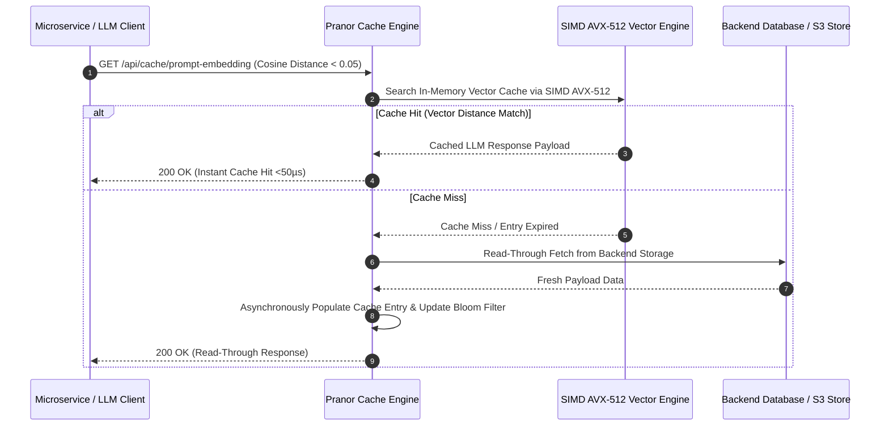

# Pranor Cache

```bash
docker run -p 8084:8084 ghcr.io/vyuvaraj/pranor-cache:latest
```

Pranor Cache is the distributed, high-performance caching service for the Pranor ecosystem. It exposes a low-latency REST API backed by pluggable engines (in-memory or Redis) with native support for OpenTelemetry context propagation, read-through/write-behind database synchronisation, key pattern invalidation, and multi-region replication.

## Features

- **Pluggable Engines**: Swap transparently between thread-safe local in-memory storage and high-throughput Redis/Valkey clusters.
- **TTL Eviction**: Automatic, background time-based pruning of expired cache keys.
- **Key Pattern Invalidation**: Delete matching keys dynamically via wildcards and prefix matching.
- **Read-Through Cache**: Cache misses automatically load data from a backend database (`PRANOR_CACHE_BACKEND_DB`) and populate the cache.
- **Write-Behind Cache**: Writes asynchronously update the backend database in the background to ensure eventually consistent writes without blocking clients.
- **Multi-Region Replication**: Forward mutations asynchronously to peer cache nodes (`PRANOR_CACHE_PEERS`) to maintain global cache consistency.
- **OTel Instrumentation**: Standardized hit/miss/latency metrics automatically exported via OTel tracing context.

---

## Architecture

```mermaid
graph TD
    classDef client fill:#1e293b,stroke:#38bdf8,stroke-width:2px,color:#fff;
    classDef engine fill:#0f172a,stroke:#0d9488,stroke-width:2px,color:#fff;
    classDef storage fill:#1e1b4b,stroke:#6366f1,stroke-width:2px,color:#fff;
    classDef monitor fill:#1e293b,stroke:#64748b,stroke-width:1px,color:#fff;

    subgraph Interface ["🌐 Cache Access Protocol"]
        API["REST Cache Engine API<br/><i>(:8084 / :8088)</i>"] :::client
        RedisProto["Redis Wire Protocol Adapter"] :::client
    end

    subgraph Core ["⚡ Core Cache Engine"]
        MemGrid["Thread-Safe In-Memory Data Grid"] :::engine
        SIMDVector["SIMD AVX-512 Vector Similarity Cache<br/><i>(Enterprise EE)</i>"] :::engine
        BloomFilter["Probabilistic Bloom Filter Guard"] :::engine
        MultiTenantPool["Multi-Tenant Isolation Memory Pool<br/><i>(Enterprise EE)</i>"] :::engine
    end

    subgraph Persistence ["💾 Pluggable Backends & DB Sync"]
        RedisCluster["Redis / Valkey Cluster"] :::storage
        ReadThrough["Read-Through & Write-Behind DB Sync"] :::storage
        ActiveMirror["Active-Active Multi-Cluster Sync<br/><i>(Enterprise EE)</i>"] :::storage
    end

    API --> MemGrid
    RedisProto --> MemGrid
    MemGrid --> SIMDVector
    SIMDVector --> BloomFilter
    BloomFilter --> MultiTenantPool
    MultiTenantPool --> RedisCluster
    MultiTenantPool --> ReadThrough
    MultiTenantPool -.-> ActiveMirror
```

### Read-Through & SIMD Vector Cache Sequence Flow



### Ecosystem Cross-Module Integration

Pranor Cache provides sub-millisecond data acceleration across all platform components:

- **Pranor Gate**: Accelerates semantic prompt caching and API response caching for high-frequency ingress routes.
- **Pranor Vault**: Caches HNSW vector graph nodes and S3 object metadata in memory for sub-5ms query performance.
- **Pranor Auth**: Stores active user session tokens, OAuth2 authorization grants, and rate-limiting counters.
- **Pranor Trace**: Exports cache hit/miss ratio metrics, memory pool allocations, and latency exemplars via OpenTelemetry.

---

### 1. Health Checks
- `GET /health` - Health probe showing cache readiness and connection status.

### 2. Cache Operations

#### Set Cache Entry
* **Path**: `POST /api/cache`
* **Headers**: `Content-Type: application/json`
* **Body**:
  ```json
  {
    "key": "user:101",
    "value": { "name": "Alice", "role": "admin" },
    "ttl": "5m"
  }
  ```
  *(TTL uses standard Go duration strings like `10s`, `5m`, `1h`)*

#### Get Cache Entry
* **Path**: `GET /api/cache/{key}`
* **Response (200 OK)**:
  ```json
  {
    "key": "user:101",
    "value": { "name": "Alice", "role": "admin" }
  }
  ```
* **Response (404 Not Found)**: If key doesn't exist (and no database read-through is configured/succeeds).

#### Delete Cache Entry
* **Path**: `DELETE /api/cache/{key}`

#### Clear Cache / Invalidate Pattern
* **Path**: `DELETE /api/cache`
* **Query Parameters**:
  * `pattern` (Optional) - Wildcard pattern matching keys to delete (e.g. `user:*`). If omitted, fully clears the cache.
  * `replicated` (Internal) - Used by peer nodes to denote replication loops.

---

## Configuration (Environment Variables)

Configure Pranor Cache dynamically by setting these parameters at startup:

| Variable | Description | Default |
|----------|-------------|---------|
| `PORT` | HTTP Server port | `8088` |
| `REDIS_URL` | Redis cluster URL (e.g. `redis://localhost:6379`). Uses in-memory engine if unset. | *(In-Memory)* |
| `PRANOR_CACHE_BACKEND_DB` | Endpoint URL of the backend database for read-through & write-behind sync. | *(Disabled)* |
| `PRANOR_CACHE_PEERS` | Comma-separated URLs of peer Pranor Cache nodes to replicate mutations (e.g. `http://peer1:8088,http://peer2:8088`). | *(Disabled)* |

---

## Running Locally

### 1. In-Memory Mode
```bash
go run main.go --addr :8088
```

### 2. Redis Mode
```bash
go run main.go --addr :8088 --redis-url redis://localhost:6379
```

### 3. Verification Suite
Run integration and unit tests:
```bash
go test -v ./...
```

---

## Use Without Pranor (Standalone Quickstart)

`Pranor Cache` can be used as a standalone HTTP memory caching microservice (Redis alternative for development):

1. **Run Pranor Cache** in standalone mode (uses in-memory engine by default):
   ```bash
   go run main.go --standalone --addr :8084
   ```

2. **Set a cache entry** (with a 5-minute TTL):
   ```bash
   curl -X POST http://localhost:8084/api/cache \
     -H "Content-Type: application/json" \
     -d '{"key": "my-key", "value": "my-cached-payload", "ttl": "5m"}'
   ```

3. **Retrieve the cache entry**:
   ```bash
   curl http://localhost:8084/api/cache/my-key
   ```

4. **Delete the cache entry**:
   ```bash
   curl -X DELETE http://localhost:8084/api/cache/my-key
   ```


