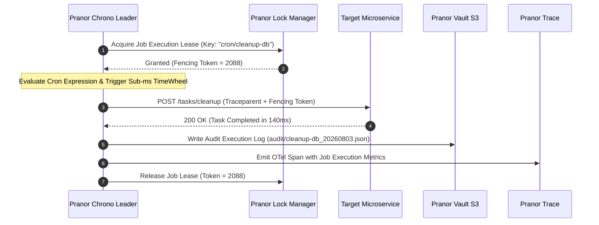

# Pranor Chrono

```bash
docker run -p 8085:8085 ghcr.io/vyuvaraj/pranor-chrono:latest
```

`Pranor Chrono` is the distributed, fault-tolerant job scheduling service for the **Pranor** ecosystem. It supports interval and cron scheduling, exactly-once semantics, DAG job chaining, Pranor cron-as-code declarations, persistent S3 job registries, and full OTel tracing.

---

## Table of Contents
- [Key Features](#key-features)
- [Architecture](#architecture)
- [API Endpoints](#api-endpoints)
- [Scheduling Expressions](#scheduling-expressions)
- [DAG Job Chaining](#dag-job-chaining)
- [Cron-as-Code (Pranor)](#cron-as-code-pranor)
- [Getting Started](#getting-started)

---

## Key Features

### ⏰ Core Scheduling
- **Interval & cron execution**: Run jobs at fixed intervals (e.g., `10s`, `5m`, `2h`) or standard 5-field cron patterns (e.g., `0 9 * * 1-5` for weekdays at 9 AM)
- **Exactly-once scheduling semantics**: Distributed Redis-based leader election ensures only one node fires each scheduled job, even across a cluster
- **Dynamic load balancing**: Distributes job execution slots across active cluster nodes

### 🔗 DAG Job Chaining
- **Multi-step job graphs**: Define jobs with dependency constraints — `job-c` only runs after `job-a` AND `job-b` succeed
- **Topological sort execution**: Automatically resolves execution order from the dependency graph
- **Fan-out / fan-in patterns**: Parallelize independent steps, then synchronize at a join step

### 🔁 Retry Policies
- **Configurable retry count**: Per-job max retry attempts
- **Backoff strategies**: Fixed, linear, or exponential backoff between retries
- **Jitter**: Randomized jitter on backoff to prevent thundering herds
- **Dead-letter after exhaustion**: After all retries fail, job moves to a dead-letter audit record

### 📋 Cron-as-Code (Pranor)
- **Define jobs in `.pnr` files**: Declare scheduled jobs using Pranor `cron` and `every` syntax
- **Version control your schedules**: Job definitions live alongside application code
- **Hot-reload**: Pranor Chrono watches `.pnr` files for changes and automatically re-registers modified jobs

### 💾 Persistence
- **Persistent job registry to Pranor Vault S3**: Job definitions serialized to `jobs.json` in a Pranor Vault bucket — survive node restarts
- **Execution audit history**: Every job execution is logged to `audit/<jobID>_<timestamp>.json` (execution time, duration, response status, response body)
- **Automatic restore on startup**: Reloads all job definitions from S3 on node boot

### 🔭 Observability
- **OTel tracing**: Client spans for every job trigger; `traceparent` header propagated to downstream callback HTTP requests
- **Prometheus metrics**: Job fire rate, success/failure counters, execution duration histograms
- **Execution history API**: Query past executions for any job

---

## Architecture

```mermaid
graph TD
    classDef client fill:#1e293b,stroke:#38bdf8,stroke-width:2px,color:#fff;
    classDef engine fill:#0f172a,stroke:#0d9488,stroke-width:2px,color:#fff;
    classDef storage fill:#1e1b4b,stroke:#6366f1,stroke-width:2px,color:#fff;
    classDef monitor fill:#1e293b,stroke:#64748b,stroke-width:1px,color:#fff;

    subgraph API ["🌐 Scheduler Control & Cron-as-Code"]
        CronAsCode["Pranor Language .pnr Watcher"] :::client
        JobAPI["REST Scheduler API<br/><i>(POST /api/v1/jobs)</i>"] :::client
    end

    subgraph SchedulerCore ["⚡ Distributed Timer & DAG Engine"]
        CronEvaluator["High-Precision Cron Evaluator<br/><i>(Sub-ms TimeWheel Grid)</i>"] :::engine
        LeaderLock["Pranor Lock Fencing Token Leader"] :::engine
        DAGRunner["DAG Topological Fan-Out & Join Engine"] :::engine
        HTTPDispatcher["HTTP Callback Dispatcher<br/><i>(Traceparent Header Propagator)</i>"] :::engine
    end

    subgraph History ["💾 Audit Trail & Vault Storage"]
        VaultS3["Pranor Vault S3 Job Registry & Audit Logs"] :::storage
        RetryEngine["Exponential Backoff Retry Engine"] :::storage
    end

    CronAsCode --> CronEvaluator
    JobAPI --> CronEvaluator
    CronEvaluator --> LeaderLock
    LeaderLock --> DAGRunner
    DAGRunner --> HTTPDispatcher
    HTTPDispatcher --> RetryEngine
    RetryEngine --> VaultS3
```

### High-Precision Distributed Cron Trigger Sequence Flow



### Ecosystem Cross-Module Integration

Pranor Chrono manages high-precision job scheduling across all platform services:

- **Pranor Lock**: Uses exclusive fencing token leases to guarantee job callbacks execute on exactly one node during multi-replica deployments.
- **Pranor Vault**: Persists serialized `jobs.json` configurations and append-only execution audit logs (`audit/<jobID>_<timestamp>.json`).
- **Pranor Flow**: Triggers scheduled workflow sagas and periodic maintenance DAGs.
- **Pranor Trace**: Emits OpenTelemetry trace spans with `traceparent` context headers for every dispatched cron job.

---

## API Endpoints

| Method | Path | Description |
|--------|------|-------------|
| `POST` | `/api/v1/jobs` | Create a scheduled job |
| `GET` | `/api/v1/jobs` | List all jobs |
| `GET` | `/api/v1/jobs/{id}` | Get job definition and status |
| `PUT` | `/api/v1/jobs/{id}` | Update a job |
| `DELETE` | `/api/v1/jobs/{id}` | Delete a job |
| `POST` | `/api/v1/jobs/{id}/run` | Trigger a job manually |
| `GET` | `/api/v1/jobs/{id}/history` | Execution history for a job |
| `POST` | `/api/v1/dag` | Define a DAG job chain |
| `GET` | `/api/v1/dag/{id}` | Get DAG execution state |
| `/metrics` | `GET` | Prometheus metrics |
| `/healthz` | `GET` | Liveness probe |

---

## Scheduling Expressions

```bash
# Every 30 seconds
curl -X POST http://pranor-chrono:8085/api/v1/jobs \
  -d '{"name": "health-check", "schedule": "30s", "callback_url": "http://myapp/health", "retry": {"max": 3, "backoff": "exponential"}}'

# Every weekday at 9 AM (cron)
curl -X POST http://pranor-chrono:8085/api/v1/jobs \
  -d '{"name": "daily-report", "schedule": "0 9 * * 1-5", "callback_url": "http://myapp/reports/daily"}'

# Every hour
curl -X POST http://pranor-chrono:8085/api/v1/jobs \
  -d '{"name": "cache-warmer", "schedule": "1h", "callback_url": "http://myapp/cache/warm"}'
```

---

## DAG Job Chaining

```bash
curl -X POST http://pranor-chrono:8085/api/v1/dag \
  -d '{
    "name": "nightly-pipeline",
    "schedule": "0 2 * * *",
    "steps": [
      { "id": "extract", "callback_url": "http://etl/extract", "depends_on": [] },
      { "id": "transform", "callback_url": "http://etl/transform", "depends_on": ["extract"] },
      { "id": "load-a", "callback_url": "http://etl/load/warehouse", "depends_on": ["transform"] },
      { "id": "load-b", "callback_url": "http://etl/load/reporting", "depends_on": ["transform"] },
      { "id": "notify", "callback_url": "http://notify/done", "depends_on": ["load-a", "load-b"] }
    ]
  }'
```

This runs `extract` → `transform` → `load-a` and `load-b` in parallel → `notify`.

---

## Cron-as-Code (Pranor)

Define jobs in a `.pnr` file alongside your application code:

```pranor
// jobs.pnr
cron "daily-report" at "0 9 * * 1-5" {
  call POST "http://myapp/reports/daily"
}

every 30s "health-check" {
  call GET "http://myapp/health"
    retry max=3 backoff=exponential
}
```

Pranor Chrono auto-reloads job definitions when `.pnr` files change.

---

## Getting Started

```bash
docker run -p 8085:8085 \
  -e PRANOR_CHRONO_REDIS_URL=redis://redis:6379 \
  -e PRANOR_CHRONO_PRANOR_VAULT_BUCKET=pranor-chrono-jobs \
  -e PRANOR_CHRONO_PRANOR_VAULT_URL=http://pranor-vault:7070 \
  -e PRANOR_CHRONO_OTEL_ENDPOINT=http://pranor-trace:4318 \
  ghcr.io/vyuvaraj/pranor-chrono:latest
```

### Environment Variables

| Variable | Default | Description |
|----------|---------|-------------|
| `PRANOR_CHRONO_PORT` | `8085` | HTTP listener port |
| `PRANOR_CHRONO_REDIS_URL` | — | Redis URL for distributed leader election |
| `PRANOR_CHRONO_PRANOR_VAULT_URL` | — | Pranor Vault URL for job persistence |
| `PRANOR_CHRONO_PRANOR_VAULT_BUCKET` | `pranor-chrono-jobs` | S3 bucket name for job registry |
| `PRANOR_CHRONO_OTEL_ENDPOINT` | — | OpenTelemetry collector URL |
| `PRANOR_CHRONO_PRANOR_FILES_DIR` | — | Directory to watch for `.pnr` job definitions |
