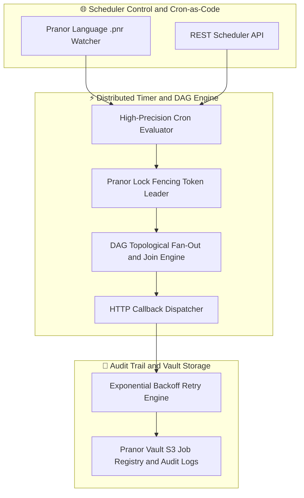
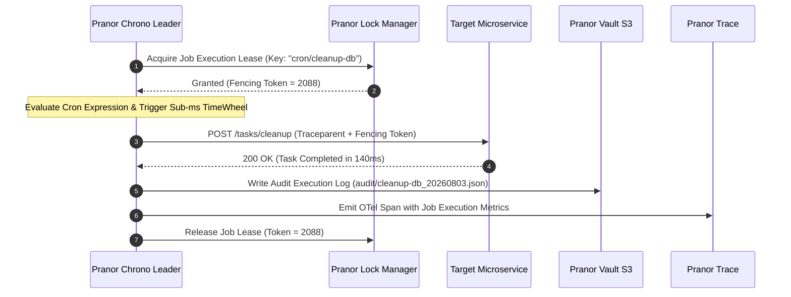

# Pranor Chrono — Distributed Job Scheduler

**Version:** 1.0.0  
**Module Path:** `github.com/vyuvaraj/pranor/chrono`  
**Default Port:** 8087  
**License:** AGPL-3.0 (OSS) / Enterprise License (EE with smart scheduling & timezone DSL)

---

## Overview

Pranor Chrono is the distributed, fault-tolerant job scheduling service for the Pranor ecosystem. It supports interval and cron scheduling, exactly-once semantics, DAG job chaining, Pranor cron-as-code declarations, persistent S3 job registries, leader election, retry policies with configurable backoff, and full OTel tracing.

Pranor Chrono can run as:
- A **standalone binary** with single-node scheduling (no Redis required)
- An **integrated module** within the Pranor ecosystem with distributed leader election, mTLS, and OTel tracing

---

## Key Features

| Feature | Description |
|---------|-------------|
| **Interval & Cron** | Run jobs at fixed intervals or standard 5-field cron patterns |
| **Exactly-once semantics** | Redis-based leader election ensures only one node fires each job |
| **DAG Job Chaining** | Multi-step dependency graphs with topological sort execution |
| **Cron-as-Code** | Define jobs in `.pnr` files with hot-reload on change |
| **Retry Policies** | Fixed, linear, or exponential backoff with jitter |
| **Dead Letter Queue** | Jobs exhausting retries are moved to DLQ for audit |
| **S3 Persistence** | Job registry and audit logs persisted to Pranor Vault S3 |
| **Leader Election** | Redis-based distributed lease ensures cluster-safe scheduling |
| **OTel Tracing** | `traceparent` headers propagated to all HTTP callbacks |
| **Fan-out / Fan-in** | Parallelize independent steps, synchronize at join points |

---

## Architecture



### High-Precision Distributed Cron Trigger Sequence Flow



### Ecosystem Cross-Module Integration

Pranor Chrono manages high-precision job scheduling across all platform services:

- **Pranor Lock**: Uses exclusive fencing token leases to guarantee job callbacks execute on exactly one node during multi-replica deployments.
- **Pranor Vault**: Persists serialized `jobs.json` configurations and append-only execution audit logs.
- **Pranor Flow**: Triggers scheduled workflow sagas and periodic maintenance DAGs.
- **Pranor Trace**: Emits OpenTelemetry trace spans with `traceparent` context headers for every dispatched cron job.

---

## Installation & Deployment

### Binary

```bash
cd pranor/chrono
go build -o pranor-chrono .
./pranor-chrono --addr :8087
```

### Docker

```bash
docker run -p 8087:8087 ghcr.io/vyuvaraj/pranor-chrono:latest
```

### With Redis Leader Election

```bash
./pranor-chrono --addr :8087 --redis-url redis://localhost:6379
```

### As Part of Pranor Ecosystem

When running under the Pranor platform, Chrono integrates automatically with Lock (leader election), Vault (persistence), Trace (OTel spans), and Console (dashboard visibility).

---

## Configuration

### Environment Variables

| Variable | Default | Description |
|----------|---------|-------------|
| `PORT` | `8087` | HTTP listener port |
| `REDIS_URL` | — | Redis URL for distributed leader election |
| `REDIS_LOCK_KEY` | `pranor-chrono:leader:lock` | Redis key for leader lease lock |
| `REDIS_LEASE_DURATION` | `15s` | Lease duration for leader election |
| `PRANOR_CHRONO_PRANOR_VAULT_URL` | — | Pranor Vault URL for job persistence |
| `PRANOR_CHRONO_PRANOR_VAULT_BUCKET` | `pranor-chrono-jobs` | S3 bucket name for job registry |
| `PRANOR_CHRONO_OTEL_ENDPOINT` | — | OpenTelemetry collector URL |
| `PRANOR_CHRONO_PRANOR_FILES_DIR` | — | Directory to watch for `.pnr` job definitions |

### YAML Config (`chrono.yaml`)

```yaml
port: "8087"
redis_url: "redis://localhost:6379"
redis_lock_key: "pranor-chrono:leader:lock"
redis_lease_duration: "15s"
vault_url: "http://pranor-vault:7070"
vault_bucket: "pranor-chrono-jobs"
otel_endpoint: "http://pranor-trace:8090"
pnr_files_dir: "./jobs"
```

### CLI Flags

| Flag | Default | Description |
|------|---------|-------------|
| `--addr` | `:8087` | HTTP listening address |
| `--redis-url` | — | Redis URL for leader election |
| `--redis-lock-key` | `pranor-chrono:leader:lock` | Redis key for leader lease |
| `--redis-lease-duration` | `15s` | Leader lease duration |

---

## API Reference

**Base URL:** `http://localhost:8087`  
**API Version:** `/api/v1/` (recommended) or `/api/` (legacy)

### POST /api/v1/jobs

Create a scheduled job.

**Request:**

```json
{
  "name": "health-check",
  "schedule": "30s",
  "callback_url": "http://myapp/health",
  "retry": {
    "max": 3,
    "backoff": "exponential"
  }
}
```

**Response (201):**

```json
{
  "id": "job-abc-123",
  "name": "health-check",
  "schedule": "30s",
  "status": "active",
  "next_run": "2026-08-01T10:00:30Z"
}
```

---

### GET /api/v1/jobs

List all jobs.

**Response (200):**

```json
{
  "jobs": [
    {
      "id": "job-abc-123",
      "name": "health-check",
      "schedule": "30s",
      "status": "active",
      "last_run": "2026-08-01T10:00:00Z",
      "next_run": "2026-08-01T10:00:30Z"
    }
  ]
}
```

---

### POST /api/v1/jobs/{id}/run

Trigger a job manually (ignores schedule).

**Response (200):**

```json
{
  "status": "triggered",
  "execution_id": "exec-xyz-789"
}
```

---

### POST /api/v1/dag

Define a DAG job chain.

**Request:**

```json
{
  "name": "nightly-pipeline",
  "schedule": "0 2 * * *",
  "steps": [
    { "id": "extract", "callback_url": "http://etl/extract", "depends_on": [] },
    { "id": "transform", "callback_url": "http://etl/transform", "depends_on": ["extract"] },
    { "id": "load", "callback_url": "http://etl/load", "depends_on": ["transform"] }
  ]
}
```

**Response (201):**

```json
{
  "id": "dag-001",
  "name": "nightly-pipeline",
  "status": "active",
  "step_count": 3
}
```

---

### GET /api/v1/jobs/{id}/history

Execution history for a job.

**Response (200):**

```json
{
  "executions": [
    {
      "id": "exec-001",
      "started_at": "2026-08-01T10:00:00Z",
      "duration_ms": 140,
      "status": "success",
      "http_status": 200
    }
  ]
}
```

---

### GET /healthz

Liveness probe.

```json
{"status":"UP","service":"pranor-chrono","version":"1.0.0"}
```

---

## Security

### Standalone Mode

In standalone mode, Pranor Chrono runs with single-node scheduling and no Redis dependency. No authentication is required.

### Ecosystem Mode (Full Auth Stack)

When running within the Pranor ecosystem, the full middleware chain activates:

1. **OTel Tracing** — every request gets a span
2. **Rate Limiting** — per-client request throttling
3. **CORS** — cross-origin request handling
4. **Max Body Size** — 10MB request body limit
5. **JWT Auth** — validates Bearer tokens against Pranor Auth
6. **Tenant Isolation** — multi-tenant namespace enforcement

### Job Callback Security

Job callbacks include:
- `traceparent` header for distributed tracing
- Fencing token from Pranor Lock leader lease
- Optional bearer token for authenticated callbacks

---

## Observability

### Prometheus Metrics

| Metric | Type | Description |
|--------|------|-------------|
| `pranor_chrono_jobs_active` | Gauge | Currently registered active jobs |
| `pranor_chrono_fires_total` | Counter | Total job fires (labeled by job name, status) |
| `pranor_chrono_execution_duration_ms` | Histogram | Job execution duration |
| `pranor_chrono_retries_total` | Counter | Total retry attempts |
| `pranor_chrono_dlq_depth` | Gauge | Dead letter queue depth |
| `pranor_chrono_leader_elections_total` | Counter | Leader election events |

### OpenTelemetry Tracing

Every job execution generates OTel spans:
- `chrono.schedule.evaluate` — cron expression evaluation
- `chrono.job.dispatch` — HTTP callback dispatch
- `chrono.job.retry` — retry attempt
- `chrono.leader.acquire` — leader lease acquisition

### Logging

Structured JSON logs with fields: `level`, `timestamp`, `trace_id`, `job_id`, `execution_id`, `status`, `duration_ms`.

---

## Enterprise Edition

| Feature | OSS | EE |
|---------|:---:|:--:|
| Interval & cron scheduling | ✓ | ✓ |
| DAG job chaining | ✓ | ✓ |
| Leader election (Redis) | ✓ | ✓ |
| Retry policies | ✓ | ✓ |
| Cron-as-Code (.pnr) | ✓ | ✓ |
| S3 job persistence | ✓ | ✓ |
| OTel tracing | ✓ | ✓ |
| Smart scheduling (load-aware distribution) | — | ✓ |
| Timezone-aware cron DSL | — | ✓ |
| Multi-cluster job federation | — | ✓ |
| AI-powered schedule optimization | — | ✓ |

---

## Operational Runbook

### Jobs not firing

1. Check leader election — only the leader fires jobs. Verify Redis connectivity
2. Review `/api/v1/jobs` to confirm job status is `active`
3. Check `pranor_chrono_leader_elections_total` metric for frequent re-elections
4. Verify callback URLs are reachable from the Chrono node
5. Check `REDIS_LEASE_DURATION` isn't too short causing leader thrashing

### DAG steps stuck in pending

1. Check `/api/v1/dag/{id}` for step dependency resolution status
2. Verify upstream step completed successfully (check execution history)
3. Look for circular dependencies in step definitions
4. Check if step callback URL is timing out

### High retry rate

1. Monitor `pranor_chrono_retries_total` metric by job name
2. Check callback service health and response times
3. Review backoff strategy — exponential with jitter prevents thundering herds
4. Consider increasing timeout for slow callbacks
5. Jobs exhausting retries move to DLQ — check DLQ depth

### Leader election instability

1. Monitor Redis connectivity and latency
2. Check `REDIS_LEASE_DURATION` (default 15s) — too short causes flapping
3. Verify clock synchronization between Chrono nodes
4. Check network partitions between nodes and Redis
