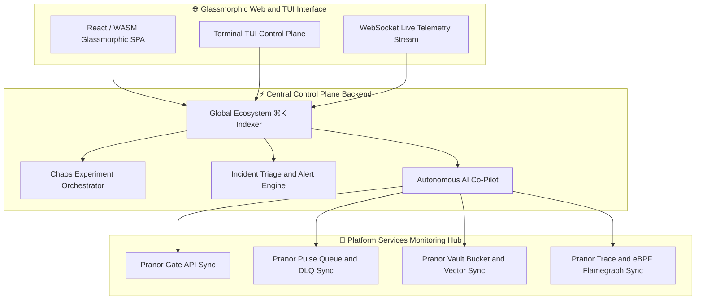
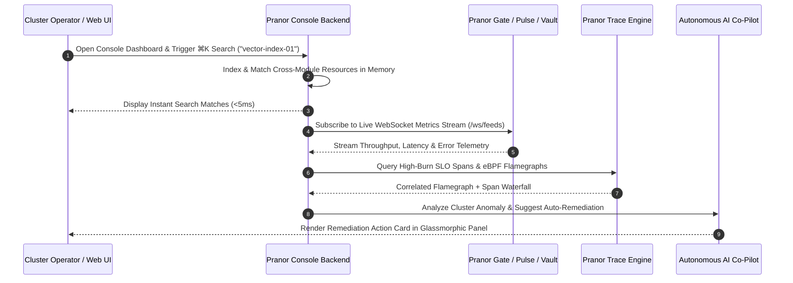

# Pranor Console — Unified Management Dashboard

**Version:** 1.0.0  
**Module Path:** `github.com/vyuvaraj/pranor/console`  
**Default Port:** 8083  
**License:** AGPL-3.0 (OSS) / Enterprise License (EE with AI Co-Pilot & Chaos Panel)

---

## Overview

Pranor Console is the unified, premium management dashboard and observability console for the Pranor ecosystem. It provides a single pane of glass for managing all Pranor components — Gate, Pulse, Vault, Mesh, Deploy, Trace, Flow, and more — with a glassmorphic, real-time UI designed for power users. It features global search, chaos engineering controls, incident management, eBPF flamegraphs, and WebSocket-driven live telemetry.

Pranor Console can run as:
- A **standalone binary** serving the web UI with manual service URL configuration
- An **integrated module** within the Pranor ecosystem with auto-discovery, mTLS, and federated telemetry

---

## Key Features

| Feature | Description |
|---------|-------------|
| **Single Pane of Glass** | Manage the entire Pranor stack from one premium glassmorphic UI |
| **Global ⌘K Search** | Fuzzy search across all resources — services, routes, queues, buckets, workflows |
| **API Gateway Management** | Live route audits, WASM hot-swap, circuit breaker status board |
| **Queue Inspector** | Topic browser, DLQ replay, consumer group lag dashboard |
| **Storage Inspector** | Bucket browser, vector index namespaces, branch management |
| **eBPF Flamegraphs** | Live CPU/memory profiling from the kernel layer |
| **SLO Burn Rate** | Real-time error budget dashboards with fast/slow windows |
| **Chaos Engineering** | Design, trigger, and monitor chaos experiments |
| **Service Topology** | Interactive dependency map with live traffic flow edges |
| **Incident Manager** | Alert rules, triage, severity management, resolution tracking |
| **Environment Provisioner** | One-click isolated environments and branch previews |
| **SQL Workbench** | Interactive query editor with schema exploration |

---

## Architecture



### Real-Time WebSocket Telemetry Stream & Global Search Sequence Flow



### Ecosystem Cross-Module Integration

Pranor Console provides single-pane-of-glass management for all platform components:

- **Pranor Gate**: Inspects dynamic HTTP routes, hot-swaps WASM security modules, and monitors AI token costs.
- **Pranor Pulse**: Browses topics, tracks consumer group partition lag, and performs 1-click DLQ message triage.
- **Pranor Vault**: Visualizes HNSW vector graph indexes, browses S3 buckets, and manages CoW bucket branches.
- **Pranor Trace**: Renders interactive eBPF CPU flamegraphs, distributed service dependency maps, and SLO burn rate dashboards.

---

## Installation & Deployment

### Binary

```bash
cd pranor/console
go build -o pranor-console .
./pranor-console --port 8083
```

### Docker

```bash
docker run -p 8083:8083 ghcr.io/vyuvaraj/pranor-console:latest
```

### With Service Discovery

```bash
docker run -p 8083:8083 \
  -e PRANOR_CONSOLE_PRANOR_GATE_URL=http://pranor-gate:8080 \
  -e PRANOR_CONSOLE_PRANOR_PULSE_URL=http://pranor-pulse:9090 \
  -e PRANOR_CONSOLE_PRANOR_VAULT_URL=http://pranor-vault:7070 \
  -e PRANOR_CONSOLE_PRANOR_TRACE_URL=http://pranor-trace:8090 \
  -e PRANOR_CONSOLE_PRANOR_MESH_URL=http://pranor-mesh:8089 \
  ghcr.io/vyuvaraj/pranor-console:latest
```

### As Part of Pranor Ecosystem

When running under the Pranor platform, Console auto-discovers all services via Mesh and displays the full topology.

---

## Configuration

### Environment Variables

| Variable | Default | Description |
|----------|---------|-------------|
| `PRANOR_CONSOLE_PORT` | `8083` | HTTP port |
| `PRANOR_CONSOLE_PRANOR_GATE_URL` | — | Pranor Gate backend URL |
| `PRANOR_CONSOLE_PRANOR_PULSE_URL` | — | Pranor Pulse backend URL |
| `PRANOR_CONSOLE_PRANOR_VAULT_URL` | — | Pranor Vault backend URL |
| `PRANOR_CONSOLE_PRANOR_TRACE_URL` | — | Pranor Trace OTLP URL |
| `PRANOR_CONSOLE_PRANOR_MESH_URL` | — | Pranor Mesh backend URL |
| `PRANOR_CONSOLE_AUTH_TOKEN` | — | Static admin auth token |
| `PRANOR_CONSOLE_THEME` | `dark` | Default theme (`dark`, `light`, `glassmorphism`) |

### YAML Config (`console.yaml`)

```yaml
port: "8083"
gate_url: "http://pranor-gate:8080"
pulse_url: "http://pranor-pulse:9090"
vault_url: "http://pranor-vault:7070"
trace_url: "http://pranor-trace:8090"
mesh_url: "http://pranor-mesh:8089"
auth_token: "admin-secret-token"
theme: "dark"
```

### CLI Flags

| Flag | Default | Description |
|------|---------|-------------|
| `--port` | `8083` | HTTP listen port |

---

## API Reference

**Base URL:** `http://localhost:8083`

### GET /api/v1/search?q={query}

Global resource search (⌘K).

**Response (200):**

```json
{
  "results": [
    { "type": "service", "name": "orders-api", "module": "mesh", "url": "/mesh/services/orders-api" },
    { "type": "route", "name": "/api/orders", "module": "gate", "url": "/gate/routes/api-orders" }
  ],
  "took_ms": 3
}
```

---

### GET /api/v1/topology/graph

Live service topology graph data.

**Response (200):**

```json
{
  "nodes": [
    { "id": "orders-api", "type": "service", "status": "healthy" },
    { "id": "payments-api", "type": "service", "status": "degraded" }
  ],
  "edges": [
    { "from": "orders-api", "to": "payments-api", "rps": 120, "error_rate": 0.02, "p99_ms": 45 }
  ]
}
```

---

### POST /api/v1/chaos/experiments

Create a chaos experiment.

**Request:**

```json
{
  "name": "latency-spike-test",
  "target_service": "payments-api",
  "fault_type": "latency",
  "latency_ms": 500,
  "percentage": 25,
  "duration": "5m"
}
```

**Response (201):**

```json
{
  "id": "exp-001",
  "status": "active",
  "blast_radius": ["orders-api", "checkout-api"],
  "expires_at": "2026-08-01T10:05:00Z"
}
```

---

### POST /api/v1/incidents

Create an incident.

**Request:**

```json
{
  "title": "High error rate on payments-api",
  "severity": "P2",
  "services": ["payments-api"],
  "description": "Error rate exceeded 5% SLO threshold"
}
```

**Response (201):**

```json
{
  "id": "inc-001",
  "status": "open",
  "created_at": "2026-08-01T10:00:00Z"
}
```

---

### GET /healthz

Liveness probe.

```json
{"status":"UP","service":"pranor-console","version":"1.0.0"}
```

---

## Security

### Standalone Mode

Set `PRANOR_CONSOLE_AUTH_TOKEN` for basic token authentication. Clients authenticate via:

```
Authorization: Bearer admin-secret-token
```

### Ecosystem Mode (Full Auth Stack)

When running within the Pranor ecosystem, Console integrates with Pranor Auth for RBAC-based access control:

1. **JWT Auth** — validates Bearer tokens against Pranor Auth
2. **Role-based dashboard access** — admins see all panels; operators see limited views
3. **Audit logging** — all management actions logged with user identity
4. **mTLS** — service-to-service communication encrypted

### CORS

Console serves the SPA from a configurable origin. CORS headers allow the frontend to call backend APIs cross-origin.

---

## Observability

### Prometheus Metrics

| Metric | Type | Description |
|--------|------|-------------|
| `pranor_console_active_sessions` | Gauge | Active WebSocket connections |
| `pranor_console_search_latency_ms` | Histogram | ⌘K search response time |
| `pranor_console_chaos_experiments_active` | Gauge | Running chaos experiments |
| `pranor_console_incidents_open` | Gauge | Open incidents |
| `pranor_console_ws_messages_total` | Counter | WebSocket messages received |

### OpenTelemetry Tracing

Console emits spans for:
- `console.search` — global search queries
- `console.chaos.inject` — chaos experiment triggers
- `console.topology.refresh` — topology graph rebuilds

### Logging

Structured JSON logs with fields: `level`, `timestamp`, `user_id`, `action`, `module`, `latency_ms`.

---

## Enterprise Edition

| Feature | OSS | EE |
|---------|:---:|:--:|
| Unified dashboard UI | ✓ | ✓ |
| Global ⌘K search | ✓ | ✓ |
| Service topology graph | ✓ | ✓ |
| SLO burn rate dashboards | ✓ | ✓ |
| Incident management | ✓ | ✓ |
| Queue inspector (DLQ replay) | ✓ | ✓ |
| Chaos engineering panel | — | ✓ |
| eBPF flamegraph profiling | — | ✓ |
| AI Co-Pilot auto-remediation | — | ✓ |
| Environment provisioner | — | ✓ |
| Custom keyboard shortcuts & themes | — | ✓ |
| Multi-cluster federation view | — | ✓ |

---

## Operational Runbook

### WebSocket connections dropping

1. Check `pranor_console_active_sessions` gauge for sudden drops
2. Verify network stability between Console and downstream services
3. Check if rate limiting is affecting WebSocket upgrade requests
4. Review nginx/load balancer timeout settings for WebSocket connections
5. Ensure `Connection: Upgrade` headers are not being stripped

### Global search returning stale results

1. Console indexes resources on startup and via WebSocket feeds
2. Force re-index by restarting Console or triggering topology refresh
3. Check connectivity to all configured service URLs
4. Verify Mesh is reporting accurate service catalog

### Chaos experiment not propagating

1. Verify Pranor Mesh connectivity (`PRANOR_CONSOLE_PRANOR_MESH_URL`)
2. Check experiment status via `GET /api/v1/chaos/experiments/{id}`
3. Confirm target service is registered in Mesh service catalog
4. Review blast radius preview before re-triggering

### Dashboard panels blank or loading

1. Check browser console for WebSocket connection errors
2. Verify backend service URLs are correct and accessible
3. Check auth token validity if using static token auth
4. Review CORS configuration if frontend is served from a different origin
