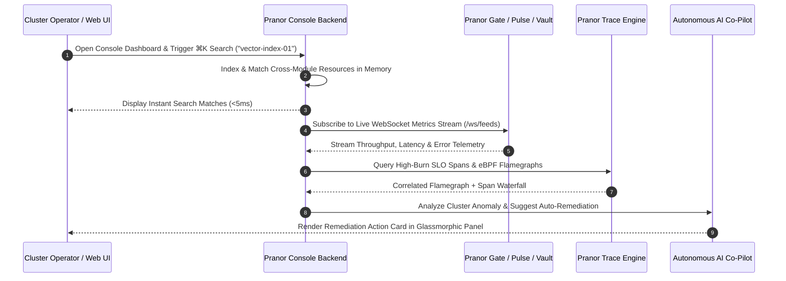

# Pranor Console

```bash
docker run -p 8083:8083 ghcr.io/vyuvaraj/pranor-console:latest
```

`Pranor Console` is the unified, premium management dashboard and observability console for the **Pranor** ecosystem. It provides a single pane of glass for managing Pranor Gate, Pranor Pulse, Pranor Vault, Pranor Mesh, Pranor Deploy, Pranor Trace, Pranor Flow, and all other Pranor components — with a glassmorphic, real-time UI designed for power users.

---

## Table of Contents
- [Key Features](#key-features)
- [Architecture](#architecture)
- [Dashboard Modules](#dashboard-modules)
- [API Endpoints](#api-endpoints)
- [Getting Started](#getting-started)
- [Configuration](#configuration)

---

## Key Features

### 🎛️ Unified Management
- **Single pane of glass**: Manage the entire Pranor stack from one premium UI
- **Glassmorphic dark UI**: Premium visual design with smooth animations and real-time data refresh
- **Multi-tab navigation**: Navigate between components in organized tabs without page reloads
- **Global `⌘K` search**: Fuzzy search across all Pranor resources — services, routes, queues, buckets, workflows, traces — instantly

### 🚪 API Gateway Management (Pranor Gate)
- **Live route audits**: View, create, and delete proxy routes in real-time
- **WASM hot-swap interface**: Upload and activate WASM middleware modules without restarting Pranor Gate
- **AI middleware audit panel**: Monitor Prompt Guard violations, Semantic Cache similarity hits, PII scrubbing events, AI cost per request
- **OpenAPI Swagger UI**: Interactive API documentation browser for all registered gateway routes
- **Circuit breaker status board**: Live open/half-open/closed state per route with SLO metrics

### 📨 Queue Inspector (Pranor Pulse)
- **Topic browser**: Real-time topic list with message rates, partition counts, and replication status
- **Schema registry browser**: Browse, compare, and evolve message schemas
- **DLQ browser & one-click replay**: Inspect dead letter messages; replay individual or bulk messages with one click
- **Consumer group lag dashboard**: Per-consumer-group, per-partition offset lag visualization with historical trend

### 🗃️ Storage Inspector (Pranor Vault)
- **Bucket browser**: Navigate bucket contents, upload/download files, manage object metadata
- **Vector index namespace browser**: Inspect HNSW graph stats, index namespaces, embedding coverage
- **Branch management**: Create, diff, and merge CoW bucket branches from the UI
- **Tiering policy editor**: Configure hot/warm/cold tiering rules visually

### 🔭 Observability & Telemetry
- **eBPF flamegraph telemetry**: Live CPU and memory flamegraph profiling from the kernel layer — visualized in-browser
- **OTel trace correlation**: Click from a slow request directly into its distributed trace waterfall
- **SLO burn rate alerts**: Real-time error budget burn rate dashboards per service, with fast/slow window indicators
- **Service topology live graph**: Interactive dependency map of all Pranor services with live traffic flow edges

### 🔥 Chaos Engineering Panel
- **Chaos control panel**: Design and trigger chaos experiments (latency injection, error rate simulation, network partition) across Pranor Mesh nodes
- **Experiment lifecycle management**: Start, monitor, and abort experiments; view blast radius before triggering
- **Historical experiment log**: Full audit trail of past chaos events with impact metrics

### 🛎️ Alerts & Incidents
- **Alert rule management**: Define threshold and anomaly-based alert rules across all Pranor metrics
- **Incident timeline**: Structured incident management with severity triage, notes, and resolution tracking

### 🌿 Provisioning & Environments
- **Environment provisioner**: Create complete isolated Pranor environments (dev/staging/prod) with one click
- **Branch preview provisioner**: Automatically spin up ephemeral Pranor Deploy environments per git branch for PR previews

### ⚙️ Customization
- **Theme selector**: Dark, light, and glassmorphism themes; custom accent color
- **Pinned dashboard widgets**: Pin any metric chart or panel to a personal dashboard
- **Custom keyboard shortcuts**: User-configurable keybindings for common operations

---

## Architecture

```mermaid
graph TD
    classDef client fill:#1e293b,stroke:#38bdf8,stroke-width:2px,color:#fff;
    classDef engine fill:#0f172a,stroke:#0d9488,stroke-width:2px,color:#fff;
    classDef storage fill:#1e1b4b,stroke:#6366f1,stroke-width:2px,color:#fff;
    classDef monitor fill:#1e293b,stroke:#64748b,stroke-width:1px,color:#fff;

    subgraph UserInterface ["🌐 Glassmorphic Web & TUI Interface"]
        SPA["React / WASM Glassmorphic SPA<br/><i>(Glass UI & Global ⌘K Search)</i>"] :::client
        TUI["Terminal TUI Control Plane<br/><i>(Bubbletea Go Framework)</i>"] :::client
        WSClient["WebSocket Live Telemetry Stream<br/><i>(/ws/feeds)</i>"] :::client
    end

    subgraph BackendCore ["⚡ Central Control Plane Backend"]
        SearchEngine["Global Ecosystem ⌘K Indexer"] :::engine
        ChaosControl["Chaos Experiment Orchestrator"] :::engine
        IncidentEngine["Incident Triage & Alert Engine"] :::engine
        AIAssistant["Autonomous AI Co-Pilot<br/><i>(Enterprise EE)</i>"] :::engine
    end

    subgraph ServiceIntegrations ["💾 Platform Services Monitoring Hub"]
        GateSync["Pranor Gate API Sync"] :::storage
        PulseSync["Pranor Pulse Queue & DLQ Sync"] :::storage
        VaultSync["Pranor Vault Bucket & Vector Sync"] :::storage
        TraceSync["Pranor Trace & eBPF Flamegraph Sync"] :::storage
    end

    SPA --> SearchEngine
    TUI --> SearchEngine
    WSClient --> SearchEngine
    SearchEngine --> ChaosControl
    SearchEngine --> IncidentEngine
    SearchEngine --> AIAssistant
    AIAssistant --> GateSync
    AIAssistant --> PulseSync
    AIAssistant --> VaultSync
    AIAssistant --> TraceSync
```

### Real-Time WebSocket Telemetry Stream & Global Search Sequence Flow



### Ecosystem Cross-Module Integration

Pranor Console provides single-pane-of-glass management for all platform components:

- **Pranor Gate**: Inspects dynamic HTTP routes, hot-swaps WASM security modules, and monitors AI token costs.
- **Pranor Pulse**: Browses topics, tracks consumer group partition lag, and performs 1-click DLQ message triage.
- **Pranor Vault**: Visualizes HNSW vector graph indexes, browses S3 buckets, and manages CoW bucket branches.
- **Pranor Trace**: Renders interactive eBPF CPU flamegraphs, distributed service dependency maps, and SLO burn rate dashboards.

---

---

## Dashboard Modules

| Module | Description |
|--------|-------------|
| **Gateway Inspector** | Pranor Gate routes, WASM modules, circuit breakers, AI middleware stats |
| **Queue Inspector** | Topic browser, consumer lag, DLQ management, schema registry |
| **Storage Inspector** | Bucket browser, vector index namespaces, branch management |
| **Topology Graph** | Live service dependency graph with traffic flow visualization |
| **Flamegraph Profiler** | eBPF-powered CPU/memory flamegraph per service |
| **Chaos Panel** | Design, trigger, and monitor chaos experiments |
| **SLO Dashboard** | Error budget burn rate, SLO compliance per service |
| **Trace Explorer** | Distributed trace waterfall search and correlation |
| **Incident Manager** | Alert rules, incident triage, resolution tracking |
| **Provisioner** | Environment and branch preview management |
| **AI Cost Dashboard** | Per-service AI token spend, model routing savings |

---

## API Endpoints

| Method | Path | Description |
|--------|------|-------------|
| `GET` | `/api/v1/search?q=` | Global resource search (⌘K) |
| `GET` | `/api/v1/topology/graph` | Live service topology graph data |
| `GET` | `/ws/topology` | WebSocket: real-time topology updates |
| `GET` | `/api/v1/flamegraph/{service}` | eBPF flamegraph for a service |
| `GET` | `/api/v1/slo/{service}/burn-rate` | SLO burn rate metrics |
| `POST` | `/api/v1/chaos/experiments` | Create a chaos experiment |
| `DELETE` | `/api/v1/chaos/experiments/{id}` | Abort a chaos experiment |
| `GET` | `/api/v1/incidents` | List active incidents |
| `POST` | `/api/v1/incidents` | Create an incident |
| `GET` | `/api/v1/queue/dlq/{topic}` | DLQ browser |
| `POST` | `/api/v1/queue/dlq/{topic}/replay` | One-click DLQ replay |
| `GET` | `/api/v1/queue/consumers/{group}/lag` | Consumer lag per group |
| `POST` | `/api/v1/environments` | Provision an environment |
| `POST` | `/api/v1/branch-preview` | Provision a branch preview |
| `GET` | `/api/v1/preferences` | Get user preferences |
| `PUT` | `/api/v1/preferences` | Update user preferences |

---

## Getting Started

```bash
docker run -p 8083:8083 \
  -e PRANOR_CONSOLE_PRANOR_GATE_URL=http://pranor-gate:8080 \
  -e PRANOR_CONSOLE_PRANOR_PULSE_URL=http://pranor-pulse:9090 \
  -e PRANOR_CONSOLE_PRANOR_VAULT_URL=http://pranor-vault:7070 \
  -e PRANOR_CONSOLE_PRANOR_TRACE_URL=http://pranor-trace:4318 \
  -e PRANOR_CONSOLE_PRANOR_MESH_URL=http://pranor-mesh:8095 \
  ghcr.io/vyuvaraj/pranor-console:latest
```

Open `http://localhost:8083` in your browser.

---

## Configuration

| Variable | Description |
|----------|-------------|
| `PRANOR_CONSOLE_PORT` | HTTP port (default: `8083`) |
| `PRANOR_CONSOLE_PRANOR_GATE_URL` | Pranor Gate backend URL |
| `PRANOR_CONSOLE_PRANOR_PULSE_URL` | Pranor Pulse backend URL |
| `PRANOR_CONSOLE_PRANOR_VAULT_URL` | Pranor Vault backend URL |
| `PRANOR_CONSOLE_PRANOR_TRACE_URL` | Pranor Trace OTLP URL |
| `PRANOR_CONSOLE_PRANOR_MESH_URL` | Pranor Mesh backend URL |
| `PRANOR_CONSOLE_AUTH_TOKEN` | Static admin auth token |
