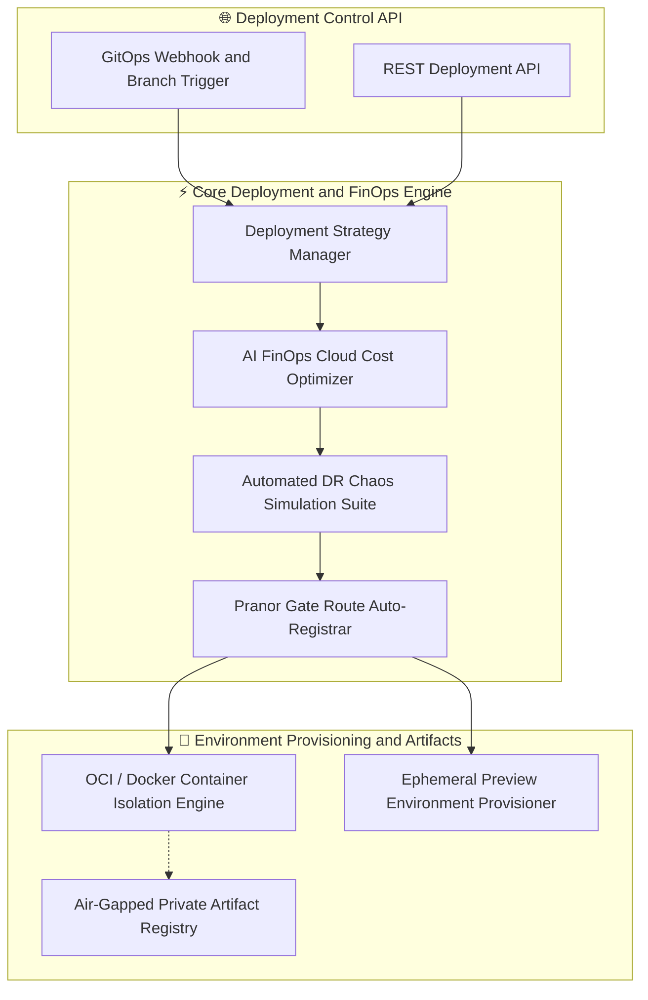
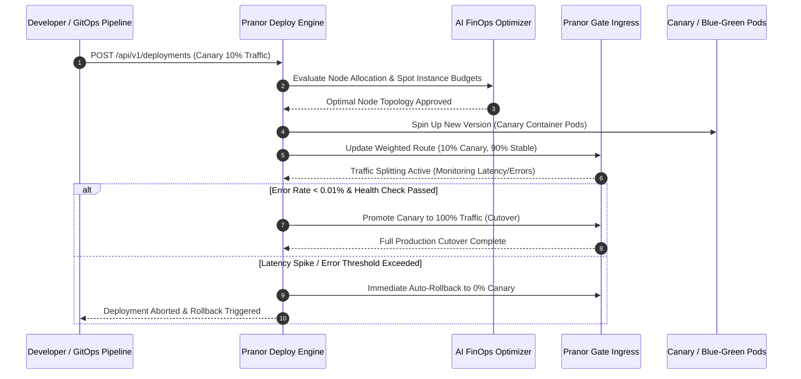

# Pranor Deploy — Deployment Orchestrator

**Version:** 0.1.0  
**Module Path:** `github.com/vyuvaraj/pranor/deploy`  
**Default Port:** 8085  
**License:** AGPL-3.0 (OSS) / Enterprise License (EE with FinOps & DR Chaos Suite)

---

## Overview

Pranor Deploy is the managed deployment platform and process orchestrator for the Pranor ecosystem. It provides PaaS-style service deployment, blue/green and canary strategies, per-branch preview environments, container isolation, ring-buffer log streaming, and deep integration with Pranor Gate for automatic routing registration.

Pranor Deploy can run as:
- A **standalone binary** deploying processes with dynamic port allocation
- An **integrated module** within the Pranor ecosystem with Gate route sync, OTel tracing, and container isolation

---

## Key Features

| Feature | Description |
|---------|-------------|
| **PaaS Deployment API** | Deploy services on demand via REST with automatic route registration |
| **Blue/Green Deployment** | Atomic zero-downtime traffic cutover with instant rollback |
| **Canary Deployment** | Configurable traffic split with auto-rollback on error threshold |
| **Preview Environments** | Per-branch ephemeral environments with unique subdomains |
| **Container Isolation** | Docker/OCI container mode with resource limits and network isolation |
| **Process Mode** | Lightweight raw process execution for development |
| **Ring-buffer Logs** | Capture stdout/stderr with streaming log API |
| **Gate Auto-Registration** | Deployed services automatically get Pranor Gate routes |
| **Health Gate** | Deployments must pass health checks before traffic cutover |
| **GitOps Webhooks** | Trigger deployments from Git push events |

---

## Architecture



### Canary Rollout & AI FinOps Promotion Sequence Flow



### Ecosystem Cross-Module Integration

Pranor Deploy automates release rollouts across all platform components:

- **Pranor Gate**: Enforces zero-downtime weighted canary traffic splits, blue/green cutovers, and preview subdomain routing.
- **Pranor Hub**: Pulls signed OCI container images, WebAssembly modules, and Helm charts for air-gapped deployments.
- **Pranor Trace**: Monitors real-time error rate budgets and latency burn rates during progressive canary rollouts.
- **Pranor Console**: Provides interactive multi-cluster deployment dashboards, 1-click rollback controls, and live container logs.

---

## Installation & Deployment

### Binary

```bash
cd pranor/deploy
go build -o pranor-deploy .
./pranor-deploy --port 8085
```

### Docker

```bash
docker run -p 8085:8085 \
  -v /var/run/docker.sock:/var/run/docker.sock \
  ghcr.io/vyuvaraj/pranor-deploy:latest
```

### With Pranor Gate Sync

```bash
./pranor-deploy --port 8085 --gateway http://pranor-gate:8080 --auth-token secret-token
```

### As Part of Pranor Ecosystem

When running under the Pranor platform, Deploy integrates automatically with Gate (route sync), Hub (artifact pull), Trace (OTel spans), and Console (dashboard visibility).

---

## Configuration

### Environment Variables

| Variable | Default | Description |
|----------|---------|-------------|
| `PRANOR_DEPLOY_PORT` | `8085` | HTTP listener port |
| `PRANOR_DEPLOY_PRANOR_GATE_URL` | — | Pranor Gate URL for route registration |
| `PRANOR_DEPLOY_OTEL_ENDPOINT` | — | OpenTelemetry collector URL |
| `PRANOR_DEPLOY_CONTAINER_RUNTIME` | `process` | `process` (raw) or `docker` (OCI container) |
| `PRANOR_DEPLOY_PREVIEW_DOMAIN` | — | Base domain for preview environments |
| `PRANOR_DEPLOY_PREVIEW_TTL` | `7d` | Default preview environment TTL |
| `PRANOR_DEPLOY_WORKDIR` | `./.deployments` | Directory for deployment artifacts |

### YAML Config (`deploy.yaml`)

```yaml
port: "8085"
gateway_url: "http://pranor-gate:8080"
auth_token: "secret-token"
container_runtime: "docker"
preview_domain: "preview.pranor.net"
preview_ttl: "7d"
workdir: "./.deployments"
otel_endpoint: "http://pranor-trace:8090"
```

### CLI Flags

| Flag | Default | Description |
|------|---------|-------------|
| `--port` | `8085` | HTTP listen port |
| `--workdir` | `./.deployments` | Deployment working directory |
| `--gateway` | `http://localhost:8080` | Pranor Gate URL |
| `--auth-token` | `secret-token` | Auth token for Gateway registration |
| `--version` | — | Print version and exit |

---

## API Reference

**Base URL:** `http://localhost:8085`

### POST /api/v1/deployments

Deploy a service.

**Request:**

```json
{
  "service": "orders-api",
  "image": "ghcr.io/myorg/orders:v2.1.0",
  "strategy": "canary",
  "port": 3000,
  "canary_weight": 10,
  "auto_rollback_error_rate": 0.05
}
```

**Response (201):**

```json
{
  "id": "dep-abc-123",
  "service": "orders-api",
  "strategy": "canary",
  "status": "deploying",
  "canary_weight": 10,
  "url": "http://orders-api:3000"
}
```

---

### POST /api/v1/deployments/{id}/promote

Promote canary to higher traffic weight.

**Request:**

```json
{
  "weight": 50
}
```

**Response (200):**

```json
{
  "status": "promoted",
  "canary_weight": 50
}
```

---

### POST /api/v1/deployments/{id}/rollback

Roll back to previous stable version.

**Response (200):**

```json
{
  "status": "rolled_back",
  "restored_version": "v2.0.0"
}
```

---

### POST /api/v1/deployments/{id}/cutover

Blue/Green: cut all traffic to new version.

**Response (200):**

```json
{
  "status": "cutover_complete",
  "active_version": "green"
}
```

---

### GET /api/v1/deployments/{id}/logs

Stream deployment logs from ring buffer.

**Response (200):**

```json
{
  "lines": [
    "[2026-08-01 10:00:01] Server started on :3000",
    "[2026-08-01 10:00:02] Connected to database"
  ]
}
```

---

### POST /api/v1/previews

Create a preview environment.

**Request:**

```json
{
  "branch": "feature/new-checkout",
  "ttl": "7d"
}
```

**Response (201):**

```json
{
  "id": "prev-001",
  "url": "https://feature-new-checkout.preview.pranor.net",
  "expires_at": "2026-08-08T10:00:00Z"
}
```

---

### GET /healthz

Liveness probe.

```json
{"status":"UP","service":"pranor-deploy","version":"0.1.0"}
```

---

## Security

### Standalone Mode

Configure `--auth-token` for Gateway registration authentication. Deploy endpoints are unauthenticated in standalone mode.

### Ecosystem Mode (Full Auth Stack)

When running within the Pranor ecosystem:

1. **JWT Auth** — validates Bearer tokens against Pranor Auth
2. **RBAC enforcement** — deployment permissions per service/environment
3. **Audit trail** — every deploy, promote, rollback logged with operator identity
4. **Container isolation** — network namespaces prevent cross-deployment access
5. **OTel Tracing** — deployment lifecycle spans

### Docker Socket Security

When using Docker runtime, Deploy requires access to the Docker socket. In production, use rootless Docker or configure appropriate socket permissions.

---

## Observability

### Prometheus Metrics

| Metric | Type | Description |
|--------|------|-------------|
| `pranor_deploy_active_deployments` | Gauge | Currently running deployments |
| `pranor_deploy_rollbacks_total` | Counter | Total rollback events |
| `pranor_deploy_canary_promotions_total` | Counter | Canary promotions |
| `pranor_deploy_preview_environments_active` | Gauge | Active preview environments |
| `pranor_deploy_error_rate` | Gauge | Current canary error rate |

### OpenTelemetry Tracing

Every deployment generates OTel spans:
- `deploy.create` — deployment initialization
- `deploy.health_check` — health gate validation
- `deploy.cutover` — traffic cutover event
- `deploy.rollback` — rollback trigger

### Logging

Structured JSON logs with fields: `level`, `timestamp`, `trace_id`, `deployment_id`, `service`, `strategy`, `action`.

---

## Enterprise Edition

| Feature | OSS | EE |
|---------|:---:|:--:|
| Direct deployment (process mode) | ✓ | ✓ |
| Blue/green deployment | ✓ | ✓ |
| Canary with auto-rollback | ✓ | ✓ |
| Preview environments | ✓ | ✓ |
| Docker container isolation | ✓ | ✓ |
| Gate route auto-registration | ✓ | ✓ |
| Ring-buffer log streaming | ✓ | ✓ |
| AI FinOps cost optimizer | — | ✓ |
| Automated DR chaos simulation | — | ✓ |
| Air-gapped private artifact registry | — | ✓ |
| Multi-cluster deployment federation | — | ✓ |
| GitOps webhook triggers | — | ✓ |

---

## Operational Runbook

### Deployment stuck in "deploying" state

1. Check `/api/v1/deployments/{id}` for status details
2. Verify container image is pullable (check registry credentials)
3. Check health check endpoint of the deployed service
4. Review deployment logs via `/api/v1/deployments/{id}/logs`
5. If using Docker, check `docker ps` for container state

### Canary auto-rollback triggered unexpectedly

1. Check `pranor_deploy_error_rate` metric during the canary window
2. Review the `auto_rollback_error_rate` threshold configuration
3. Verify Trace/Gate are reporting accurate error rates (not false positives)
4. Check if a downstream dependency caused the errors (not the canary itself)

### Preview environments not cleaning up

1. Check `PRANOR_DEPLOY_PREVIEW_TTL` configuration
2. List active previews: `GET /api/v1/previews`
3. Manually delete expired previews: `DELETE /api/v1/previews/{id}`
4. Verify the cleanup background worker is running (check logs)

### Gate route not registering after deploy

1. Verify `PRANOR_DEPLOY_PRANOR_GATE_URL` is configured and reachable
2. Check auth token matches between Deploy and Gate
3. Review Deploy logs for route registration errors
4. Manually verify route via Gate's route listing API
