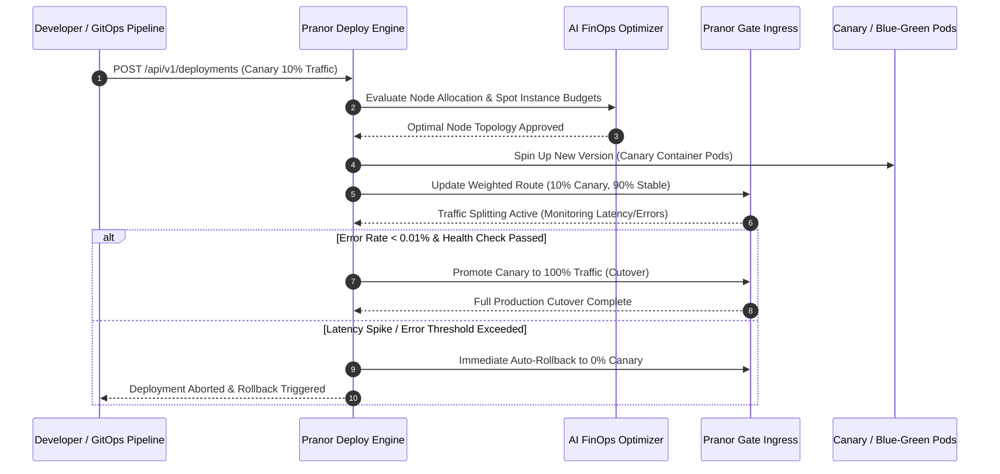

# Pranor Deploy

```bash
docker run -p 8088:8088 ghcr.io/vyuvaraj/pranor-deploy:latest
```

`Pranor Deploy` is the managed deployment platform and process orchestrator for the **Pranor** ecosystem. It provides PaaS-style service deployment, blue/green and canary strategies, per-branch preview environments, container isolation, and deep integration with `Pranor Gate` for automatic routing registration.

---

## Table of Contents
- [Key Features](#key-features)
- [Architecture](#architecture)
- [API Endpoints](#api-endpoints)
- [Deployment Strategies](#deployment-strategies)
- [Preview Environments](#preview-environments)
- [Getting Started](#getting-started)

---

## Key Features

### 🚀 Core Deployment Platform
- **PaaS deployment API**: Compile and run `.pnr` background services on demand via REST API
- **Process isolation**: Dedicated port allocation per deployment; process metrics tracking
- **Dynamic gateway routing registration**: Newly deployed services are automatically registered with `Pranor Gate` — zero manual route configuration
- **Ring-buffer log streaming**: Capture stdout/stderr into a ring buffer; stream logs via REST API
- **OTel tracing**: Deep integration with `Pranor Trace` via shared tracing — per-deployment spans

### 🔵🟢 Blue/Green Deployment
- **Zero-downtime traffic switch**: Atomic cutover — Pranor Gate switches 100% of traffic to new (green) deployment in a single atomic update
- **Instant rollback**: If issues arise, switch back to blue with one API call
- **Health gate**: Green deployment must pass health checks before cutover is triggered
- **Audit trail**: Every cutover and rollback event logged with timestamp and operator identity

### 🐤 Canary Deployment
- **Configurable traffic split**: Route a percentage (e.g., 5%, 10%, 25%) of traffic to the canary deployment
- **Automatic rollback**: Monitor error rate on canary; if it exceeds configurable threshold, automatically revert 100% traffic to stable
- **Progressive promotion**: Incrementally increase canary traffic weight on success (5% → 25% → 50% → 100%)
- **Pranor Gate integration**: Traffic split is enforced by Pranor Gate's weighted routing — no client-side changes required

### 🌿 Preview Environments
- **Per-branch preview provisioner**: Automatically create complete isolated Pranor environments per git branch — ideal for PR review workflows
- **Ephemeral lifecycle**: Preview environments are automatically cleaned up when the branch is deleted or after a configurable TTL
- **Independent routing**: Each preview gets its own Pranor Gate subdomain (e.g., `feature-x.preview.pranor.net`)
- **Full stack provisioning**: Preview environments include isolated Pranor Pulse, Pranor Vault, and Pranor Cache instances

### 🐳 Container Isolation
- **Docker/OCI container mode**: Deploy services as fully isolated containers (via Docker or OCI runtime) rather than raw processes
- **Resource limits**: Configure per-container CPU and memory limits
- **Network isolation**: Container deployments run in isolated bridge networks

---

## Architecture

```mermaid
graph TD
    classDef client fill:#1e293b,stroke:#38bdf8,stroke-width:2px,color:#fff;
    classDef engine fill:#0f172a,stroke:#0d9488,stroke-width:2px,color:#fff;
    classDef storage fill:#1e1b4b,stroke:#6366f1,stroke-width:2px,color:#fff;
    classDef monitor fill:#1e293b,stroke:#64748b,stroke-width:1px,color:#fff;

    subgraph Trigger ["🌐 Deployment Control API"]
        GitOps["GitOps Webhook & Branch Trigger"] :::client
        DeployAPI["REST Deployment API<br/><i>(POST /api/v1/deployments)</i>"] :::client
    end

    subgraph Orchestrator ["⚡ Core Deployment & FinOps Engine"]
        StrategyMgr["Deployment Strategy Manager<br/><i>(Blue/Green, Canary, Direct)</i>"] :::engine
        FinOps["AI FinOps Cloud Cost Optimizer<br/><i>(Spot Instance & Autoscaler EE)</i>"] :::engine
        ChaosSuite["Automated DR Chaos Simulation Suite<br/><i>(Enterprise EE)</i>"] :::engine
        GateReg["Pranor Gate Route Auto-Registrar"] :::engine
    end

    subgraph IsolatedEnvs ["💾 Environment Provisioning & Artifacts"]
        ContainerIso["OCI / Docker Container Isolation Engine"] :::storage
        PreviewMgr["Ephemeral Preview Environment Provisioner"] :::storage
        AirgapHub["Air-Gapped Private Artifact Registry<br/><i>(Enterprise EE)</i>"] :::storage
    end

    GitOps --> StrategyMgr
    DeployAPI --> StrategyMgr
    StrategyMgr --> FinOps
    FinOps --> ChaosSuite
    ChaosSuite --> GateReg
    GateReg --> ContainerIso
    GateReg --> PreviewMgr
    ContainerIso -.-> AirgapHub
```

### Canary Rollout & AI FinOps Promotion Sequence Flow



### Ecosystem Cross-Module Integration

Pranor Deploy automates release rollouts across all platform components:

- **Pranor Gate**: Enforces zero-downtime weighted canary traffic splits, blue/green cutovers, and preview subdomain routing.
- **Pranor Hub**: Pulls signed OCI container images, WebAssembly modules, and Helm charts for air-gapped deployments.
- **Pranor Trace**: Monitors real-time error rate budgets and latency burn rates during progressive canary rollouts.
- **Pranor Console**: Provides interactive multi-cluster deployment dashboards, 1-click rollback controls, and live container logs.

---

## API Endpoints

| Method | Path | Description |
|--------|------|-------------|
| `POST` | `/api/v1/deployments` | Deploy a service (direct, blue/green, or canary) |
| `GET` | `/api/v1/deployments` | List all deployments |
| `GET` | `/api/v1/deployments/{id}` | Get deployment status and metrics |
| `POST` | `/api/v1/deployments/{id}/promote` | Promote canary to stable |
| `POST` | `/api/v1/deployments/{id}/rollback` | Roll back to previous version |
| `POST` | `/api/v1/deployments/{id}/cutover` | Blue/Green: cut all traffic to new version |
| `GET` | `/api/v1/deployments/{id}/logs` | Stream deployment logs (ring buffer) |
| `DELETE` | `/api/v1/deployments/{id}` | Stop and remove a deployment |
| `POST` | `/api/v1/previews` | Create a preview environment for a branch |
| `GET` | `/api/v1/previews` | List active preview environments |
| `DELETE` | `/api/v1/previews/{id}` | Destroy a preview environment |
| `/metrics` | `GET` | Prometheus metrics (deployments active, error rates, rollback events) |
| `/healthz` | `GET` | Liveness probe |

---

## Deployment Strategies

### Direct Deploy
```bash
curl -X POST http://pranor-deploy:8088/api/v1/deployments \
  -d '{"service": "orders-api", "image": "ghcr.io/myorg/orders:v2.1.0", "strategy": "direct", "port": 3000}'
```

### Blue/Green Deploy
```bash
# Deploy green (new version)
curl -X POST http://pranor-deploy:8088/api/v1/deployments \
  -d '{"service": "orders-api", "image": "ghcr.io/myorg/orders:v2.2.0", "strategy": "blue-green"}'
# → { "id": "dep-456", "status": "green-standby", "green_url": "http://green-orders:3001" }

# Cut over all traffic to green
curl -X POST http://pranor-deploy:8088/api/v1/deployments/dep-456/cutover
# → Pranor Gate atomically switches all /api/orders traffic to green

# Rollback if needed
curl -X POST http://pranor-deploy:8088/api/v1/deployments/dep-456/rollback
```

### Canary Deploy
```bash
# Deploy canary at 5% traffic
curl -X POST http://pranor-deploy:8088/api/v1/deployments \
  -d '{
    "service": "orders-api",
    "image": "ghcr.io/myorg/orders:v2.3.0",
    "strategy": "canary",
    "canary_weight": 5,
    "auto_rollback_error_rate": 0.05
  }'

# Progressive promotion: 5% → 25% → 50% → 100%
curl -X POST http://pranor-deploy:8088/api/v1/deployments/dep-789/promote \
  -d '{"weight": 25}'
```

---

## Preview Environments

```bash
# Create preview environment for a feature branch
curl -X POST http://pranor-deploy:8088/api/v1/previews \
  -d '{"branch": "feature/new-checkout", "ttl": "7d"}'
# → { "id": "prev-001", "url": "https://feature-new-checkout.preview.pranor.net", "expires_at": "..." }

# Destroy preview
curl -X DELETE http://pranor-deploy:8088/api/v1/previews/prev-001
```

---

## Getting Started

```bash
docker run -p 8088:8088 \
  -e PRANOR_DEPLOY_PRANOR_GATE_URL=http://pranor-gate:8080 \
  -e PRANOR_DEPLOY_OTEL_ENDPOINT=http://pranor-trace:4318 \
  -e PRANOR_DEPLOY_CONTAINER_RUNTIME=docker \
  -v /var/run/docker.sock:/var/run/docker.sock \
  ghcr.io/vyuvaraj/pranor-deploy:latest
```

### Environment Variables

| Variable | Default | Description |
|----------|---------|-------------|
| `PRANOR_DEPLOY_PORT` | `8088` | HTTP listener port |
| `PRANOR_DEPLOY_PRANOR_GATE_URL` | — | Pranor Gate URL for route registration |
| `PRANOR_DEPLOY_OTEL_ENDPOINT` | — | OpenTelemetry collector URL |
| `PRANOR_DEPLOY_CONTAINER_RUNTIME` | `process` | `process` (raw) or `docker` (OCI container) |
| `PRANOR_DEPLOY_PREVIEW_DOMAIN` | — | Base domain for preview environments |
| `PRANOR_DEPLOY_PREVIEW_TTL` | `7d` | Default preview environment TTL |
