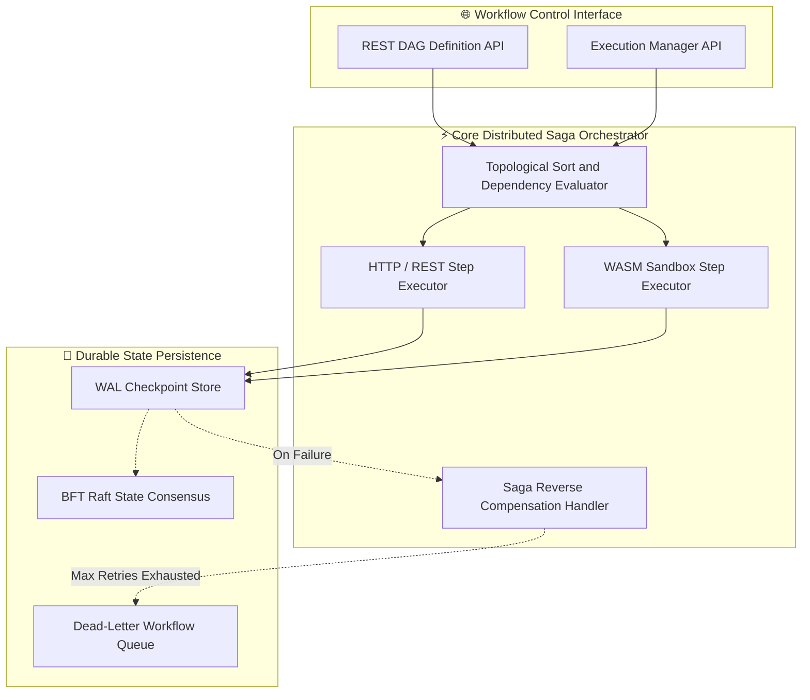
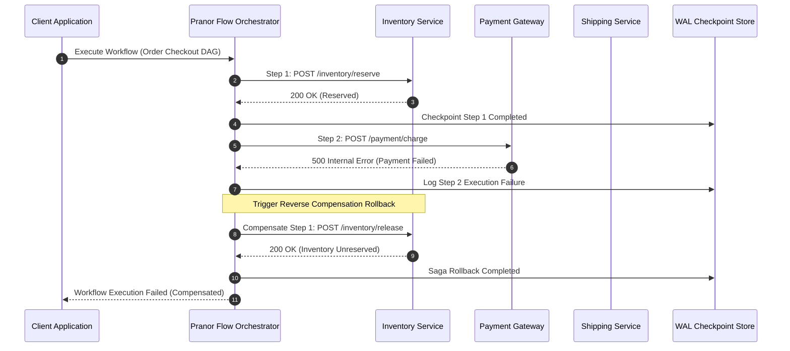

# Pranor Flow — DAG Workflow & Saga Orchestrator

**Version:** 1.0.0  
**Module Path:** `github.com/vyuvaraj/pranor/flow`  
**Default Port:** 8096  
**License:** AGPL-3.0 (OSS) / Enterprise License (EE with BFT Raft & Visual Designer)

---

## Overview

Pranor Flow is a stateful, DAG-based workflow orchestrator and Saga compensation engine for the Pranor ecosystem. It supports durable execution with checkpointing, WASM step functions, sub-workflow composition, per-execution tracing, a Dead Letter Workflow Queue with manual retry, and automatic reverse compensation on failure.

Pranor Flow can run as:
- A **standalone binary** with file-based checkpoint persistence
- An **integrated module** within the Pranor ecosystem with OTel tracing, Pranor Lock leader election, and Console visual designer

---

## Key Features

| Feature | Description |
|---------|-------------|
| **DAG Orchestration** | Multi-step execution graphs with topological sort and parallel fan-out/fan-in |
| **Saga Compensation** | Automatic reverse compensation on failure — only completed steps are rolled back |
| **Durable Execution** | WAL checkpoint persistence; resume from last successful step after restarts |
| **WASM Step Functions** | Sandboxed WASI-compliant WebAssembly step execution (Rust, C, Go) |
| **Sub-workflow Composition** | Compose workflows from reusable sub-workflows with recursive nesting |
| **Dead Letter Queue** | Failed workflows moved to DLWQ with full context and manual retry |
| **Step Output Propagation** | Each step's output becomes the next step's input |
| **Conditional Branching** | Skip steps based on upstream output conditions |
| **AI Cost Tracking** | LLM token cost annotations on spans for AI workflow steps |
| **Idempotent Replay** | Skip already-completed steps on resume for safe replay |

---

## Architecture



### Saga Execution & Compensation Sequence Flow



### Ecosystem Cross-Module Integration

Pranor Flow acts as the primary saga orchestrator across the Pranor ecosystem:

- **Pranor Pulse**: Dispatches asynchronous event triggers and listens to topic completions during long-running saga steps.
- **Pranor Trace**: Annotates every workflow execution and individual step with W3C traceparent headers, tracking LLM token costs and latency flamegraphs.
- **Pranor Lock**: Acquires distributed fencing token leases to ensure saga execution steps are evaluated by a single leader node during failover.
- **Pranor Console**: Provides a visual DAG designer, live workflow step progress tracking, and 1-click DLQ retry controls.

---

## Installation & Deployment

### Binary

```bash
cd pranor/flow
go build -o pranor-flow .
./pranor-flow --port 8096
```

### Docker

```bash
docker run -p 8096:8096 \
  -v flow-data:/data \
  ghcr.io/vyuvaraj/pranor-flow:latest
```

### With Checkpoint Persistence

```bash
./pranor-flow --port 8096 --checkpoint-dir /data/checkpoints
```

### As Part of Pranor Ecosystem

When running under the Pranor platform, Flow integrates automatically with Lock (leader election), Trace (OTel spans), Console (visual designer), and Pulse (event triggers).

---

## Configuration

### Environment Variables

| Variable | Default | Description |
|----------|---------|-------------|
| `PRANOR_FLOW_PORT` | `8096` | HTTP listener port |
| `PRANOR_FLOW_CHECKPOINT_DIR` | `./checkpoints` | Directory for workflow state checkpoint files |
| `PRANOR_FLOW_OTEL_ENDPOINT` | — | OpenTelemetry collector URL |
| `PRANOR_FLOW_WASM_MODULES_DIR` | `./wasm` | Directory for WASM step module files |
| `PRANOR_FLOW_DLQ_MAX_SIZE` | `1000` | Max workflows retained in DLQ |

### YAML Config (`flow.yaml`)

```yaml
port: "8096"
checkpoint_dir: "/data/checkpoints"
otel_endpoint: "http://pranor-trace:8090"
wasm_modules_dir: "./wasm"
dlq_max_size: 1000
```

### CLI Flags

| Flag | Default | Description |
|------|---------|-------------|
| `--port` | `8096` | HTTP listen port |
| `--checkpoint-dir` | `./checkpoints` | Checkpoint persistence directory |

---

## API Reference

**Base URL:** `http://localhost:8096`

### POST /api/workflows/define

Define a new DAG workflow.

**Request:**

```json
{
  "name": "order-fulfillment",
  "steps": [
    {
      "id": "reserve-inventory",
      "type": "http",
      "url": "http://inventory/reserve",
      "depends_on": [],
      "compensate_url": "http://inventory/release"
    },
    {
      "id": "charge-payment",
      "type": "http",
      "url": "http://payments/charge",
      "depends_on": ["reserve-inventory"],
      "compensate_url": "http://payments/refund"
    },
    {
      "id": "notify-customer",
      "type": "http",
      "url": "http://notifications/send",
      "depends_on": ["charge-payment"]
    }
  ]
}
```

**Response (201):**

```json
{
  "id": "wf-def-001",
  "name": "order-fulfillment",
  "step_count": 3,
  "status": "registered"
}
```

---

### POST /api/workflows/execute

Execute a workflow instance.

**Request:**

```json
{
  "workflow": "order-fulfillment",
  "input": { "order_id": "ord-123", "amount": 99.99 }
}
```

**Response (200):**

```json
{
  "instance_id": "wf-abc-001",
  "status": "running",
  "started_at": "2026-08-01T10:00:00Z"
}
```

---

### GET /api/workflows/instances/{id}

Get execution status and step logs.

**Response (200):**

```json
{
  "instance_id": "wf-abc-001",
  "workflow": "order-fulfillment",
  "status": "completed",
  "steps": [
    { "id": "reserve-inventory", "status": "success", "duration_ms": 45 },
    { "id": "charge-payment", "status": "success", "duration_ms": 230 },
    { "id": "notify-customer", "status": "success", "duration_ms": 12 }
  ]
}
```

---

### POST /api/workflows/resume

Resume a workflow from its last checkpoint.

**Request:**

```json
{
  "instance_id": "wf-abc-001"
}
```

**Response (200):**

```json
{
  "status": "resumed",
  "resumed_from_step": "charge-payment"
}
```

---

### GET /api/workflows/dlq

Browse Dead Letter Workflow Queue.

**Response (200):**

```json
{
  "workflows": [
    {
      "instance_id": "wf-xyz-002",
      "workflow": "order-fulfillment",
      "failed_step": "charge-payment",
      "error": "connection timeout",
      "failed_at": "2026-08-01T09:30:00Z"
    }
  ]
}
```

---

### POST /api/workflows/dlq/{id}/retry

Retry a DLQ workflow.

**Response (200):**

```json
{
  "status": "retrying",
  "instance_id": "wf-xyz-002"
}
```

---

### GET /healthz

Liveness probe.

```json
{"status":"UP","service":"pranor-flow","version":"1.0.0"}
```

---

## Security

### Standalone Mode

In standalone mode, Flow runs without authentication. Workflow callbacks are dispatched without auth headers.

### Ecosystem Mode (Full Auth Stack)

When running within the Pranor ecosystem:

1. **OTel Tracing** — every request and step execution gets a span
2. **Rate Limiting** — per-client request throttling
3. **JWT Auth** — validates Bearer tokens against Pranor Auth
4. **Tenant Isolation** — workflows scoped per tenant namespace
5. **Callback Auth** — configurable bearer token forwarded to step URLs

### WASM Sandbox Security

WASM steps execute in a sandboxed environment:
- No filesystem access beyond stdin/stdout
- Per-step execution timeout prevents runaway processes
- Memory limits enforced per WASM module

---

## Observability

### Prometheus Metrics

| Metric | Type | Description |
|--------|------|-------------|
| `pranor_flow_workflows_active` | Gauge | Currently executing workflows |
| `pranor_flow_steps_total` | Counter | Total step executions (labeled by status) |
| `pranor_flow_step_duration_ms` | Histogram | Step execution duration |
| `pranor_flow_compensations_total` | Counter | Saga compensation events |
| `pranor_flow_dlq_depth` | Gauge | Dead letter queue depth |
| `pranor_flow_checkpoints_total` | Counter | Checkpoint writes |

### OpenTelemetry Tracing

Every workflow and step generates OTel spans:
- `flow.workflow.execute` — root workflow span
- `flow.step.http` — HTTP step execution
- `flow.step.wasm` — WASM step execution
- `flow.saga.compensate` — compensation rollback
- `flow.dlq.enqueue` — DLQ enqueue event

### Logging

Structured JSON logs with fields: `level`, `timestamp`, `trace_id`, `instance_id`, `step_id`, `status`, `duration_ms`.

---

## Enterprise Edition

| Feature | OSS | EE |
|---------|:---:|:--:|
| DAG workflow orchestration | ✓ | ✓ |
| Saga compensation | ✓ | ✓ |
| Checkpoint persistence | ✓ | ✓ |
| WASM step functions | ✓ | ✓ |
| Sub-workflow composition | ✓ | ✓ |
| Dead letter queue | ✓ | ✓ |
| OTel tracing | ✓ | ✓ |
| BFT Raft state consensus | — | ✓ |
| Visual DAG designer UI | — | ✓ |
| AI cost tracking per step | — | ✓ |
| Multi-cluster workflow federation | — | ✓ |
| Event-driven triggers (Pranor Pulse) | — | ✓ |

---

## Operational Runbook

### Workflow stuck in "running" state

1. Check `/api/workflows/instances/{id}` for step-level status
2. Identify which step is blocking — check its callback URL health
3. If step timed out, the workflow may be waiting for checkpoint write
4. Resume from checkpoint: `POST /api/workflows/resume`
5. If stuck permanently, check disk space for checkpoint directory

### Saga compensation failing

1. Check compensate_url endpoints are reachable and returning 200
2. Review logs for compensation step errors
3. Compensations are best-effort — if they fail, manual intervention required
4. Check `pranor_flow_compensations_total` metric for failure patterns

### DLQ growing unbounded

1. Monitor `pranor_flow_dlq_depth` gauge
2. Review failed workflows in DLQ for common error patterns
3. Fix root cause (downstream service, timeout, etc.)
4. Retry workflows: `POST /api/workflows/dlq/{id}/retry`
5. Adjust `PRANOR_FLOW_DLQ_MAX_SIZE` to prevent memory issues

### WASM steps timing out

1. Check `PRANOR_FLOW_WASM_MODULES_DIR` for module availability
2. Review step timeout configuration in workflow definition
3. Check WASM module for infinite loops or excessive memory allocation
4. Monitor `pranor_flow_step_duration_ms` histogram for WASM steps
