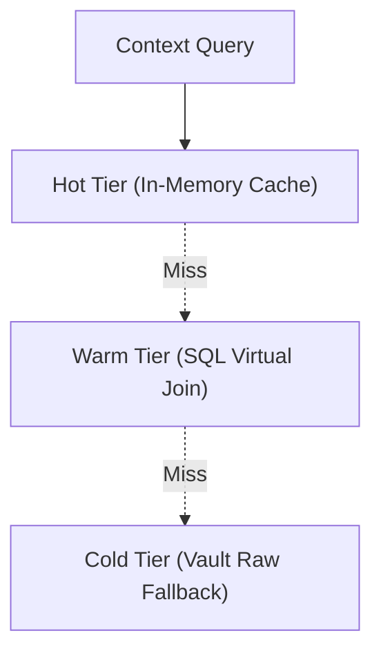

# Pranor Graph — Entity Context Layer

**Version:** 2.0.0-dev  
**Module Path:** `github.com/vyuvaraj/pranor/graph`  
**License:** AGPL-3.0 (OSS) / EE

---

## Overview

Pranor Graph provides a virtual entity context assembly layer linking Pranor Pool, Cache, and Vault. It is part of the v2.0 AI Execution Fabric.

---

## Key Features

| Tier | Latency | Source | Description |
|------|---------|--------|-------------|
| **Hot tier** | <2ms | In-memory | Local memory cache for ultra-fast context retrieval |
| **Warm tier** | ~10-50ms | SQL virtual join | Database queries joining structured data |
| **Cold tier** | >50ms | Raw fallback | S3/Vault unstructured data fallback |

---

## Architecture



### Fail-closed Contract
Pranor Graph guarantees a fail-closed contract: it returns `ErrGraphContextUnavailable` on all-tier exhaustion to ensure AI models never receive partial context.

---

## API Reference

### GraphProvider Interface

```go
type GraphProvider interface {
    Query(ctx context.Context, q ContextQuery) (ContextResult, error)
    Invalidate(ctx context.Context, entityID, tenantID string) error
    HealthCheck(ctx context.Context) error
}
```

### Types

**ContextQuery**
Struct representing a query to assemble context for an entity.

**ContextResult**
Struct returning the assembled entity context payload.

---

## Zero-CGO constraint
`CGO_ENABLED=0`, all EE features are implemented via a gRPC sidecar.

---

## Quick Start

```go
provider := graph.NewProvider(cfg)
ctx := context.Background()

result, err := provider.Query(ctx, graph.ContextQuery{
    EntityID: "user_123",
    TenantID: "tenant_456",
})
if err != nil {
    // Fails closed on exhaustion
    log.Fatal(err)
}
fmt.Println(result)
```

---

## Enterprise Edition

| Feature | OSS | EE |
|---------|:---:|:--:|
| In-memory hot cache | ✓ | ✓ |
| SQL stub | ✓ | ✓ |
| Cross-datacenter sync | — | ✓ |
| RBAC isolation | — | ✓ |
| Distributed invalidation | — | ✓ |
