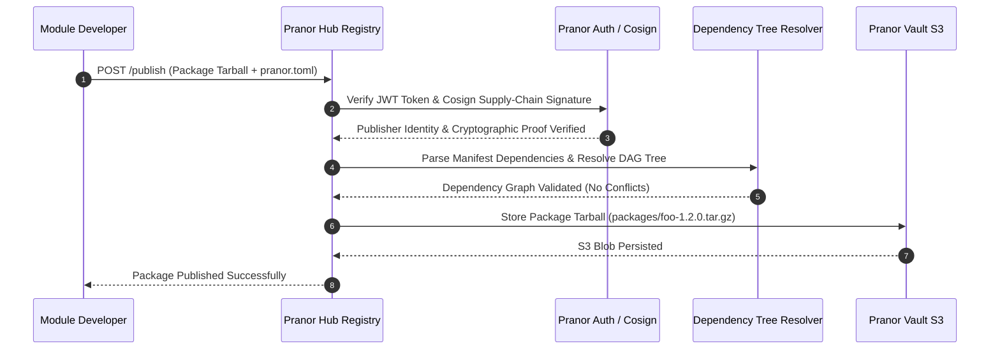

# Pranor Hub

```bash
docker run -p 8090:8090 ghcr.io/vyuvaraj/pranor-hub:latest
```

Pranor Hub is the lightweight, S3-backed community package hub and registry server for the Pranor ecosystem. It allows sharing, versioning, and resolving packages written for `pranor` microservices.

## Features

- **S3 / Pranor Vault Backend**: Packages are stored as tarballs in a dedicated S3 bucket (or `Pranor Vault`).
- **Dependency Resolution**: Exposes APIs to resolve package dependency trees dynamically.
- **Token Authorization**: Supports JWT signature verification to protect package publication.
- **Ecosystem Landing Dashboard**: Built-in web dashboard displaying active packages, sizes, and versions.

## Architecture

```mermaid
graph TD
    classDef client fill:#1e293b,stroke:#38bdf8,stroke-width:2px,color:#fff;
    classDef engine fill:#0f172a,stroke:#0d9488,stroke-width:2px,color:#fff;
    classDef storage fill:#1e1b4b,stroke:#6366f1,stroke-width:2px,color:#fff;
    classDef monitor fill:#1e293b,stroke:#64748b,stroke-width:1px,color:#fff;

    subgraph PackageClients ["🌐 CLI & Package Registry API"]
        CLI["pranor-cli Package Manager"] :::client
        PublishAPI["REST Package Publishing API<br/><i>(POST /publish)</i>"] :::client
        RegistryDash["Package Registry Landing UI"] :::client
    end

    subgraph RegistryCore ["⚡ Package Resolver & Security Engine"]
        ManifestParser["pranor.toml Manifest Inspector"] :::engine
        DepResolver["Dependency Graph Resolver Engine"] :::engine
        CosignVerifier["Cosign / Sigstore Supply-Chain Verification<br/><i>(Enterprise EE)</i>"] :::engine
        JWTAuth["JWT Signature & Publisher Verifier"] :::engine
    end

    subgraph StorageLayer ["💾 S3 & Vault Package Store"]
        VaultStore["Pranor Vault S3 Bucket Tarball Storage"] :::storage
        ColdArchive["Air-Gapped Private Package Mirror<br/><i>(Enterprise EE)</i>"] :::storage
    end

    CLI --> ManifestParser
    PublishAPI --> ManifestParser
    RegistryDash --> ManifestParser
    ManifestParser --> DepResolver
    DepResolver --> CosignVerifier
    CosignVerifier --> JWTAuth
    JWTAuth --> VaultStore
    VaultStore -.-> ColdArchive
```

### Package Publish & Dependency Resolution Sequence Flow



### Ecosystem Cross-Module Integration

Pranor Hub acts as the official artifact and WebAssembly module registry for the Pranor platform:

- **Pranor Deploy**: Pulls signed WebAssembly security modules, OCI container images, and deployment manifests during canary rollouts.
- **Pranor Gate**: Downloads compiled WASM dynamic policy plugins published to Hub repositories.
- **Pranor Vault**: Serves as the high-availability S3 storage backend for all published package tarballs and signatures.
- **Pranor Auth**: Enforces RBAC permissions for organization-scoped package publishing and team access control.

---

### 1. Health Checks
- `GET /healthz` - Health probe.
- `GET /readyz` - Readiness probe.

### 2. Publish Package
- `POST /publish` or `POST /api/v1/publish`
  - Uploads a package tarball (`.tar.gz`).
  - Expects a `pranor.toml` manifest file in the root of the archive to parse the package name, version, and dependencies.
  - If `PRANOR_JWT_SECRET` is enabled, requires a valid token via the `Authorization: Bearer <token>` header.

### 3. Fetch Package Tarball
- `GET /packages/{name}.tar.gz` or `GET /api/v1/packages/{name}.tar.gz`
  - Fetches the latest published version of the package.
- `GET /packages/{name}/{version}/{name}-{version}.tar.gz` or `GET /api/v1/packages/{name}/{version}/{name}-{version}.tar.gz`
  - Fetches a specific version of the package.

### 4. Search Packages
- `GET /api/packages/search?q={query}` or `GET /api/v1/packages/search?q={query}`
  - Returns a list of packages matching the query string.

### 5. Listing and Dependencies
- `GET /api/packages/` or `GET /api/v1/packages/`
  - Lists all packages in the registry.
- `GET /api/packages/{name}/versions` or `GET /api/v1/packages/{name}/versions`
  - Retrieves all published versions of a package.
- `GET /api/packages/{name}/deps` or `GET /api/packages/{name}/deps`
  - Returns the resolved dependency tree for the latest package version.
- `GET /api/packages/{name}/{version}/deps` or `GET /api/packages/{name}/{version}/deps`
  - Returns the resolved dependency tree for a specific version.

## Configuration (Environment Variables)

| Variable | Description | Default |
|----------|-------------|---------|
| `PORT` | Local server port | `8088` |
| `PRANOR_STORE_ENDPOINT` | Pranor Vault or external S3 URL | `http://localhost:9000` |
| `PRANOR_STORE_ACCESS_KEY` | Access key for S3 bucket | `admin` |
| `PRANOR_STORE_SECRET_KEY` | Secret key for S3 bucket | `admin123` |
| `PRANOR_JWT_SECRET` | Secret key to validate signature for publishing | *(Disabled)* |

## Running Locally

```bash
go run main.go --addr :8088 --s3-endpoint http://localhost:9000
```
