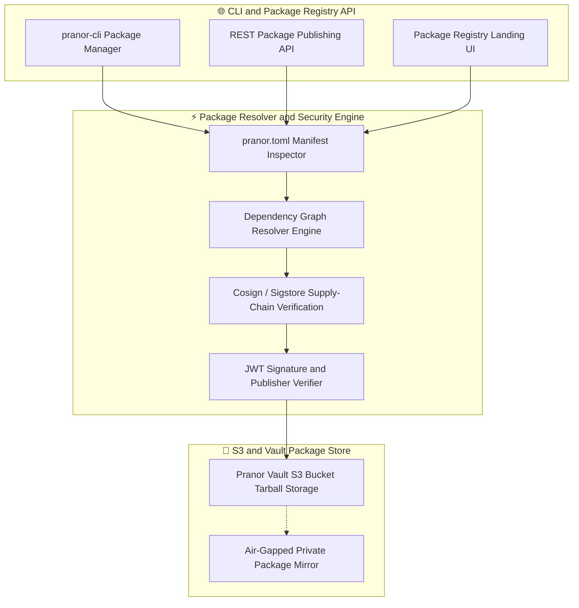
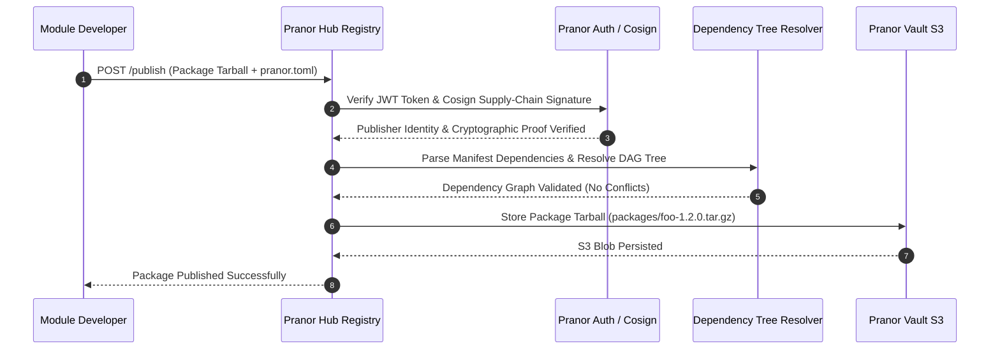

# Pranor Hub — Package Registry & Artifact Store

**Version:** 1.0.0  
**Module Path:** `github.com/vyuvaraj/pranor/hub`  
**Default Port:** 8088  
**License:** AGPL-3.0 (OSS) / Enterprise License (EE with OCI backend & Air-gapped Mirror)

---

## Overview

Pranor Hub is the lightweight, S3-backed package registry and artifact store for the Pranor ecosystem. It provides package publishing, semver resolution, dependency graph analysis, Cosign supply-chain verification, JWT-authenticated publishing, and a built-in landing dashboard for browsing packages.

Pranor Hub can run as:
- A **standalone binary** with S3-compatible storage backend
- An **integrated module** within the Pranor ecosystem with Pranor Vault storage, Auth RBAC, and OCI container image support

---

## Key Features

| Feature | Description |
|---------|-------------|
| **S3 / Pranor Vault Backend** | Packages stored as tarballs in S3-compatible storage |
| **Semver Resolution** | Semantic versioning with dependency tree resolution |
| **Cosign Verification** | Sigstore supply-chain signature verification on publish |
| **JWT Authorization** | Token-based authentication for package publishing |
| **Dependency Graph** | Resolve and visualize full dependency trees |
| **Package Search** | Full-text search across package names and metadata |
| **Version History** | Browse all published versions per package |
| **Landing Dashboard** | Built-in web UI displaying packages, sizes, and versions |
| **pranor.toml Manifests** | Standard manifest format for package metadata |
| **OCI Backend** | Store and distribute packages as OCI artifacts |

---

## Architecture



### Package Publish & Dependency Resolution Sequence Flow



### Ecosystem Cross-Module Integration

Pranor Hub acts as the official artifact and WebAssembly module registry for the Pranor platform:

- **Pranor Deploy**: Pulls signed WebAssembly security modules, OCI container images, and deployment manifests during canary rollouts.
- **Pranor Gate**: Downloads compiled WASM dynamic policy plugins published to Hub repositories.
- **Pranor Vault**: Serves as the high-availability S3 storage backend for all published package tarballs and signatures.
- **Pranor Auth**: Enforces RBAC permissions for organization-scoped package publishing and team access control.

---

## Installation & Deployment

### Binary

```bash
cd pranor/hub
go build -o pranor-hub .
./pranor-hub --addr :8088 --s3-endpoint http://localhost:9000
```

### Docker

```bash
docker run -p 8088:8088 ghcr.io/vyuvaraj/pranor-hub:latest
```

### With Pranor Vault Storage

```bash
./pranor-hub --addr :8088 \
  --s3-endpoint http://pranor-vault:7070 \
  --s3-access-key admin \
  --s3-secret-key admin123
```

### As Part of Pranor Ecosystem

When running under the Pranor platform, Hub integrates automatically with Vault (storage), Auth (RBAC), Deploy (artifact pull), and Gate (WASM module distribution).

---

## Configuration

### Environment Variables

| Variable | Default | Description |
|----------|---------|-------------|
| `PORT` | `8088` | HTTP server port |
| `PRANOR_STORE_ENDPOINT` | `http://localhost:9000` | Pranor Vault or external S3 URL |
| `PRANOR_STORE_ACCESS_KEY` | `admin` | S3 access key |
| `PRANOR_STORE_SECRET_KEY` | `admin123` | S3 secret key |
| `PRANOR_JWT_SECRET` | — | JWT secret for publish authentication (disabled if unset) |
| `PRANOR_HUB_OTEL_ENDPOINT` | — | OpenTelemetry collector URL |

### YAML Config (`hub.yaml`)

```yaml
port: "8088"
store_endpoint: "http://pranor-vault:7070"
store_access_key: "admin"
store_secret_key: "admin123"
jwt_secret: "my-signing-secret"
otel_endpoint: "http://pranor-trace:8090"
```

### CLI Flags

| Flag | Default | Description |
|------|---------|-------------|
| `--addr` | `:8088` | HTTP listen address |
| `--s3-endpoint` | `http://localhost:9000` | S3-compatible storage endpoint |

---

## API Reference

**Base URL:** `http://localhost:8088`  
**API Version:** `/api/v1/` (recommended) or `/api/` (legacy)

### POST /api/v1/publish

Publish a package tarball.

**Headers:**
- `Authorization: Bearer <jwt-token>` (required if `PRANOR_JWT_SECRET` is set)
- `Content-Type: multipart/form-data`

**Request:** Multipart upload with `.tar.gz` file containing `pranor.toml` manifest.

**Response (201):**

```json
{
  "status": "published",
  "package": "my-module",
  "version": "1.2.0",
  "checksum": "sha256:abc123..."
}
```

---

### GET /api/v1/packages

List all packages in the registry.

**Response (200):**

```json
{
  "packages": [
    { "name": "my-module", "latest_version": "1.2.0", "published_at": "2026-08-01T10:00:00Z" },
    { "name": "utils-lib", "latest_version": "0.5.3", "published_at": "2026-07-28T14:30:00Z" }
  ]
}
```

---

### GET /api/v1/packages/{name}/versions

List all versions of a package.

**Response (200):**

```json
{
  "name": "my-module",
  "versions": ["1.0.0", "1.1.0", "1.2.0"]
}
```

---

### GET /api/v1/packages/{name}/deps

Resolve dependency tree for the latest version.

**Response (200):**

```json
{
  "package": "my-module",
  "version": "1.2.0",
  "dependencies": [
    { "name": "utils-lib", "version": ">=0.5.0", "resolved": "0.5.3" },
    { "name": "crypto-core", "version": "^2.0.0", "resolved": "2.1.1" }
  ]
}
```

---

### GET /api/v1/packages/search?q={query}

Search packages by name or metadata.

**Response (200):**

```json
{
  "results": [
    { "name": "my-module", "description": "Core utility module", "latest_version": "1.2.0" }
  ]
}
```

---

### GET /packages/{name}.tar.gz

Download the latest version tarball.

### GET /packages/{name}/{version}/{name}-{version}.tar.gz

Download a specific version tarball.

---

### GET /healthz

Liveness probe.

```json
{"status":"UP","service":"pranor-hub","version":"1.0.0"}
```

---

## Security

### Standalone Mode

When `PRANOR_JWT_SECRET` is unset, publishing is unauthenticated. Set the JWT secret to require token authentication for all publish operations.

### Ecosystem Mode (Full Auth Stack)

When running within the Pranor ecosystem:

1. **JWT Auth** — validates Bearer tokens against Pranor Auth
2. **Cosign Verification** — supply-chain signature validation on published artifacts
3. **RBAC** — organization-scoped publish permissions via Pranor Auth roles
4. **Artifact Signing** — all published packages signed with Sigstore transparency log

### Package Integrity

- Packages are checksummed (SHA-256) on upload
- Cosign signatures verify publisher identity and build provenance
- Immutable versions — once published, a version cannot be overwritten

---

## Observability

### Prometheus Metrics

| Metric | Type | Description |
|--------|------|-------------|
| `pranor_hub_packages_total` | Gauge | Total registered packages |
| `pranor_hub_publishes_total` | Counter | Publish events (labeled by status) |
| `pranor_hub_downloads_total` | Counter | Package downloads |
| `pranor_hub_resolution_duration_ms` | Histogram | Dependency resolution time |
| `pranor_hub_storage_bytes` | Gauge | Total storage used |

### OpenTelemetry Tracing

Hub emits spans for:
- `hub.publish` — package publication
- `hub.resolve` — dependency tree resolution
- `hub.download` — package download
- `hub.verify` — Cosign signature verification

### Logging

Structured JSON logs with fields: `level`, `timestamp`, `trace_id`, `package`, `version`, `action`, `publisher`.

---

## Enterprise Edition

| Feature | OSS | EE |
|---------|:---:|:--:|
| S3-backed package storage | ✓ | ✓ |
| Semver dependency resolution | ✓ | ✓ |
| JWT publish authentication | ✓ | ✓ |
| Package search | ✓ | ✓ |
| Landing dashboard UI | ✓ | ✓ |
| Cosign supply-chain verification | ✓ | ✓ |
| OCI container image backend | — | ✓ |
| Air-gapped private package mirror | — | ✓ |
| Organization-scoped RBAC publishing | — | ✓ |
| Vulnerability scanning on publish | — | ✓ |
| Package deprecation & yanking | — | ✓ |

---

## Operational Runbook

### Package publish failing with auth error

1. Verify `PRANOR_JWT_SECRET` is configured correctly
2. Check JWT token validity and expiration
3. Ensure the publishing user has the correct RBAC role
4. If using Cosign, verify the signing key is available

### Dependency resolution failing

1. Check if all declared dependencies exist in the registry
2. Review version constraints in `pranor.toml` for conflicts
3. Check for circular dependency chains
4. Monitor `pranor_hub_resolution_duration_ms` for timeout issues

### S3 storage backend unavailable

1. Verify `PRANOR_STORE_ENDPOINT` connectivity
2. Check S3 access key/secret key credentials
3. Verify the target bucket exists and has correct permissions
4. If using Pranor Vault, check Vault health endpoint

### Slow package downloads

1. Check S3 backend latency and throughput
2. Review `pranor_hub_downloads_total` for traffic spikes
3. Consider using a CDN or regional cache in front of Hub
4. Verify network bandwidth between Hub and storage backend
