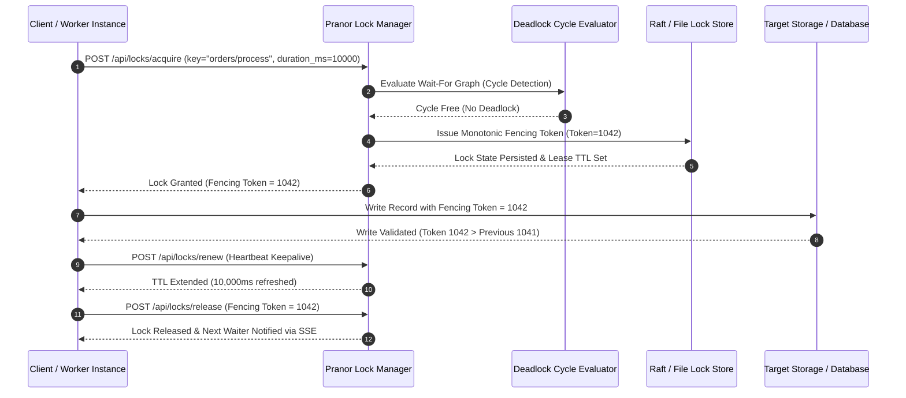

# Pranor Lock — Distributed Lock Manager

**Version:** 1.0.0  
**Module Path:** `github.com/vyuvaraj/pranor/lock`  
**Default Port:** 8089  
**License:** AGPL-3.0 (OSS) / Enterprise License (EE with Raft consensus)

---

## Overview

Pranor Lock is a lightweight, production-grade distributed lock manager that provides lease-based mutual exclusion for coordinating access to shared resources across services. It supports exclusive and shared lock modes, priority-based wait queues, deadlock detection, fencing tokens, reentrant locks, real-time event streaming, and client heartbeat monitoring.

Pranor Lock can run as:
- A **standalone binary** with zero external dependencies (memory or file-backed)
- An **integrated module** within the Pranor ecosystem with mTLS, RBAC, and OTel tracing

---

## Table of Contents

- [Key Features](#key-features)
- [Architecture](#architecture)
- [Installation & Deployment](#installation--deployment)
- [Configuration](#configuration)
- [API Reference](#api-reference)
- [Lock Semantics](#lock-semantics)
- [Storage Backends](#storage-backends)
- [Security](#security)
- [Observability](#observability)
- [Client Libraries](#client-libraries)
- [Enterprise Edition](#enterprise-edition)
- [Operational Runbook](#operational-runbook)

---

## Key Features

| Feature | Description |
|---------|-------------|
| **Lease-based TTL locks** | Every lock has an expiry. No permanent deadlocks from crashed clients. |
| **Exclusive & Shared modes** | Read-write lock semantics. Multiple shared readers, single exclusive writer. |
| **Fencing tokens** | Monotonically increasing tokens prevent stale clients from corrupting state. |
| **Reentrant locks** | Same owner+client_id can re-acquire without blocking. Reentrancy count tracked. |
| **Priority wait queues** | Waiters are served in priority order. Higher priority clients jump the queue. |
| **Deadlock detection** | Cycle detection in the wait-for graph prevents distributed deadlocks. |
| **Blocking acquire** | Optional `wait_ms` parameter blocks until lock is available or timeout. |
| **Real-time SSE events** | Subscribe to lock lifecycle events (released, expired) via Server-Sent Events. |
| **Client heartbeats** | Dead client detection — locks auto-release when heartbeats stop. |
| **File persistence** | Optional file-backed storage survives process restarts. |
| **Zombie lock alerts** | Logs a warning when locks are held longer than 5 seconds. |
| **Prometheus metrics** | Active locks, waiter count, deadlock counter. |

---

## Architecture

```mermaid
graph TD
    classDef client fill:#1e293b,stroke:#38bdf8,stroke-width:2px,color:#fff;
    classDef engine fill:#0f172a,stroke:#0d9488,stroke-width:2px,color:#fff;
    classDef storage fill:#1e1b4b,stroke:#6366f1,stroke-width:2px,color:#fff;
    classDef monitor fill:#1e293b,stroke:#64748b,stroke-width:1px,color:#fff;

    subgraph API ["🌐 Access & Stream Interface"]
        REST["HTTP REST API<br/><i>(Acquire / Release / Renew)</i>"] :::client
        Auth["Auth & Security Layer<br/><i>(mTLS / JWT / API Key)</i>"] :::client
        SSE["SSE Pub/Sub Stream<br/><i>(Real-Time Lock Events)</i>"] :::client
    end

    subgraph Core ["⚡ Core Distributed Lock Engine"]
        Reentrant["Reentrancy & Lease Engine<br/><i>(Exclusive & Shared Modes)</i>"] :::engine
        Fencing["Monotonic Fencing Token Generator"] :::engine
        Deadlock["Deadlock Cycle Detector<br/><i>(Wait-For Graph Evaluator)</i>"] :::engine
        Priority["Priority Wait Queue Manager"] :::engine
    end

    subgraph Backend ["💾 Persisted Lock Store"]
        MemStore["In-Memory Lock Store<br/><i>(Zero-Allocation)</i>"] :::storage
        FileStore["File-Backed Lease Store"] :::storage
        RaftStore["Raft Consensus Engine<br/><i>(Enterprise EE)</i>"] :::storage
    end

    subgraph Background ["⏱️ Background Monitors"]
        TTLCleaner["TTL Lease Evictor<br/><i>(500ms Sweep)</i>"] :::monitor
        Heartbeat["Client Heartbeat Monitor"] :::monitor
    end

    REST --> Auth
    Auth --> Reentrant
    Reentrant --> Fencing
    Fencing --> Deadlock
    Deadlock --> Priority
    Priority --> MemStore
    Priority --> FileStore
    Priority --> RaftStore
    TTLCleaner -.-> MemStore
    Heartbeat -.-> Reentrant
    Reentrant --> SSE
```

### Lease Acquisition & Fencing Token Sequence Flow



### Ecosystem Cross-Module Integration

Pranor Lock provides distributed synchronization across all core ecosystem components:

- **Pranor Chrono**: Uses exclusive fencing token locks to ensure distributed cron jobs trigger on exactly one node during multi-replica deployments.
- **Pranor Flow**: Manages saga execution state locks, preventing concurrent workers from processing duplicate saga compensation steps.
- **Pranor Pool**: Coordinates online database DDL migrations, ensuring zero-downtime schema changes are executed by a single leader node.
- **Pranor Auth**: Enforces single-session user login restrictions across clusters when configured in strict single-tenant security mode.
- **Pranor Trace**: Emits lock contention metrics, wait-queue durations, and deadlock cycle detections directly to OpenTelemetry traces.

---

## Installation & Deployment

### Binary

```bash
cd pranor/lock
go build -o pranor-lock .
./pranor-lock --port 8089
```

### Docker

```bash
docker run -p 8089:8089 ghcr.io/vyuvaraj/pranor-lock:latest
```

### With Config File

```bash
./pranor-lock --config lock.yaml
```

### As Part of Pranor Ecosystem

When running under the Pranor platform, Lock integrates automatically with Auth (JWT/mTLS), Trace (OTel spans), and Console (dashboard visibility).

---

## Configuration

### YAML Config (`lock.yaml`)

```yaml
port: "8089"
backend: "file"          # "memory" or "file"
file_path: "leases.json" # Only used when backend is "file"
api_key: "your-secret"   # Optional: standalone API key auth
tls_cert: ""             # Path to TLS certificate
tls_key: ""              # Path to TLS private key
client_ca: ""            # Path to CA cert for mTLS client verification
```

### Environment Variables

| Variable | Default | Description |
|----------|---------|-------------|
| `PRANOR_LOCK_API_KEY` | — | API key for standalone auth |
| `PRANOR_OTLP_ENDPOINT` | — | OpenTelemetry collector URL |

### CLI Flags

| Flag | Default | Description |
|------|---------|-------------|
| `--port` | `8089` | HTTP listen port |
| `--config` | — | Path to YAML config file |

---

## API Reference

**Base URL:** `http://localhost:8089`  
**API Version:** `/api/v1/` (recommended) or `/api/` (legacy)

### POST /api/locks/acquire

Acquire a distributed lock.

**Request:**

```json
{
  "key": "orders/processing",
  "owner": "worker-1",
  "client_id": "instance-abc",
  "duration_ms": 30000,
  "wait_ms": 5000,
  "mode": "exclusive",
  "priority": 10
}
```

| Field | Type | Required | Description |
|-------|------|----------|-------------|
| `key` | string | ✓ | Lock identifier (namespace/resource) |
| `owner` | string | ✓ | Who is requesting the lock |
| `client_id` | string | | Instance identifier (enables reentrancy) |
| `duration_ms` | int | | Lease TTL in ms (default: 10000) |
| `wait_ms` | int | | Block until lock available (0 = fail immediately) |
| `mode` | string | | `"exclusive"` (default) or `"shared"` |
| `priority` | int | | Higher = served first in wait queue |

**Success Response (200):**

```json
{
  "status": "success",
  "lock": {
    "key": "orders/processing",
    "owner": "worker-1",
    "client_id": "instance-abc",
    "reentrancy_count": 1,
    "fencing_token": 42,
    "expires_at": "2026-08-01T10:00:30Z",
    "mode": "exclusive",
    "acquired_at": "2026-08-01T10:00:00Z"
  }
}
```

**Conflict Response (409):**

```json
{
  "status": "failed",
  "message": "lock conflict: key \"orders/processing\" is held in mode \"exclusive\""
}
```

**Deadlock Response (409):**

```json
{
  "status": "failed",
  "message": "deadlock detected: cycle in lock wait queue"
}
```

---

### POST /api/locks/release

Release a held lock.

**Request:**

```json
{
  "key": "orders/processing",
  "owner": "worker-1",
  "fencing_token": 42
}
```

| Field | Type | Required | Description |
|-------|------|----------|-------------|
| `key` | string | ✓ | Lock to release |
| `owner` | string | ✓ | Must match the lock holder |
| `fencing_token` | int64 | | If provided, must match (prevents stale releases) |

**Response (200):**

```json
{
  "status": "success",
  "message": "Lock released successfully"
}
```

---

### POST /api/locks/renew

Extend the lease of an active lock.

**Request:**

```json
{
  "key": "orders/processing",
  "owner": "worker-1",
  "fencing_token": 42,
  "duration_ms": 30000
}
```

**Response (200):**

```json
{
  "status": "success",
  "message": "Lock lease renewed successfully"
}
```

---

### POST /api/locks/heartbeat

Ping to indicate client is alive. If heartbeats stop for >5s, all locks held by that client are auto-released.

**Request:**

```json
{
  "client_id": "instance-abc"
}
```

**Response (200):**

```json
{
  "status": "success"
}
```

---

### GET /api/locks/observability

List all active locks with their waiters.

**Response (200):**

```json
[
  {
    "key": "orders/processing",
    "owner": "worker-1",
    "fencing_token": 42,
    "expires_at": "2026-08-01T10:00:30Z",
    "waiters": ["worker-2", "worker-3"]
  }
]
```

---

### GET /api/locks/metrics

Prometheus-compatible metrics endpoint.

**Response (200 text/plain):**

```
# HELP pranor_lock_active_locks Number of active locks currently held
# TYPE pranor_lock_active_locks gauge
pranor_lock_active_locks 3

# HELP pranor_lock_waiters_count Total number of clients waiting for locks
# TYPE pranor_lock_waiters_count gauge
pranor_lock_waiters_count 1

# HELP pranor_lock_deadlocks_total Total number of deadlocks detected
# TYPE pranor_lock_deadlocks_total counter
pranor_lock_deadlocks_total 0
```

---

### GET /api/locks/subscribe

Server-Sent Events stream for real-time lock lifecycle events.

**Response (text/event-stream):**

```
: keep-alive

data: {"key":"orders/processing","action":"released"}

data: {"key":"inventory/update","action":"expired"}
```

Events:
- `released` — lock explicitly released by owner
- `expired` — lock TTL expired or client heartbeat timed out

---

### GET /healthz

Liveness probe.

```json
{"status":"UP","service":"pranor","version":"1.0.0"}
```

### GET /readyz

Readiness probe. Same format as healthz.

---

## Lock Semantics

### Exclusive Mode (Default)

Only one owner can hold the lock. All other acquire attempts either fail immediately or block (if `wait_ms` > 0).

```
Worker-1: acquire("key", exclusive) → ✓ granted
Worker-2: acquire("key", exclusive) → ✗ conflict (or blocks)
Worker-1: release("key") → ✓
Worker-2: (if waiting) → ✓ auto-granted
```

### Shared Mode

Multiple owners can hold a shared lock simultaneously. Exclusive requests block until all shared locks are released.

```
Reader-1: acquire("key", shared) → ✓ granted
Reader-2: acquire("key", shared) → ✓ granted (concurrent)
Writer-1: acquire("key", exclusive) → ✗ blocks (shared locks active)
Reader-1: release → ✓
Reader-2: release → ✓
Writer-1: → ✓ auto-granted (all readers done)
```

### Reentrancy

If the same `owner` + `client_id` acquires a lock they already hold, the reentrancy count increments. The lock is only fully released when the count reaches zero.

```
Worker-1: acquire("key") → reentrancy_count: 1
Worker-1: acquire("key") → reentrancy_count: 2 (no block)
Worker-1: release("key") → reentrancy_count: 1 (still held)
Worker-1: release("key") → reentrancy_count: 0 (fully released)
```

### Fencing Tokens

Every lock acquisition generates a monotonically increasing fencing token. Downstream systems should validate the token to reject operations from stale lock holders:

```
Worker-1: acquire → fencing_token: 41
Worker-1: crashes, lock expires
Worker-2: acquire → fencing_token: 42
Worker-1: wakes up, tries write with token 41 → REJECTED
Worker-2: writes with token 42 → ACCEPTED
```

### Deadlock Detection

When `wait_ms` > 0, the engine checks for cycles in the wait-for graph before queueing:

```
Worker-A holds Lock-X, waiting for Lock-Y
Worker-B holds Lock-Y, waiting for Lock-X
→ Cycle detected → "deadlock detected" error returned immediately
```

### Priority Queue

When multiple waiters exist for a lock, they are served in descending priority order (higher number = higher priority):

```
Worker-A (priority: 1) waiting
Worker-B (priority: 10) waiting
Worker-C (priority: 5) waiting
Lock released → Worker-B gets it first
```

---

## Storage Backends

### InMemory (Default)

- Zero configuration
- All state in memory
- Lost on restart
- Best for: development, testing, ephemeral workloads

### File-Backed

- Persists leases to JSON file (`leases.json`)
- Survives process restarts
- Loads non-expired leases on startup
- Best for: single-node production, edge deployments

```yaml
backend: "file"
file_path: "/var/pranor/lock/leases.json"
```

### Raft Consensus (Enterprise)

- Multi-node replication
- Strong consistency
- Automatic leader election
- Best for: production HA deployments

---

## Security

### Standalone Mode (API Key)

Set `PRANOR_LOCK_API_KEY` or configure in YAML. Clients authenticate via:

```
X-API-Key: your-secret
```

or:

```
Authorization: Bearer your-secret
```

Health endpoints (`/healthz`, `/readyz`) are unauthenticated.

### Ecosystem Mode (Full Auth Stack)

When running within the Pranor ecosystem (no API key configured), the full middleware chain activates:

1. **OTel Tracing** — every request gets a span
2. **Rate Limiting** — per-client request throttling
3. **CORS** — cross-origin request handling
4. **Max Body Size** — 10MB request body limit
5. **JWT Auth** — validates Bearer tokens against Pranor Auth
6. **Tenant Isolation** — multi-tenant namespace enforcement

### mTLS

Enable mutual TLS for service-to-service authentication:

```yaml
tls_cert: "/certs/lock.crt"
tls_key: "/certs/lock.key"
client_ca: "/certs/ca.crt"
```

---

## Observability

### Metrics

| Metric | Type | Description |
|--------|------|-------------|
| `pranor_lock_active_locks` | Gauge | Currently held locks |
| `pranor_lock_waiters_count` | Gauge | Clients waiting in queues |
| `pranor_lock_deadlocks_total` | Counter | Total deadlocks detected |

### Real-time Events (SSE)

Connect to `/api/locks/subscribe` for real-time lock state changes. Useful for building dashboards or triggering downstream workflows.

### Zombie Lock Alerts

Locks held longer than 5 seconds generate a log warning:

```
[Warning] Zombie Lock Alert: Lock on "orders/processing" was held for 12.3s
```

### Heartbeat Monitoring

If a client stops sending heartbeats for >5 seconds, all its locks are automatically released and an `expired` event is broadcast.

---

## Client Libraries

### Go (via Pranor Core)

```go
import "github.com/vyuvaraj/pranor/core"

client := core.NewLockClient("http://localhost:8089", "your-api-key")
lock, err := client.Acquire("orders/processing", "worker-1", 30*time.Second)
defer client.Release(lock)
```

### cURL

```bash
# Acquire
curl -X POST http://localhost:8089/api/v1/locks/acquire \
  -H "X-API-Key: your-secret" \
  -H "Content-Type: application/json" \
  -d '{"key":"my-resource","owner":"worker-1","duration_ms":30000}'

# Renew
curl -X POST http://localhost:8089/api/v1/locks/renew \
  -H "X-API-Key: your-secret" \
  -d '{"key":"my-resource","owner":"worker-1","duration_ms":30000}'

# Release
curl -X POST http://localhost:8089/api/v1/locks/release \
  -H "X-API-Key: your-secret" \
  -d '{"key":"my-resource","owner":"worker-1"}'
```

### Pranor CLI

```bash
pranor lock acquire --key orders/processing --owner worker-1 --ttl 30s
pranor lock renew --key orders/processing --owner worker-1 --ttl 30s
pranor lock release --key orders/processing --owner worker-1
pranor lock list
```

---

## Enterprise Edition

| Feature | OSS | EE |
|---------|:---:|:--:|
| InMemory backend | ✓ | ✓ |
| File-backed persistence | ✓ | ✓ |
| API Key auth | ✓ | ✓ |
| Shared/Exclusive modes | ✓ | ✓ |
| Deadlock detection | ✓ | ✓ |
| Priority queues | ✓ | ✓ |
| SSE event stream | ✓ | ✓ |
| Client heartbeats | ✓ | ✓ |
| Raft consensus replication | — | ✓ |
| Multi-node HA | — | ✓ |
| Automatic failover | — | ✓ |

---

## Operational Runbook

### Lock stuck / not releasing

1. Check `/api/locks/observability` for the lock state
2. Verify the owner's heartbeat is active
3. If owner is dead, wait for TTL expiry (or heartbeat timeout)
4. As last resort, release manually via API with matching owner

### High waiter count

1. Check `/api/locks/metrics` for `pranor_lock_waiters_count`
2. Identify hot keys via `/api/locks/observability`
3. Consider:
   - Increasing lock TTL (reduce churn)
   - Switching to shared mode if readers dominate
   - Sharding the resource key

### Deadlocks increasing

1. Monitor `pranor_lock_deadlocks_total`
2. Review client code for multi-key acquisition patterns
3. Enforce consistent lock ordering across all services
4. Consider using shorter TTLs so deadlocked chains resolve via expiry

### Process restart (file backend)

On restart, the file store loads all non-expired leases from `leases.json`. Locks that expired during downtime are automatically cleaned up.

---

## Versioning & Compatibility

- API is versioned at `/api/v1/`
- Legacy `/api/` paths continue to work (internally rewritten to v1)
- Fencing tokens are monotonically increasing and never reset (even across restarts with file backend)
