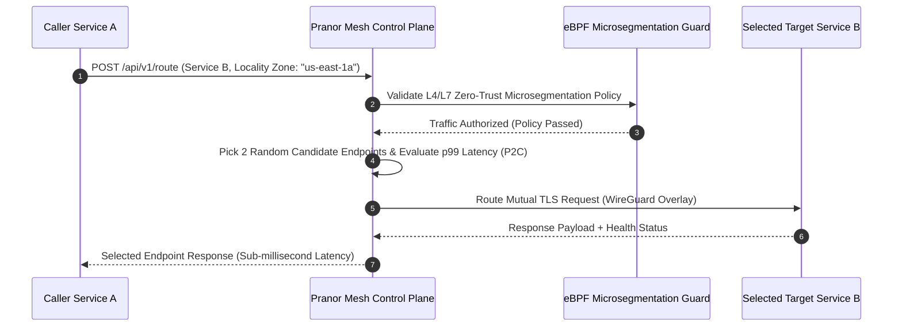

# Pranor Mesh

```bash
docker run -p 8095:8095 ghcr.io/vyuvaraj/pranor-mesh:latest
```

`Pranor Mesh` is the intelligent service mesh for the **Pranor** ecosystem, providing latency-aware load balancing, distributed rate limiting, live topology telemetry, and chaos fault injection — all without requiring sidecar proxies.

---

## Table of Contents
- [Key Features](#key-features)
- [Architecture](#architecture)
- [API Endpoints](#api-endpoints)
- [Load Balancing](#load-balancing)
- [Rate Limiting](#rate-limiting)
- [Chaos Fault Injection](#chaos-fault-injection)
- [Getting Started](#getting-started)

---

## Key Features

### ⚖️ Load Balancing
- **Latency-aware Power-of-Two-Choices (P2C)**: On each routing decision, sample two random backends and pick the one with lower observed latency — dramatically reduces tail latency compared to round-robin
- **Locality preference**: Prefer backends in the same availability zone/region before spilling over to remote nodes; configurable locality weight
- **Health-aware routing**: Unhealthy backends are automatically excluded; exponential recovery probing

### 🚦 Distributed Rate Limiting
- **Global rate limiting via Pranor Cache token buckets**: Rate limit counters stored in Pranor Cache — all mesh nodes share state for true global enforcement (not per-node)
- **Per-service and per-route policies**: Define separate rate limits per service, per endpoint pattern
- **Burst control**: Token bucket allows short bursts above sustained rate

### 🗺️ Live Topology Telemetry
- **Real-time service topology graph**: Pranor Mesh tracks all observed service-to-service call edges and pushes live updates to Pranor Console via WebSocket
- **Traffic flow visualization**: Annotates edges with RPS, error rate, and p99 latency in real-time
- **Dependency discovery**: Automatically discovers service dependencies without manual configuration

### 💥 Chaos Fault Injection
- **Latency injection**: Add artificial delay (configurable distribution: fixed, uniform, normal) to selected service calls
- **Error rate simulation**: Inject synthetic HTTP errors (configurable status code and percentage)
- **Network partition simulation**: Block traffic between specified service pairs
- **Abort experiments**: Immediately restore normal traffic flow; auto-expiry on configured duration
- **Blast radius preview**: Preview which service pairs are affected before triggering

---

```mermaid
graph TD
    classDef client fill:#1e293b,stroke:#38bdf8,stroke-width:2px,color:#fff;
    classDef engine fill:#0f172a,stroke:#0d9488,stroke-width:2px,color:#fff;
    classDef storage fill:#1e1b4b,stroke:#6366f1,stroke-width:2px,color:#fff;
    classDef monitor fill:#1e293b,stroke:#64748b,stroke-width:1px,color:#fff;

    subgraph ServiceTraffic ["🌐 Encrypted Service Connectivity"]
        ClientService["Client Service Pod / Host"] :::client
        mTLSSidecar["mTLS Auto-Inject Sidecar Proxy"] :::client
        WireGuardMesh["WireGuard Private Network Mesh Overlay"] :::client
    end

    subgraph MeshCore ["⚡ Zero-Trust Control & Microsegmentation"]
        P2CRouter["Power-of-Two-Choices (P2C) Load Balancer"] :::engine
        Microseg["eBPF Layer 4/7 Microsegmentation Policy Engine<br/><i>(Enterprise EE)</i>"] :::engine
        BFTRaft["Byzantine Fault Tolerant (BFT) Raft Control Plane<br/><i>(Enterprise EE)</i>"] :::engine
        ChaosEngine["In-Situ Chaos Experiment Injector"] :::engine
    end

    subgraph PlatformSync ["💾 Ecosystem Sync & Observability"]
        CacheLimit["Pranor Cache Shared Token Bucket"] :::storage
        ConsoleTopology["Pranor Console Live Topology Emitter"] :::storage
    end

    ClientService --> mTLSSidecar
    mTLSSidecar --> WireGuardMesh
    WireGuardMesh --> P2CRouter
    P2CRouter --> Microseg
    Microseg --> BFTRaft
    BFTRaft --> ChaosEngine
    ChaosEngine --> CacheLimit
    ChaosEngine -.-> ConsoleTopology
```

### Power-of-Two-Choices (P2C) Routing & Microsegmentation Sequence Flow



### Ecosystem Cross-Module Integration

Pranor Mesh manages secure inter-service communication across all ecosystem components:

- **Pranor Gate**: Acts as the external ingress target for Mesh WireGuard overlay tunnels and mTLS sidecar proxies.
- **Pranor Cache**: Shares token bucket rate-limiting counters across all cluster Mesh nodes for global traffic shaping.
- **Pranor Auth**: Enforces SPIFFE/SPIRE workload identities and mutual TLS (mTLS) certificate verification per service route.
- **Pranor Console**: Renders live service topology dependency graphs, real-time latency heatmaps, and active chaos experiment controls.

---

---

## API Endpoints

| Method | Path | Description |
|--------|------|-------------|
| `POST` | `/api/v1/services` | Register a service endpoint |
| `GET` | `/api/v1/services` | List all registered services |
| `POST` | `/api/v1/route` | Route a request (P2C selection) |
| `GET` | `/api/v1/topology` | Current topology graph snapshot |
| `POST` | `/api/v1/ratelimit/policy` | Set rate limit policy for a service |
| `GET` | `/api/v1/ratelimit/policy` | List rate limit policies |
| `POST` | `/api/v1/chaos/inject` | Inject a chaos fault |
| `POST` | `/api/v1/chaos/abort/{id}` | Abort an active chaos fault |
| `GET` | `/api/v1/chaos/active` | List active chaos faults |
| `/metrics` | `GET` | Prometheus metrics (routing decisions, rate limit hits, fault injection events) |
| `/healthz` | `GET` | Liveness probe |

---

## Load Balancing

```bash
# Register backends for a service
curl -X POST http://pranor-mesh:8095/api/v1/services \
  -d '{"name": "orders-api", "endpoints": ["http://orders-1:3000", "http://orders-2:3000", "http://orders-3:3000"], "locality_zone": "us-east-1a"}'

# Route a request (pranor-mesh selects backend via P2C)
curl -X POST http://pranor-mesh:8095/api/v1/route \
  -d '{"service": "orders-api", "caller_zone": "us-east-1a"}'
# → { "selected_endpoint": "http://orders-2:3000", "latency_p99_ms": 12 }
```

---

## Rate Limiting

```bash
# Set global rate limit for a service
curl -X POST http://pranor-mesh:8095/api/v1/ratelimit/policy \
  -d '{"service": "orders-api", "requests_per_second": 500, "burst": 1000}'
```

Pranor Mesh uses `Pranor Cache` token buckets — the rate limit is enforced globally across all Pranor Mesh nodes:

```
Node 1 ──┐
Node 2 ──┼──→ Pranor Cache token bucket ──→ allow/deny
Node 3 ──┘    (shared global counter)
```

---

## Chaos Fault Injection

```bash
# Inject 200ms latency into 30% of calls to payments-api
curl -X POST http://pranor-mesh:8095/api/v1/chaos/inject \
  -d '{
    "target_service": "payments-api",
    "fault_type": "latency",
    "latency_ms": 200,
    "percentage": 30,
    "duration": "5m"
  }'

# Inject 5% HTTP 503 errors
curl -X POST http://pranor-mesh:8095/api/v1/chaos/inject \
  -d '{"target_service": "inventory-api", "fault_type": "error", "error_code": 503, "percentage": 5, "duration": "2m"}'

# Abort an experiment
curl -X POST http://pranor-mesh:8095/api/v1/chaos/abort/exp-123
```

---

## Getting Started

```bash
docker run -p 8095:8095 \
  -e PRANOR_MESH_PRANOR_CACHE_URL=http://pranor-cache:6379 \
  -e PRANOR_MESH_PRANOR_CONSOLE_WS_URL=ws://pranor-console:8083/ws/topology \
  -e PRANOR_MESH_OTEL_ENDPOINT=http://pranor-trace:4318 \
  ghcr.io/vyuvaraj/pranor-mesh:latest
```

### Environment Variables

| Variable | Default | Description |
|----------|---------|-------------|
| `PRANOR_MESH_PORT` | `8095` | HTTP listener port |
| `PRANOR_MESH_PRANOR_CACHE_URL` | — | Pranor Cache URL for distributed rate limit state |
| `PRANOR_MESH_PRANOR_CONSOLE_WS_URL` | — | Pranor Console WebSocket URL for topology push |
| `PRANOR_MESH_LOCALITY_ZONE` | — | Availability zone for locality-preference routing |
| `PRANOR_MESH_OTEL_ENDPOINT` | — | OpenTelemetry collector URL |

---

## Enterprise Edition (Planned)

| Feature | Tier |
|---------|------|
| Automatic WireGuard Kernel Tunnel Mesh | EE |
| SPIFFE/SPIRE mTLS Workload Identity Attestation | EE |
