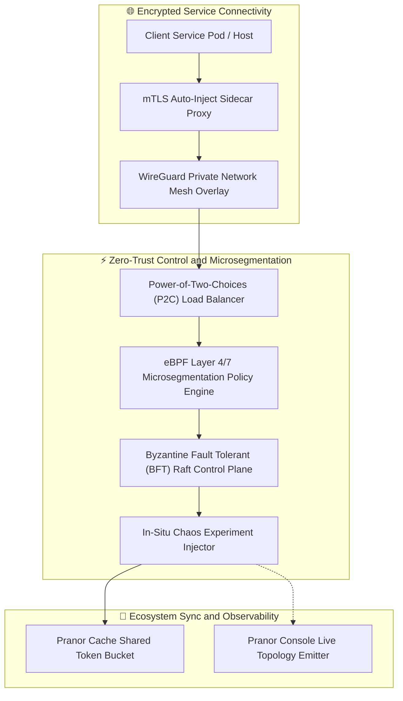
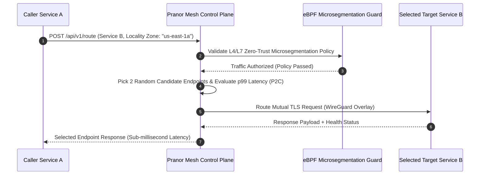

# Pranor Mesh — Intelligent Service Mesh

**Version:** 1.0.0  
**Module Path:** `github.com/vyuvaraj/pranor/mesh`  
**Default Port:** 8089  
**License:** AGPL-3.0 (OSS) / Enterprise License (EE with WireGuard & mTLS Attestation)

---

## Overview

Pranor Mesh is the intelligent service mesh for the Pranor ecosystem, providing latency-aware Power-of-Two-Choices (P2C) load balancing, distributed rate limiting, live topology telemetry, circuit breaking, mTLS, and chaos fault injection — all without requiring sidecar proxies.

Pranor Mesh can run as:
- A **standalone binary** providing load balancing and service discovery
- An **integrated module** within the Pranor ecosystem with distributed rate limiting via Cache, topology push to Console, and mTLS via Auth

---

## Key Features

| Feature | Description |
|---------|-------------|
| **P2C Load Balancing** | Power-of-Two-Choices with latency-aware backend selection |
| **Locality Preference** | Prefer backends in the same AZ before spilling to remote nodes |
| **Distributed Rate Limiting** | Global rate limits via Pranor Cache token buckets |
| **Circuit Breaking** | Automatic circuit open/half-open/closed state per backend |
| **Live Topology** | Real-time service dependency graph pushed to Console |
| **Chaos Fault Injection** | Latency injection, error simulation, network partition |
| **Health-aware Routing** | Unhealthy backends excluded with exponential recovery probing |
| **mTLS** | Mutual TLS for encrypted service-to-service communication |
| **Traffic Flow Visualization** | Edges annotated with RPS, error rate, and p99 latency |
| **Microsegmentation** | eBPF L4/L7 policy enforcement between services |

---

## Architecture



### Power-of-Two-Choices (P2C) Routing & Microsegmentation Sequence Flow



### Ecosystem Cross-Module Integration

Pranor Mesh manages secure inter-service communication across all ecosystem components:

- **Pranor Gate**: Acts as the external ingress target for Mesh WireGuard overlay tunnels and mTLS sidecar proxies.
- **Pranor Cache**: Shares token bucket rate-limiting counters across all cluster Mesh nodes for global traffic shaping.
- **Pranor Auth**: Enforces SPIFFE/SPIRE workload identities and mutual TLS (mTLS) certificate verification per service route.
- **Pranor Console**: Renders live service topology dependency graphs, real-time latency heatmaps, and active chaos experiment controls.

---

## Installation & Deployment

### Binary

```bash
cd pranor/mesh
go build -o pranor-mesh .
./pranor-mesh --port 8089
```

### Docker

```bash
docker run -p 8089:8089 ghcr.io/vyuvaraj/pranor-mesh:latest
```

### With Distributed Rate Limiting

```bash
docker run -p 8089:8089 \
  -e PRANOR_MESH_PRANOR_CACHE_URL=http://pranor-cache:8086 \
  -e PRANOR_MESH_PRANOR_CONSOLE_WS_URL=ws://pranor-console:8083/ws/topology \
  ghcr.io/vyuvaraj/pranor-mesh:latest
```

### As Part of Pranor Ecosystem

When running under the Pranor platform, Mesh integrates automatically with Cache (rate limiting), Console (topology), Auth (mTLS), and Trace (OTel spans).

---

## Configuration

### Environment Variables

| Variable | Default | Description |
|----------|---------|-------------|
| `PRANOR_MESH_PORT` | `8089` | HTTP listener port |
| `PRANOR_MESH_PRANOR_CACHE_URL` | — | Pranor Cache URL for distributed rate limit state |
| `PRANOR_MESH_PRANOR_CONSOLE_WS_URL` | — | Pranor Console WebSocket URL for topology push |
| `PRANOR_MESH_LOCALITY_ZONE` | — | Availability zone for locality-preference routing |
| `PRANOR_MESH_OTEL_ENDPOINT` | — | OpenTelemetry collector URL |

### YAML Config (`mesh.yaml`)

```yaml
port: "8089"
cache_url: "http://pranor-cache:8086"
console_ws_url: "ws://pranor-console:8083/ws/topology"
locality_zone: "us-east-1a"
otel_endpoint: "http://pranor-trace:8090"
circuit_breaker:
  failure_threshold: 5
  recovery_timeout: "30s"
```

### CLI Flags

| Flag | Default | Description |
|------|---------|-------------|
| `--port` | `8089` | HTTP listen port |

---

## API Reference

**Base URL:** `http://localhost:8089`

### POST /api/v1/services

Register a service endpoint.

**Request:**

```json
{
  "name": "orders-api",
  "endpoints": ["http://orders-1:3000", "http://orders-2:3000", "http://orders-3:3000"],
  "locality_zone": "us-east-1a"
}
```

**Response (201):**

```json
{
  "status": "registered",
  "service": "orders-api",
  "endpoint_count": 3
}
```

---

### POST /api/v1/route

Route a request via P2C selection.

**Request:**

```json
{
  "service": "orders-api",
  "caller_zone": "us-east-1a"
}
```

**Response (200):**

```json
{
  "selected_endpoint": "http://orders-2:3000",
  "latency_p99_ms": 12,
  "locality_match": true
}
```

---

### POST /api/v1/ratelimit/policy

Set rate limit policy for a service.

**Request:**

```json
{
  "service": "orders-api",
  "requests_per_second": 500,
  "burst": 1000
}
```

**Response (200):**

```json
{
  "status": "applied",
  "service": "orders-api"
}
```

---

### POST /api/v1/chaos/inject

Inject a chaos fault.

**Request:**

```json
{
  "target_service": "payments-api",
  "fault_type": "latency",
  "latency_ms": 200,
  "percentage": 30,
  "duration": "5m"
}
```

**Response (201):**

```json
{
  "id": "exp-123",
  "status": "active",
  "expires_at": "2026-08-01T10:05:00Z"
}
```

---

### GET /api/v1/topology

Current topology graph snapshot.

**Response (200):**

```json
{
  "services": ["orders-api", "payments-api", "inventory-api"],
  "edges": [
    { "from": "orders-api", "to": "payments-api", "rps": 120, "p99_ms": 45 }
  ]
}
```

---

### GET /healthz

Liveness probe.

```json
{"status":"UP","service":"pranor-mesh","version":"1.0.0"}
```

---

## Security

### Standalone Mode

In standalone mode, Mesh provides unauthenticated load balancing and service discovery.

### Ecosystem Mode (Full Auth Stack)

When running within the Pranor ecosystem:

1. **mTLS** — mutual TLS for all service-to-service traffic
2. **SPIFFE/SPIRE** — workload identity attestation per service
3. **eBPF Microsegmentation** — L4/L7 zero-trust policy enforcement
4. **WireGuard Overlay** — encrypted mesh network between nodes
5. **Token-bucket rate limiting** — global enforcement via Pranor Cache

### Circuit Breaking

Mesh implements circuit breaking per backend:
- **Closed**: Normal traffic flow
- **Open**: All requests fast-fail (after failure threshold)
- **Half-Open**: Limited probe requests to test recovery

---

## Observability

### Prometheus Metrics

| Metric | Type | Description |
|--------|------|-------------|
| `pranor_mesh_routing_decisions_total` | Counter | Total P2C routing decisions |
| `pranor_mesh_rate_limit_hits_total` | Counter | Rate limit rejections |
| `pranor_mesh_chaos_faults_active` | Gauge | Active chaos experiments |
| `pranor_mesh_circuit_breaker_state` | Gauge | Circuit state per backend (0=closed, 1=open, 2=half-open) |
| `pranor_mesh_backend_latency_ms` | Histogram | Backend response latency |
| `pranor_mesh_topology_edges` | Gauge | Active service-to-service edges |

### OpenTelemetry Tracing

Mesh emits spans for:
- `mesh.route` — P2C routing decision
- `mesh.ratelimit.check` — rate limit evaluation
- `mesh.chaos.inject` — chaos fault injection
- `mesh.circuit.trip` — circuit breaker state change

### Logging

Structured JSON logs with fields: `level`, `timestamp`, `trace_id`, `service`, `endpoint`, `latency_ms`, `action`.

---

## Enterprise Edition

| Feature | OSS | EE |
|---------|:---:|:--:|
| P2C load balancing | ✓ | ✓ |
| Service registration & discovery | ✓ | ✓ |
| Locality-aware routing | ✓ | ✓ |
| Distributed rate limiting (via Cache) | ✓ | ✓ |
| Chaos fault injection | ✓ | ✓ |
| Circuit breaking | ✓ | ✓ |
| Live topology telemetry | ✓ | ✓ |
| WireGuard kernel tunnel mesh | — | ✓ |
| SPIFFE/SPIRE mTLS workload attestation | — | ✓ |
| eBPF L4/L7 microsegmentation | — | ✓ |
| BFT Raft control plane | — | ✓ |

---

## Operational Runbook

### High tail latency on routed requests

1. Check `pranor_mesh_backend_latency_ms` histogram for p99 spikes
2. Review which backends are being selected — P2C should prefer faster ones
3. Verify locality zone configuration matches actual deployment topology
4. Check if circuit breaker is tripping on slow backends
5. Look for active chaos experiments affecting the target service

### Rate limiting blocking legitimate traffic

1. Check `pranor_mesh_rate_limit_hits_total` for unexpected rejections
2. Review rate limit policy: `GET /api/v1/ratelimit/policy`
3. Verify Pranor Cache connectivity — rate limit state is shared globally
4. Increase burst allowance if traffic is legitimately spiky

### Topology graph missing services

1. Verify services are registered: `GET /api/v1/services`
2. Check Console WebSocket connectivity (`PRANOR_MESH_PRANOR_CONSOLE_WS_URL`)
3. Ensure services are actually making calls through Mesh (not direct)
4. Review Mesh logs for registration errors

### Chaos experiment not auto-expiring

1. Check experiment status: `GET /api/v1/chaos/active`
2. Verify system clock is accurate (expiry is time-based)
3. Manually abort: `POST /api/v1/chaos/abort/{id}`
4. Review duration configuration in the inject request
