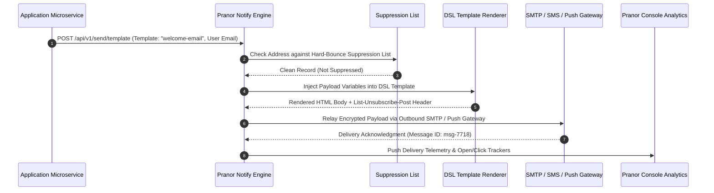

# Pranor Notify

```bash
docker run -p 8091:8091 ghcr.io/vyuvaraj/pranor-notify:latest
```

`Pranor Notify` is the transactional email and deliverability management service for the **Pranor** ecosystem. It handles sending, receiving, bounce management, unsubscribe compliance, DMARC enforcement, and provides a rich templating DSL and delivery analytics.

---

## Table of Contents
- [Key Features](#key-features)
- [Architecture](#architecture)
- [API Endpoints](#api-endpoints)
- [Template DSL](#template-dsl)
- [DMARC & Deliverability](#dmarc--deliverability)
- [Compliance](#compliance)
- [Getting Started](#getting-started)

---

## Key Features

### 📤 Sending
- **Transactional email API**: Simple REST API to send emails with HTML/plain text body, attachments, CC/BCC
- **SMTP relay integration**: Route outgoing mail through your own SMTP relay (Postfix, SendGrid, AWS SES, Mailgun)
- **Template rendering**: Render emails from reusable templates with the Pranor Notify DSL

### 📥 Inbound Routing
- **Inbound email webhook router**: Route inbound emails to HTTP endpoints based on configurable rules (match by `From`, `Subject`, header patterns, or recipient address)
- **Rule-based routing**: Priority-ordered rules with regex matching; fallback default handler

### 📝 Template Engine DSL
- **Variable interpolation**: `{{ user.name }}`, `{{ order.total }}`
- **Conditionals**: ` ... `
- **Loops**: ` ... `
- **Partials / includes**: ``
- **Layouts**: Extend base layouts for consistent header/footer across templates

### 📊 Bounce & Complaint Management
- **Automatic suppression list**: Bounced and complained addresses are automatically added to a suppression list; future sends are blocked
- **Bounce classification**: Distinguishes hard bounces (invalid address) from soft bounces (mailbox full) — hard bounces are immediately suppressed, soft bounces retry with backoff
- **Webhook callbacks**: Configure webhooks for bounce, complaint, and delivery events
- **Retry policies**: Configurable retry count and backoff strategy for soft bounces

### 🔒 DMARC & Deliverability
- **DMARC policy enforcement**: Check incoming mail against sender's DMARC DNS record; reject, quarantine, or report non-compliant messages
- **SPF/DKIM alignment checking**: Validate SPF and DKIM headers are aligned with the `From:` domain
- **DMARC aggregation reports (RUA)**: Generate and send periodic DMARC aggregate reports to the domain owner's `rua` address
- **Deliverability scoring**: Pre-send score estimation based on SPF/DKIM/DMARC alignment, suppression list checks, and content scoring

### ✅ Compliance
- **One-click unsubscribe (RFC 8058)**: `List-Unsubscribe-Post` header injected on all bulk emails; honor unsubscribe POSTs from email clients (Gmail, Apple Mail)
- **List management API**: Subscribe, unsubscribe, and manage mailing list membership; segmentation support
- **Automatic unsubscribe link injection**: Pranor Notify injects a unique unsubscribe link in every outgoing email footer

### 📈 Analytics
- **Delivery analytics telemetry**: Per-campaign delivery rates, open rates, click rates, bounce rates, complaint rates
- **Per-recipient event tracking**: Track individual recipient events (delivered, opened, clicked, bounced, unsubscribed)
- **Pranor Console dashboard integration**: Live analytics charts for mail campaigns

---

## Architecture

```mermaid
graph TD
    classDef client fill:#1e293b,stroke:#38bdf8,stroke-width:2px,color:#fff;
    classDef engine fill:#0f172a,stroke:#0d9488,stroke-width:2px,color:#fff;
    classDef storage fill:#1e1b4b,stroke:#6366f1,stroke-width:2px,color:#fff;
    classDef monitor fill:#1e293b,stroke:#64748b,stroke-width:1px,color:#fff;

    subgraph ChannelAdapters ["🌐 Multi-Channel Notification Ingress"]
        EmailAPI["Transactional Email API<br/><i>(POST /api/v1/send)</i>"] :::client
        PushAPI["WebPush & APNs Provider"] :::client
        SMSAPI["Twilio & Multi-Carrier SMS Gateway"] :::client
    end

    subgraph DispatchEngine ["⚡ Template & Deliverability Engine"]
        TemplateEngine["HTML / DSL Template Rendering Engine"] :::engine
        DMARCVal["DMARC / SPF / DKIM Inspector & Alignment"] :::engine
        SuppressionList["Automatic Bounce & Suppression Filter"] :::engine
        AIOptimizer["AI Deliverability & Send-Time Optimizer<br/><i>(Enterprise EE)</i>"] :::engine
    end

    subgraph Relays ["💾 Provider Relays & Analytics"]
        SMTPRelay["Outbound SMTP Relay Pool"] :::storage
        WebhookRouter["Inbound Webhook & RFC 8058 Unsubscribe Router"] :::storage
    end

    EmailAPI --> TemplateEngine
    PushAPI --> TemplateEngine
    SMSAPI --> TemplateEngine
    TemplateEngine --> DMARCVal
    DMARCVal --> SuppressionList
    SuppressionList --> AIOptimizer
    AIOptimizer --> SMTPRelay
    SMTPRelay --> WebhookRouter
```

### Notification Dispatch & Bounce Suppression Sequence Flow



### Ecosystem Cross-Module Integration

Pranor Notify delivers multi-channel communications across the Pranor platform:

- **Pranor Auth**: Sends one-time password (OTP) codes for multi-factor authentication (MFA) step-up login challenges.
- **Pranor Trace**: Annotates notification dispatch events with OpenTelemetry traces, recording deliverability latency flamegraphs.
- **Pranor Flow**: Triggers customer communication steps in saga workflows (e.g., order confirmation emails, shipment SMS alerts).
- **Pranor Console**: Renders live deliverability analytics, bounce rate histograms, and template editor UI.

---

---

## API Endpoints

| Method | Path | Description |
|--------|------|-------------|
| `POST` | `/api/v1/send` | Send a transactional email |
| `POST` | `/api/v1/send/template` | Send using a named template |
| `POST` | `/api/v1/templates` | Create/update an email template |
| `GET` | `/api/v1/templates` | List all templates |
| `GET` | `/api/v1/templates/{name}` | Get a template |
| `DELETE` | `/api/v1/templates/{name}` | Delete a template |
| `GET` | `/api/v1/suppression` | List suppressed addresses |
| `POST` | `/api/v1/suppression` | Manually suppress an address |
| `DELETE` | `/api/v1/suppression/{email}` | Remove from suppression list |
| `POST` | `/api/v1/inbound/rules` | Create an inbound routing rule |
| `GET` | `/api/v1/inbound/rules` | List inbound routing rules |
| `POST` | `/api/v1/lists` | Create a mailing list |
| `POST` | `/api/v1/lists/{id}/subscribe` | Subscribe to a list |
| `POST` | `/api/v1/lists/{id}/unsubscribe` | Unsubscribe from a list |
| `GET` | `/api/v1/analytics/campaigns/{id}` | Analytics for a campaign |
| `GET` | `/api/v1/dmarc/report` | Generate DMARC aggregate report |
| `/healthz` | `GET` | Liveness probe |

---

## Template DSL

Create a template:

```bash
curl -X POST http://pranor-notify:8091/api/v1/templates \
  -d '{
    "name": "welcome-email",
    "subject": "Welcome, {{ user.name }}!",
    "html": "<h1>Welcome, {{ user.name }}!</h1>\n<p>Your account is verified.</p>\n"
  }'
```

Send using the template:

```bash
curl -X POST http://pranor-notify:8091/api/v1/send/template \
  -d '{
    "template": "welcome-email",
    "to": "alice@example.com",
    "variables": { "user": { "name": "Alice", "verified": true } }
  }'
```

---

## DMARC & Deliverability

```bash
# Check DMARC policy for a domain
curl http://pranor-notify:8091/api/v1/dmarc/check?domain=example.com

# Generate DMARC aggregate report
curl -X POST http://pranor-notify:8091/api/v1/dmarc/report \
  -d '{"reporting_period": "2026-07", "report_to": "dmarc-reports@example.com"}'
```

---

## Compliance

Pranor Notify automatically injects unsubscribe headers on bulk sends:

```
List-Unsubscribe: <https://pranor-notify.yourapp.com/unsubscribe?token=xxx>
List-Unsubscribe-Post: List-Unsubscribe=One-Click
```

When a mail client (Gmail, Apple Mail) sends the one-click unsubscribe POST, Pranor Notify handles it and suppresses the recipient automatically.

---

## Getting Started

```bash
docker run -p 8091:8091 \
  -e PRANOR_NOTIFY_SMTP_HOST=smtp.sendgrid.net \
  -e PRANOR_NOTIFY_SMTP_PORT=587 \
  -e PRANOR_NOTIFY_SMTP_USER=apikey \
  -e PRANOR_NOTIFY_SMTP_PASS=SG.xxxxx \
  -e PRANOR_NOTIFY_FROM_DOMAIN=yourapp.com \
  -e PRANOR_NOTIFY_OTEL_ENDPOINT=http://pranor-trace:4318 \
  ghcr.io/vyuvaraj/pranor-notify:latest
```

### Environment Variables

| Variable | Default | Description |
|----------|---------|-------------|
| `PRANOR_NOTIFY_PORT` | `8091` | HTTP listener port |
| `PRANOR_NOTIFY_SMTP_HOST` | — | Outbound SMTP relay host |
| `PRANOR_NOTIFY_SMTP_PORT` | `587` | Outbound SMTP relay port |
| `PRANOR_NOTIFY_SMTP_USER` | — | SMTP authentication username |
| `PRANOR_NOTIFY_SMTP_PASS` | — | SMTP authentication password |
| `PRANOR_NOTIFY_FROM_DOMAIN` | — | Default sending domain |
| `PRANOR_NOTIFY_INBOUND_PORT` | — | SMTP port for inbound mail reception |
| `PRANOR_NOTIFY_DMARC_ENABLED` | `true` | Enable DMARC enforcement |
| `PRANOR_NOTIFY_OTEL_ENDPOINT` | — | OpenTelemetry collector URL |
