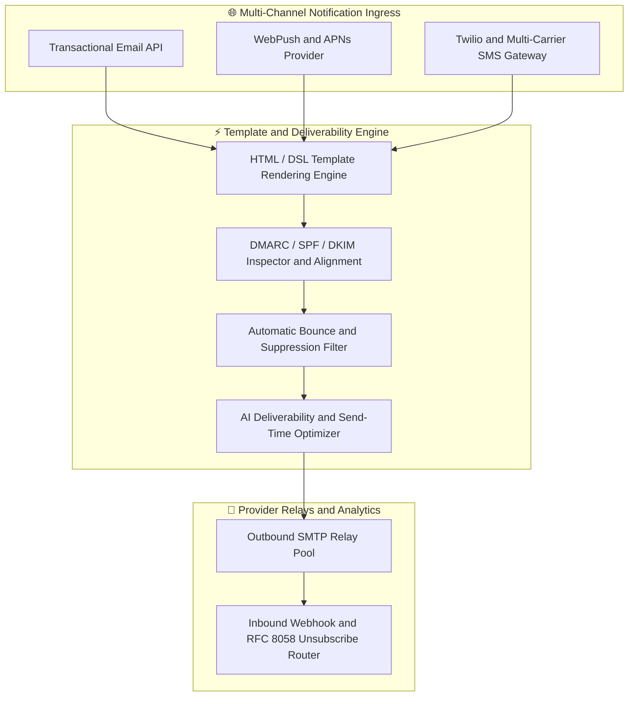
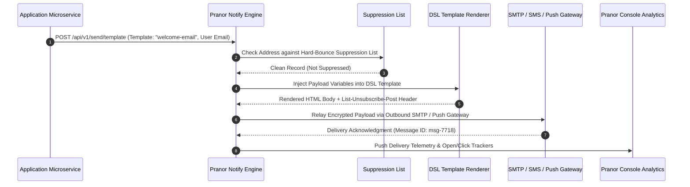

# Pranor Notify — Multi-Channel Notification Engine

**Version:** 1.0.0  
**Module Path:** `github.com/vyuvaraj/pranor/notify`  
**Default Port:** 8094  
**License:** AGPL-3.0 (OSS) / Enterprise License (EE with AI Deliverability & WebPush)

---

## Overview

Pranor Notify is the transactional email, SMS, and push notification service for the Pranor ecosystem. It handles sending, receiving, bounce management, unsubscribe compliance (RFC 8058), DMARC/SPF/DKIM enforcement, inbound email routing, and provides a rich templating DSL with delivery analytics.

Pranor Notify can run as:
- A **standalone binary** with SMTP relay configuration for email delivery
- An **integrated module** within the Pranor ecosystem with multi-channel dispatch, OTel tracing, and Console analytics

---

## Key Features

| Feature | Description |
|---------|-------------|
| **Transactional Email** | REST API for HTML/plain text emails with attachments, CC/BCC |
| **Template DSL** | Variable interpolation, conditionals, loops, partials, and layouts |
| **SMTP Relay** | Route via SendGrid, AWS SES, Mailgun, or custom SMTP |
| **Inbound Routing** | Route incoming emails to HTTP webhooks based on rules |
| **Bounce Management** | Auto-suppression list with hard/soft bounce classification |
| **DMARC Enforcement** | SPF/DKIM/DMARC alignment checking and aggregate reports |
| **RFC 8058 Unsubscribe** | One-click unsubscribe headers on all bulk emails |
| **SMS Gateway** | Twilio and multi-carrier SMS delivery |
| **WebPush / APNs** | Browser push and Apple Push Notification delivery |
| **Delivery Analytics** | Per-campaign rates, opens, clicks, bounces, complaints |
| **Suppression List** | Automatic and manual address suppression management |

---

## Architecture



### Notification Dispatch & Bounce Suppression Sequence Flow



### Ecosystem Cross-Module Integration

Pranor Notify delivers multi-channel communications across the Pranor platform:

- **Pranor Auth**: Sends one-time password (OTP) codes for multi-factor authentication (MFA) step-up login challenges.
- **Pranor Trace**: Annotates notification dispatch events with OpenTelemetry traces, recording deliverability latency flamegraphs.
- **Pranor Flow**: Triggers customer communication steps in saga workflows (e.g., order confirmation emails, shipment SMS alerts).
- **Pranor Console**: Renders live deliverability analytics, bounce rate histograms, and template editor UI.

---

## Installation & Deployment

### Binary

```bash
cd pranor/notify
go build -o pranor-notify .
./pranor-notify --port 8094
```

### Docker

```bash
docker run -p 8094:8094 ghcr.io/vyuvaraj/pranor-notify:latest
```

### With SMTP Configuration

```bash
docker run -p 8094:8094 \
  -e PRANOR_NOTIFY_SMTP_HOST=smtp.sendgrid.net \
  -e PRANOR_NOTIFY_SMTP_PORT=587 \
  -e PRANOR_NOTIFY_SMTP_USER=apikey \
  -e PRANOR_NOTIFY_SMTP_PASS=SG.xxxxx \
  -e PRANOR_NOTIFY_FROM_DOMAIN=yourapp.com \
  ghcr.io/vyuvaraj/pranor-notify:latest
```

### As Part of Pranor Ecosystem

When running under the Pranor platform, Notify integrates automatically with Auth (MFA OTP), Trace (OTel spans), Flow (saga steps), and Console (analytics dashboard).

---

## Configuration

### Environment Variables

| Variable | Default | Description |
|----------|---------|-------------|
| `PRANOR_NOTIFY_PORT` | `8094` | HTTP listener port |
| `PRANOR_NOTIFY_SMTP_HOST` | — | Outbound SMTP relay host |
| `PRANOR_NOTIFY_SMTP_PORT` | `587` | Outbound SMTP relay port |
| `PRANOR_NOTIFY_SMTP_USER` | — | SMTP authentication username |
| `PRANOR_NOTIFY_SMTP_PASS` | — | SMTP authentication password |
| `PRANOR_NOTIFY_FROM_DOMAIN` | — | Default sending domain |
| `PRANOR_NOTIFY_INBOUND_PORT` | — | SMTP port for inbound mail reception |
| `PRANOR_NOTIFY_DMARC_ENABLED` | `true` | Enable DMARC enforcement |
| `PRANOR_NOTIFY_OTEL_ENDPOINT` | — | OpenTelemetry collector URL |

### YAML Config (`notify.yaml`)

```yaml
port: "8094"
smtp:
  host: "smtp.sendgrid.net"
  port: 587
  user: "apikey"
  pass: "SG.xxxxx"
from_domain: "yourapp.com"
inbound_port: 25
dmarc_enabled: true
otel_endpoint: "http://pranor-trace:8090"
```

### CLI Flags

| Flag | Default | Description |
|------|---------|-------------|
| `--port` | `8094` | HTTP listen port |

---

## API Reference

**Base URL:** `http://localhost:8094`

### POST /api/v1/send

Send a transactional email.

**Request:**

```json
{
  "to": "alice@example.com",
  "from": "noreply@yourapp.com",
  "subject": "Order Confirmation",
  "html": "<h1>Thanks for your order!</h1>",
  "text": "Thanks for your order!",
  "cc": ["admin@yourapp.com"],
  "attachments": []
}
```

**Response (200):**

```json
{
  "status": "sent",
  "message_id": "msg-7718",
  "delivered_at": "2026-08-01T10:00:01Z"
}
```

---

### POST /api/v1/send/template

Send using a named template.

**Request:**

```json
{
  "template": "welcome-email",
  "to": "alice@example.com",
  "variables": {
    "user": { "name": "Alice", "verified": true }
  }
}
```

**Response (200):**

```json
{
  "status": "sent",
  "message_id": "msg-7719",
  "template": "welcome-email"
}
```

---

### POST /api/v1/templates

Create or update an email template.

**Request:**

```json
{
  "name": "welcome-email",
  "subject": "Welcome, {{ user.name }}!",
  "html": "<h1>Welcome, {{ user.name }}!</h1>\n<p>Verified.</p>"
}
```

**Response (201):**

```json
{
  "status": "created",
  "name": "welcome-email"
}
```

---

### GET /api/v1/suppression

List suppressed addresses.

**Response (200):**

```json
{
  "addresses": [
    { "email": "bad@example.com", "reason": "hard_bounce", "suppressed_at": "2026-07-30T08:00:00Z" }
  ]
}
```

---

### POST /api/v1/inbound/rules

Create an inbound routing rule.

**Request:**

```json
{
  "name": "support-tickets",
  "match": { "to_pattern": "support@yourapp.com" },
  "forward_to": "http://helpdesk/api/tickets",
  "priority": 10
}
```

**Response (201):**

```json
{
  "status": "created",
  "rule_id": "rule-001"
}
```

---

### GET /api/v1/dmarc/report

Generate DMARC aggregate report.

**Response (200):**

```json
{
  "period": "2026-07",
  "total_messages": 15420,
  "aligned": 15100,
  "failed_spf": 120,
  "failed_dkim": 200
}
```

---

### GET /healthz

Liveness probe.

```json
{"status":"UP","service":"pranor-notify","version":"1.0.0"}
```

---

## Security

### Standalone Mode

In standalone mode, Notify connects directly to a configured SMTP relay. No authentication required for API access.

### Ecosystem Mode (Full Auth Stack)

When running within the Pranor ecosystem:

1. **JWT Auth** — validates Bearer tokens against Pranor Auth
2. **Rate Limiting** — per-client send rate throttling
3. **DMARC Enforcement** — incoming mail validated against SPF/DKIM/DMARC
4. **Suppression List** — automatic blocking of bounced/complained addresses
5. **OTel Tracing** — every send generates a trace span

### Email Security

- **SPF alignment** — validates sender IP against domain's SPF record
- **DKIM signing** — signs outgoing emails with domain key
- **DMARC reporting** — generates and sends RUA aggregate reports
- **TLS encryption** — STARTTLS for all outbound SMTP connections

---

## Observability

### Prometheus Metrics

| Metric | Type | Description |
|--------|------|-------------|
| `pranor_notify_sent_total` | Counter | Emails sent (labeled by channel, status) |
| `pranor_notify_bounces_total` | Counter | Bounce events (labeled by type: hard/soft) |
| `pranor_notify_suppressed_total` | Counter | Suppressed sends (address on suppression list) |
| `pranor_notify_delivery_latency_ms` | Histogram | Time to SMTP acknowledgment |
| `pranor_notify_templates_active` | Gauge | Registered templates |
| `pranor_notify_inbound_routed_total` | Counter | Inbound emails routed |

### OpenTelemetry Tracing

Notify emits spans for:
- `notify.send` — email dispatch
- `notify.template.render` — template rendering
- `notify.suppression.check` — suppression list lookup
- `notify.dmarc.validate` — DMARC alignment check
- `notify.inbound.route` — inbound email routing

### Logging

Structured JSON logs with fields: `level`, `timestamp`, `trace_id`, `message_id`, `to`, `template`, `channel`, `status`.

---

## Enterprise Edition

| Feature | OSS | EE |
|---------|:---:|:--:|
| Transactional email via SMTP | ✓ | ✓ |
| Template DSL (variables, conditionals, loops) | ✓ | ✓ |
| Bounce management & suppression | ✓ | ✓ |
| DMARC/SPF/DKIM enforcement | ✓ | ✓ |
| Inbound email routing | ✓ | ✓ |
| RFC 8058 one-click unsubscribe | ✓ | ✓ |
| Mailing list management | ✓ | ✓ |
| SMS gateway (Twilio, multi-carrier) | — | ✓ |
| WebPush / APNs push notifications | — | ✓ |
| AI deliverability & send-time optimizer | — | ✓ |
| Delivery analytics dashboard | — | ✓ |
| Per-recipient event tracking | — | ✓ |

---

## Operational Runbook

### Emails not being delivered

1. Check SMTP relay connectivity (`PRANOR_NOTIFY_SMTP_HOST`)
2. Verify SMTP credentials are correct
3. Check suppression list — recipient may be suppressed
4. Review DMARC/SPF/DKIM alignment for the sending domain
5. Check `pranor_notify_delivery_latency_ms` for SMTP timeout issues

### High bounce rate

1. Monitor `pranor_notify_bounces_total` metric by type
2. Hard bounces indicate invalid addresses — clean your list
3. Soft bounces (mailbox full) will auto-retry with backoff
4. Review suppression list growth: `GET /api/v1/suppression`
5. Check domain reputation via external tools (Google Postmaster)

### Inbound routing not matching

1. List rules: `GET /api/v1/inbound/rules`
2. Verify rule patterns match incoming email headers
3. Check priority ordering — higher priority rules match first
4. Verify the `forward_to` webhook URL is reachable
5. Check inbound SMTP port is accessible (`PRANOR_NOTIFY_INBOUND_PORT`)

### Template rendering errors

1. Verify template exists: `GET /api/v1/templates/{name}`
2. Check variable names match the payload structure
3. Review DSL syntax for unclosed conditionals or loops
4. Test with minimal variables to isolate the issue
