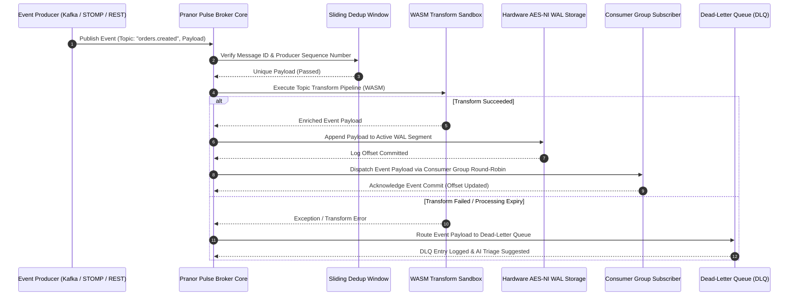

# Pranor Pulse — Async Event Broker & Message Queue

**Version:** 1.0.0  
**Module Path:** `github.com/vyuvaraj/pranor/pulse`  
**Default Ports:** 8082 (HTTP), 61613 (STOMP)  
**License:** AGPL-3.0 (OSS) / Enterprise License (EE with Raft, MirrorMaker, KMS Encryption)

---

## Overview

Pranor Pulse is a multi-protocol message broker and event streaming platform that supports STOMP, Kafka wire protocol, and MQTT v5 simultaneously. It provides durable WAL-based persistence, WASM-powered message transforms, dead letter queues with intelligent triage, consumer groups, partitioned topics, priority queues, delayed/scheduled messages, schema validation, tiered cold storage offloading, and browser-native OPFS queue support.

Pranor Pulse can run as:
- A **standalone binary** with zero external dependencies (WAL file-backed)
- An **integrated module** within the Pranor ecosystem with mTLS, RBAC, OTel tracing, and Console visibility
- A **Kafka-compatible broker** accepting native Kafka producer/consumer clients
- A **browser-embedded queue** via OPFS for offline-first PWAs

---

## Table of Contents

- [Key Features](#key-features)
- [Architecture](#architecture)
- [Installation & Deployment](#installation--deployment)
- [Configuration](#configuration)
- [API Reference](#api-reference)
- [Messaging Semantics](#messaging-semantics)
- [Protocol Support](#protocol-support)
- [Storage & Durability](#storage--durability)
- [Security](#security)
- [Observability](#observability)
- [Client Libraries & SDKs](#client-libraries--sdks)
- [Enterprise Edition](#enterprise-edition)
- [Operational Runbook](#operational-runbook)

---

## Key Features

| Feature | Description |
|---------|-------------|
| **Multi-Protocol** | STOMP 1.2, Kafka wire protocol, MQTT v5 — all on a single broker. |
| **WAL Persistence** | Write-ahead log ensures zero message loss across restarts. |
| **WASM Transforms** | Per-topic WebAssembly transform pipelines for filtering, enrichment, or routing. |
| **Dead Letter Queues** | Automatic DLQ routing on transform failures with triage and requeue APIs. |
| **Consumer Groups** | Round-robin message dispatch across group members with rebalancing. |
| **Partitioned Topics** | FNV-1a key-based partitioning with partition-level subscribers. |
| **Priority Queues** | Priority-ordered message delivery — higher priority messages dispatched first. |
| **Delayed Messages** | Schedule message delivery N milliseconds in the future via TimeWheel. |
| **Message Deduplication** | Idempotent message-ID and producer-sequence-number dedup. |
| **Schema Registry** | Per-topic schema validation — reject non-conforming payloads at publish time. |
| **Tiered Storage** | Automatic offload of closed WAL segments to S3-compatible cold storage. |
| **Message TTL** | Per-message expiry — expired messages route to DLQ instead of delivery. |
| **Topic Compaction** | Key-based log compaction retaining only the latest value per key. |
| **Wildcard Subscriptions** | MQTT-style wildcard topics (`sensors.*`, `events.#`). |
| **Backpressure** | Queue capacity limits with configurable overflow behavior. |
| **Rate Limiting** | Token-bucket publish rate limiting per broker. |
| **WebSocket Subscriptions** | Real-time browser consumption via WebSocket upgrade. |
| **SSE Subscriptions** | Server-Sent Events stream for lightweight real-time consumption. |
| **Offset Management** | Consumer group offset commit/fetch with replay-from-offset support. |
| **Time-Based Seek** | Seek to a timestamp offset for event replay. |
| **CDC (Change Data Capture)** | Database change event capture and publishing. |
| **OPFS Browser Queue** | Offline-first browser queue using Origin Private File System. |
| **Batch Publish** | Multi-message atomic publish in a single request. |
| **DLQ AI Triage** | Intelligent DLQ classification and suggested remediation. |

---

## Architecture

```mermaid
graph TD
    classDef client fill:#1e293b,stroke:#38bdf8,stroke-width:2px,color:#fff;
    classDef engine fill:#0f172a,stroke:#0d9488,stroke-width:2px,color:#fff;
    classDef storage fill:#1e1b4b,stroke:#6366f1,stroke-width:2px,color:#fff;
    classDef monitor fill:#1e293b,stroke:#64748b,stroke-width:1px,color:#fff;

    subgraph Adapters ["🌐 Multi-Protocol Wire Interface"]
        STOMP["STOMP 1.2 Protocol Listener<br/><i>(:61613)</i>"] :::client
        Kafka["Kafka Wire Decoder<br/><i>(:9092)</i>"] :::client
        MQTT["MQTT v5 Broker Listener<br/><i>(:1883)</i>"] :::client
        HTTP["HTTP / REST Management API<br/><i>(:8082)</i>"] :::client
    end

    subgraph Core ["⚡ Core Event Streaming Broker"]
        Registry["Topic Registry & Wildcard Matcher"] :::engine
        Dedup["Idempotent Dedup Window<br/><i>(5-min Sliding Window)</i>"] :::engine
        Schema["Schema Compatibility Inspector"] :::engine
        WASM["WASM Transform Pipeline"] :::engine
        Dispatch["Partition & Consumer Group Dispatcher"] :::engine
    end

    subgraph Storage ["💾 WAL & Tiered Persistence Engine"]
        WAL["Write-Ahead Log Engine<br/><i>(Zero-Copy Hardware AES-NI)</i>"] :::storage
        DLQ["Dead-Letter Queue Storage<br/><i>(AI Auto-Triage)</i>"] :::storage
        ColdStore["S3 Cold Storage Offloader<br/><i>(Closed Segments)</i>"] :::storage
    end

    subgraph Timers ["⏱️ Delayed Delivery & Recovery"]
        TimeWheel["TimeWheel Delayed Scheduler<br/><i>(10ms Tick Slots)</i>"] :::monitor
        OffsetStore["Consumer Group Offset Commit Store"] :::monitor
    end

    STOMP --> Registry
    Kafka --> Registry
    MQTT --> Registry
    HTTP --> Registry
    Registry --> Dedup
    Dedup --> Schema
    Schema --> WASM
    WASM --> Dispatch
    Dispatch --> WAL
    WAL --> DLQ
    WAL -.-> ColdStore
    TimeWheel -.-> Dispatch
    OffsetStore -.-> Dispatch
```

### Event Streaming & Consumer Dispatch Sequence Flow



### Ecosystem Cross-Module Integration

Pranor Pulse serves as the primary asynchronous message bus across the Pranor platform:

- **Pranor Flow**: Dispatches saga workflow execution steps, compensation triggers, and human-in-the-loop task events via Pulse topics.
- **Pranor Vault**: Receives closed WAL segments offloaded automatically to S3 object buckets for long-term cold archive retention.
- **Pranor Trace**: Propagates trace context headers across message boundaries, tracking event latency flamegraphs end-to-end.
- **Pranor Console**: Provides real-time event throughput dashboards, consumer group rebalance monitors, and 1-click DLQ message replay UI.
- **Pranor Gate**: Relays event streams to web clients via WebSocket upgrader and SSE stream passthrough.

---

## Installation & Deployment

### Binary

```bash
cd pranor/pulse
go build -o pranor-pulse .
./pranor-pulse
```

### Docker

```bash
docker run -p 8082:8082 -p 61613:61613 ghcr.io/vyuvaraj/pranor-pulse:latest
```

### Docker Compose

```yaml
services:
  pulse:
    image: ghcr.io/vyuvaraj/pranor-pulse:latest
    ports:
      - "8082:8082"
      - "61613:61613"
    environment:
      - PRANOR_PULSE_WAL_PATH=/data/queue.wal
    volumes:
      - pulse-data:/data
volumes:
  pulse-data:
```

### As Part of Pranor Ecosystem

When running under the Pranor platform, Pulse integrates automatically with Auth (JWT/mTLS), Trace (OTel spans), and Console (dashboard visibility). Multi-tenant topic namespacing is enforced automatically.

---

## Configuration

### Environment Variables

| Variable | Default | Description |
|----------|---------|-------------|
| `PRANOR_PULSE_WAL_PATH` | `queue.wal` | Path to write-ahead log file |
| `PRANOR_PULSE_PUBLISH_RATE` | `100` | Token bucket publish rate (messages/sec) |
| `PRANOR_PULSE_PUBLISH_CAPACITY` | `100` | Token bucket burst capacity |
| `PRANOR_PULSE_BACKPRESSURE_LIMIT` | `1000` | Max messages in per-topic queue before backpressure |
| `PRANOR_PULSE_S3_ENDPOINT` | — | S3 endpoint for cold storage offloading |
| `PRANOR_PULSE_S3_BUCKET` | — | S3 bucket for WAL segment offload |
| `PRANOR_PULSE_S3_TOKEN` | — | S3 auth token for offloader |
| `PRANOR_JWT_SECRET` | — | JWT signing key for token auth |
| `PRANOR_OTLP_ENDPOINT` | — | OpenTelemetry collector URL |
| `TLS_CERT_FILE` | — | Path to TLS certificate |
| `TLS_KEY_FILE` | — | Path to TLS private key |

### STOMP Credentials

Default credentials (configured in code, overridable via ecosystem auth):
- Username: `admin`
- Password: `secret`

### HTTP API Auth Token

Default: `secret-token` (standalone mode). In ecosystem mode, full JWT/mTLS auth chain is used.

---

## API Reference

**Base URL:** `http://localhost:8082`  
**API Version:** `/api/v1/` (recommended) or `/api/` (legacy)

### GET /healthz

Liveness probe.

```json
{"status":"UP","service":"pranor","version":"1.0.0"}
```

### GET /readyz

Readiness probe.

---

### POST /api/v1/publish

Publish a message to a topic.

**Request:**

```json
{
  "topic": "orders.created",
  "payload": "{\"order_id\":\"abc-123\",\"amount\":99.99}",
  "key": "abc-123",
  "priority": 5,
  "delay_ms": 0,
  "message_id": "msg-unique-001",
  "ttl_ms": 60000
}
```

| Field | Type | Required | Description |
|-------|------|----------|-------------|
| `topic` | string | ✓ | Destination topic |
| `payload` | string | ✓ | Message content (JSON string) |
| `key` | string | | Partition key (FNV-1a hash for partition assignment) |
| `priority` | int | | Higher = dispatched first (default: 0) |
| `delay_ms` | int | | Delay delivery by N milliseconds |
| `message_id` | string | | Unique ID for deduplication |
| `ttl_ms` | int | | Message expires after N ms (routes to DLQ) |
| `producer_id` | string | | Producer identity for sequence dedup |
| `sequence_number` | int | | Monotonic sequence for producer dedup |

**Response (200):**

```json
{
  "status": "success",
  "topic": "orders.created",
  "processed_payload": "{\"order_id\":\"abc-123\",\"amount\":99.99}"
}
```

**Backpressure Response (503):**

```json
{
  "error": "queue capacity exceeded: backpressure active",
  "code": "ERR_BACKPRESSURE"
}
```

---

### POST /api/v1/publish/batch

Publish multiple messages atomically.

**Request:**

```json
{
  "messages": [
    {"topic": "events.user", "payload": "{\"action\":\"login\"}"},
    {"topic": "events.user", "payload": "{\"action\":\"page_view\"}"}
  ]
}
```

---

### GET /api/v1/topics

List all topics with metadata.

**Response (200):**

```json
{
  "topics": [
    {
      "name": "orders.created",
      "subscribers": 3,
      "partitions": 3,
      "has_transform": true,
      "dlq_topic": "orders.created.dlq"
    }
  ],
  "count": 1
}
```

---

### POST /api/v1/topics/{topic}/transform

Register a WASM transform for a topic.

**Request:** Raw `.wasm` binary as request body.

**Response (200):**

```
WASM transform registered for topic orders.created
```

To clear a transform, send an empty body.

---

### POST /api/v1/topics/{topic}/dlq

Register a Dead Letter Queue for a topic.

**Request:**

```json
{"dlq_topic": "orders.created.dlq"}
```

### GET /api/v1/topics/{topic}/dlq

List DLQ messages for a topic.

**Response (200):**

```json
{
  "messages": [
    {
      "message_id": "dlq-1234567890",
      "source_topic": "orders.created",
      "original_payload": "{\"bad\":\"data\"}",
      "failure_reason": "WASM transform error: invalid field",
      "timestamp": 1706000000,
      "retry_count": 1
    }
  ],
  "total": 1,
  "dlq_topic": "orders.created.dlq"
}
```

### GET /api/v1/topics/{topic}/dlq/summary

AI-powered DLQ analysis with failure pattern clustering.

### GET /api/v1/topics/{topic}/dlq/triage

Intelligent DLQ triage with remediation suggestions.

### POST /api/v1/topics/{topic}/dlq/requeue

Requeue a DLQ message (optionally patched) back to its source topic.

**Request:**

```json
{"message_id": "dlq-1234567890", "payload": "{\"fixed\":\"data\"}"}
```

---

### POST /api/v1/topics/{topic}/schema

Register a validation schema for a topic.

**Request:**

```json
{"order_id": "string", "amount": "number", "status": "string"}
```

Messages that fail schema validation are rejected at publish time.

---

### GET /api/v1/topics/{topic}/anomalies

Detect anomalous message patterns (spike detection, schema drift).

---

### GET /api/v1/subscribe/{topic}

Subscribe via Server-Sent Events for real-time message consumption.

**Response (text/event-stream):**

```
data: {"order_id":"abc-123","amount":99.99}

data: {"order_id":"def-456","amount":45.00}
```

---

### GET /ws/subscribe/{topic}

Subscribe via WebSocket for real-time bidirectional message consumption.

---

### GET /api/v1/tail?topic={topic}

Tail the latest N messages from a topic (useful for debugging).

**Query Parameters:**

| Param | Default | Description |
|-------|---------|-------------|
| `topic` | — | Topic to tail |
| `n` | `10` | Number of recent messages |

---

### GET /api/v1/stats

Broker statistics and metrics.

**Response (200):**

```json
{
  "messages_published": 152340,
  "wasm_executions": 45000,
  "wasm_execution_errors": 12,
  "wasm_avg_duration_ns": 250000,
  "topics_count": 8,
  "wal_entries": 152340
}
```

---

### GET /api/v1/stats/ws

WebSocket endpoint streaming real-time broker stats every second.

---

### POST /api/v1/replay

Replay messages from a specific offset for a consumer group.

**Request:**

```json
{
  "topic": "orders.created",
  "start_offset": 100,
  "group_name": "analytics-group"
}
```

**Response (200):**

```json
{"replayed": 52}
```

---

### POST /api/v1/replay/time

Seek to a timestamp-based offset.

**Request:**

```json
{"topic": "orders.created", "timestamp": 1706000000000}
```

**Response (200):**

```json
{"offset": 1523}
```

---

### GET /api/v1/offsets

Get committed offsets for a consumer group.

### POST /api/v1/offsets

Commit an offset for a consumer group.

**Request:**

```json
{"group": "analytics", "topic": "orders.created", "offset": 1523}
```

---

### GET /api/v1/consumers/lag

Get consumer group lag (difference between latest offset and committed offset).

---

### POST /api/v1/topics/retention

Configure topic retention policy.

---

### POST /api/v1/admin/offloader

Configure tiered storage offloader.

**Request:**

```json
{
  "s3_endpoint": "http://vault:9000",
  "s3_bucket": "pulse-cold-storage",
  "s3_token": "auth-token"
}
```

---

### GET /metrics

Prometheus-compatible metrics.

```
# HELP pranor_pulse_messages_published_total Total messages published
# TYPE pranor_pulse_messages_published_total counter
pranor_pulse_messages_published_total 152340

# HELP pranor_pulse_wasm_executions_total Total WASM transform executions
# TYPE pranor_pulse_wasm_executions_total counter
pranor_pulse_wasm_executions_total 45000
```

---

### GET /api/v1/events/{topic}

Event sourcing API — list events with filtering.

---

### POST /api/v1/sqlite/query

Query broker metadata via embedded SQLite interface.

---

## Messaging Semantics

### Publish/Subscribe (Fan-Out)

Every subscriber on a topic receives every message:

```
Producer → publish("events.user", msg)
  ├── Subscriber-A receives msg
  ├── Subscriber-B receives msg
  └── Subscriber-C receives msg
```

### Consumer Groups (Competing Consumers)

Messages are round-robin dispatched to one member per group:

```
Producer → publish("orders", msg1)
  Group "processors":
    ├── Worker-1 receives msg1
    ├── Worker-2 receives msg2 (next message)
    └── Worker-3 receives msg3 (next message)
```

### Partitioned Topics

Key-based partitioning ensures ordering per key:

```
publish("orders", key="customer-A", msg1) → Partition 0
publish("orders", key="customer-A", msg2) → Partition 0 (same key = same partition)
publish("orders", key="customer-B", msg3) → Partition 2 (different key)
```

### Priority Queues

Messages with higher priority are dispatched first regardless of arrival order:

```
publish("tasks", payload="low", priority=1)
publish("tasks", payload="high", priority=10)
publish("tasks", payload="medium", priority=5)
→ Consumer receives: "high", "medium", "low"
```

### Delayed Messages

Schedule delivery N milliseconds in the future:

```
publish("reminders", payload="Check order status", delay_ms=300000)
→ Message delivered after 5 minutes
```

The TimeWheel implementation provides 10ms resolution with O(1) scheduling.

### Message Deduplication

Two dedup mechanisms:
1. **Message-ID dedup:** Same `message_id` within 5-minute window is dropped
2. **Producer-sequence dedup:** Per `producer_id`, any `sequence_number ≤ last_seen` is dropped

### Message TTL / Expiry

Messages with `ttl_ms` expire and route to the DLQ instead of delivering to consumers:

```
publish("events", payload="time-sensitive", ttl_ms=5000)
→ If not consumed within 5s, routes to DLQ with reason "message TTL expired"
```

### Topic Compaction

For compacted topics, only the latest message per key is retained:

```
publish("state", key="user-1", payload="v1")
publish("state", key="user-1", payload="v2")
publish("state", key="user-2", payload="v1")
→ Compacted state: {"user-1": "v2", "user-2": "v1"}
```

### Wildcard Subscriptions

MQTT-style topic patterns:
- `*` matches exactly one level: `sensors.*` matches `sensors.temp` but not `sensors.temp.room1`
- `#` matches zero or more levels: `events.#` matches `events`, `events.user`, `events.user.login`

### Dead Letter Queues

When a WASM transform fails, the original message routes to the registered DLQ topic with an envelope containing:
- Original payload
- Source topic
- Failure reason
- Message ID
- Retry count

---

## Protocol Support

### STOMP 1.2 (Port 61613)

Full STOMP 1.2 implementation with username/password authentication. Compatible with any STOMP client (ActiveMQ clients, Spring Messaging, etc.).

```python
import stomp
conn = stomp.Connection([('localhost', 61613)])
conn.connect('admin', 'secret', wait=True)
conn.subscribe('/topic/orders', id=1)
conn.send('/topic/orders', '{"order":"123"}')
```

### Kafka Wire Protocol (Port 9092)

Native Kafka producer/consumer compatibility. Existing Kafka applications can point to Pulse without code changes.

### MQTT v5 (Port 1883)

Full MQTT v5 support for IoT workloads — QoS levels, retained messages, topic aliases, and shared subscriptions.

### HTTP REST API (Port 8082)

JSON-based publish/subscribe with SSE and WebSocket real-time delivery.

### OPFS Browser Queue

Client-side JavaScript SDK using Origin Private File System for offline message queuing with automatic sync on reconnection.

---

## Storage & Durability

### Write-Ahead Log (WAL)

Every published message is appended to the WAL before acknowledgment. The WAL provides:
- Crash recovery — replays unprocessed messages on restart
- Segment rotation — closed segments can be offloaded to cold storage
- Sequential I/O — optimized for throughput

### Tiered Storage Offloading

Configure S3-compatible cold storage for WAL segment archival:

```bash
export PRANOR_PULSE_S3_ENDPOINT=http://vault:9000
export PRANOR_PULSE_S3_BUCKET=pulse-archive
export PRANOR_PULSE_S3_TOKEN=auth-token
```

When a WAL segment rotates, it's automatically uploaded to the configured S3 bucket.

### Offset Persistence

Consumer group offsets are stored in-memory with WAL backing. Consumers can:
- Commit offsets explicitly via API
- Replay from any historical offset
- Seek to a timestamp-based position

---

## Security

### Standalone Mode (API Token)

HTTP endpoints require:

```
Authorization: Bearer secret-token
```

STOMP connections authenticate with username/password.

### Ecosystem Mode (Full Auth Stack)

When running within the Pranor ecosystem, the full middleware chain activates:

1. **OTel Tracing** — every request gets a span
2. **Rate Limiting** — per-client request throttling
3. **CORS** — cross-origin handling
4. **Max Body Size** — 10MB limit
5. **JWT Auth** — validates Bearer tokens
6. **Tenant Isolation** — topic namespacing (`tenant:topic`)

### Multi-Tenant Isolation

Topics are automatically namespaced with tenant ID. Tenant A cannot see or publish to Tenant B's topics:

```
Tenant "acme" publishes to "orders" → stored as "acme:orders"
Tenant "acme" listing topics → only sees topics prefixed "acme:"
```

### TLS Encryption

Enable TLS on both STOMP and HTTP listeners:

```bash
export TLS_CERT_FILE=/certs/pulse.crt
export TLS_KEY_FILE=/certs/pulse.key
```

---

## Observability

### Prometheus Metrics

| Metric | Type | Description |
|--------|------|-------------|
| `pranor_pulse_messages_published_total` | Counter | Total messages published |
| `pranor_pulse_wasm_executions_total` | Counter | Total WASM transform runs |
| `pranor_pulse_wasm_errors_total` | Counter | WASM execution failures |
| `pranor_pulse_wasm_duration_ns` | Histogram | WASM transform latency |
| `pranor_pulse_topics_count` | Gauge | Active topic count |
| `pranor_pulse_subscribers_count` | Gauge | Connected subscriber count |
| `pranor_pulse_dlq_messages_total` | Counter | Messages routed to DLQ |

### OpenTelemetry Tracing

Every publish operation generates an OTel span with:
- `messaging.system`: `pranor-pulse`
- `messaging.destination`: topic name
- `messaging.payload_len`: payload size
- Child spans for WASM transforms and DLQ routing

### Real-time Stats WebSocket

Connect to `/api/v1/stats/ws` for streaming broker stats (1-second updates).

### Embedded Web UI

Access `/ui/` on the HTTP port for a management dashboard showing topics, subscribers, DLQ state, and real-time throughput graphs.

### Grafana Dashboard

Import the bundled `grafana_dashboard.json` for a pre-built Pulse monitoring dashboard.

---

## Client Libraries & SDKs

### Go

```go
import "github.com/vyuvaraj/pranor/pulse/sdks/go"

client := pulse.NewClient("http://localhost:8082", "secret-token")

// Publish
err := client.Publish("orders.created", `{"order_id":"abc"}`, pulse.WithPriority(5))

// Subscribe
ch, err := client.Subscribe("orders.created")
for msg := range ch {
    fmt.Println("Received:", msg)
}
```

### Python (STOMP)

```python
import stomp

class MyListener(stomp.ConnectionListener):
    def on_message(self, frame):
        print(f"Received: {frame.body}")

conn = stomp.Connection([('localhost', 61613)])
conn.set_listener('', MyListener())
conn.connect('admin', 'secret', wait=True)
conn.subscribe('/topic/orders.created', id=1, ack='auto')
conn.send('/topic/orders.created', '{"order_id":"abc-123"}')
```

### TypeScript (WebSocket)

```typescript
const ws = new WebSocket('ws://localhost:8082/ws/subscribe/orders.created');
ws.onmessage = (event) => {
  const order = JSON.parse(event.data);
  console.log('New order:', order);
};
```

### cURL

```bash
# Publish
curl -X POST http://localhost:8082/api/v1/publish \
  -H "Authorization: Bearer secret-token" \
  -H "Content-Type: application/json" \
  -d '{"topic":"orders.created","payload":"{\"order_id\":\"abc\"}"}'

# List topics
curl http://localhost:8082/api/v1/topics \
  -H "Authorization: Bearer secret-token"

# Register WASM transform
curl -X POST http://localhost:8082/api/v1/topics/orders.created/transform \
  -H "Authorization: Bearer secret-token" \
  --data-binary @enrich.wasm

# Replay from offset
curl -X POST http://localhost:8082/api/v1/replay \
  -H "Authorization: Bearer secret-token" \
  -d '{"topic":"orders.created","start_offset":0,"group_name":"replay-group"}'
```

### Pranor CLI

```bash
pranor pulse publish --topic orders.created --payload '{"id":"abc"}'
pranor pulse subscribe --topic orders.created
pranor pulse topics list
pranor pulse dlq list --topic orders.created
pranor pulse dlq requeue --topic orders.created --message-id dlq-123
pranor pulse replay --topic orders.created --offset 0 --group analytics
```

---

## Enterprise Edition

| Feature | OSS | EE |
|---------|:---:|:--:|
| STOMP / Kafka / MQTT protocols | ✓ | ✓ |
| WAL persistence & recovery | ✓ | ✓ |
| WASM transforms | ✓ | ✓ |
| Dead letter queues | ✓ | ✓ |
| Consumer groups & partitions | ✓ | ✓ |
| Priority queues & delayed messages | ✓ | ✓ |
| Message deduplication | ✓ | ✓ |
| Schema validation | ✓ | ✓ |
| Tiered S3 storage offload | ✓ | ✓ |
| WebSocket & SSE subscriptions | ✓ | ✓ |
| Topic compaction | ✓ | ✓ |
| OPFS browser queue | ✓ | ✓ |
| Raft consensus replication | — | ✓ |
| Multi-region MirrorMaker sync | — | ✓ |
| Hardware KMS/HSM payload encryption | — | ✓ |
| Schema registry breaking change guard | — | ✓ |
| Federated cross-cluster topic routing | — | ✓ |
| Advanced DLQ AI triage & auto-remediation | — | ✓ |

---

## Operational Runbook

### Messages not being delivered

1. Check `/api/v1/topics` to confirm the topic exists and has subscribers
2. Verify the publisher is authenticated and targeting the correct tenant namespace
3. Check for backpressure — if queue is full, publishes return 503
4. Review WASM transform logs — transform failures route to DLQ silently
5. Check dedup — same `message_id` within 5 minutes is dropped

### DLQ filling up

1. Check `/api/v1/topics/{topic}/dlq/summary` for failure pattern clusters
2. Review the WASM transform for bugs — most DLQ entries come from transform errors
3. Use `/api/v1/topics/{topic}/dlq/triage` for AI-suggested remediation
4. Fix the transform, then requeue messages via `/api/v1/topics/{topic}/dlq/requeue`

### High publish latency

1. Check `pranor_pulse_wasm_duration_ns` — slow transforms add latency
2. Review backpressure limit — increase `PRANOR_PULSE_BACKPRESSURE_LIMIT` if queue is healthy
3. Check WAL disk I/O — WAL append is synchronous
4. Verify S3 offloader isn't blocking rotation (network issues to cold storage)

### Consumer group rebalancing

1. Check subscriber count on the topic — new/removed consumers trigger rebalance
2. Verify consumer heartbeats are active
3. Review offset commits — stale offsets cause replay on rejoin

### WAL recovery after crash

On restart, Pulse automatically:
1. Opens the WAL file
2. Recovers all non-expired entries
3. Re-publishes them through the broker engine
4. Resumes normal operation

No manual intervention required.

### Tiered storage not offloading

1. Verify S3 endpoint connectivity: `curl $PRANOR_PULSE_S3_ENDPOINT/healthz`
2. Check S3 credentials and bucket existence
3. WAL segments only offload on rotation — ensure enough write volume to trigger rotation
4. Check broker logs for offloader errors

---

## Versioning & Compatibility

- HTTP API is versioned at `/api/v1/`
- Legacy `/api/` paths continue to work
- STOMP protocol follows STOMP 1.2 specification
- Kafka wire protocol maintains compatibility with Kafka 2.x+ clients
- MQTT follows MQTT v5.0 specification
- WAL format is forward-compatible within major versions
