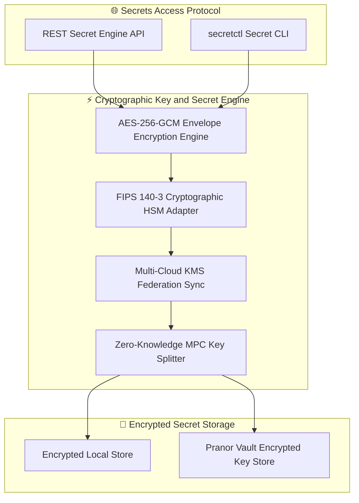
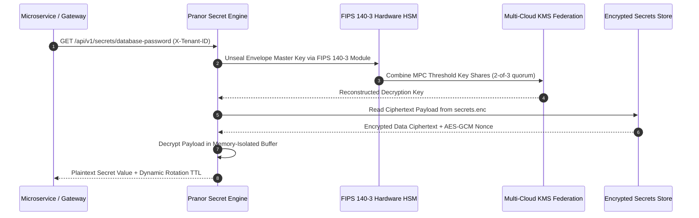

# Pranor Secret — Secret & Credential Management

**Version:** 1.0.0  
**Module Path:** `github.com/vyuvaraj/pranor/secret`  
**Default Port:** 8091  
**License:** AGPL-3.0 (OSS) / Enterprise License (EE with HSM & Multi-Cloud KMS)

---

## Overview

Pranor Secret is the centralized secrets, credentials, and configuration protection engine for the Pranor ecosystem. It provides tenant-isolated secret storage encrypted at rest using AES-256-GCM, Shamir secret splitting, dynamic injection into services, automatic rotation policies, and leak detection scanning.

Pranor Secret can run as:
- A **standalone binary** with local encrypted file storage and a master key
- An **integrated module** within the Pranor ecosystem with Pranor Core middleware, multi-tenant isolation, HSM integration, and dynamic rotation

---

## Key Features

| Feature | Description |
|---------|-------------|
| **AES-256-GCM Encryption** | All secrets encrypted at rest with envelope encryption |
| **Tenant Isolation** | Secrets organized per tenant with namespace enforcement |
| **Shamir Splitting** | Master key split across multiple key holders (2-of-3 quorum) |
| **Dynamic Injection** | Services retrieve secrets at runtime via API |
| **Automatic Rotation** | Configurable TTL-based rotation with zero-downtime rollover |
| **Leak Detection** | Scan codebases and logs for accidentally exposed secrets |
| **KMS Federation** | Multi-cloud KMS sync (AWS KMS, GCP KMS, Azure Key Vault) |
| **FIPS 140-3 HSM** | Hardware security module adapter for key operations |
| **Encrypted File Store** | Local persistence in encrypted `secrets.enc` file |
| **Vault Backend** | Optional Pranor Vault encrypted key store |

---

## Architecture



### Cryptographic Secret Envelope & Key Unsealing Sequence Flow



### Ecosystem Cross-Module Integration

Pranor Secret provides master key management and secret protection across all Pranor modules:

- **Pranor Gate**: Dynamically provisions and auto-rotates TLS server certificates and client mTLS credentials without restarting proxy instances.
- **Pranor Auth**: Secures private RSA/ECDSA JWT signing keys, WebAuthn passkey seeds, and OIDC client secrets.
- **Pranor Vault**: Stores client-side envelope encryption keys and S3 cloud storage access credentials.
- **Pranor Console**: Renders the visual Secret Management Webview, unsealing vaults and inspecting rotation policies securely.

---

## Installation & Deployment

### Binary

```bash
cd pranor/secret
go build -o pranor-secret .
./pranor-secret --port 8091 --file secrets.enc
```

### Docker

```bash
docker run -p 8091:8091 \
  -e PRANOR_SECRET_MASTER_KEY="000102030405060708090a0b0c0d0e0f101112131415161718191a1b1c1d1e1f" \
  -v secret-data:/data \
  ghcr.io/vyuvaraj/pranor-secret:latest
```

### With Master Key

```bash
export PRANOR_SECRET_MASTER_KEY="000102030405060708090a0b0c0d0e0f101112131415161718191a1b1c1d1e1f"
./pranor-secret --port 8091 --file /data/secrets.enc
```

### As Part of Pranor Ecosystem

When running under the Pranor platform, Secret integrates automatically with Auth (JWT key storage), Gate (TLS cert rotation), Console (secret management UI), and Core middleware (tenant isolation).

---

## Configuration

### Environment Variables

| Variable | Default | Description |
|----------|---------|-------------|
| `PRANOR_SECRET_PORT` | `8091` | HTTP listener port |
| `PRANOR_SECRET_MASTER_KEY` | — | 32-byte hex-encoded master encryption key |
| `PRANOR_SECRET_FILE` | `secrets.enc` | Path to encrypted secrets file |
| `PRANOR_SECRET_ROTATION_INTERVAL` | — | Default rotation interval for secrets |
| `PRANOR_SECRET_OTEL_ENDPOINT` | — | OpenTelemetry collector URL |

### YAML Config (`secret.yaml`)

```yaml
port: "8091"
master_key: ""              # Set via env var for security
file: "/data/secrets.enc"
rotation_interval: "24h"
otel_endpoint: "http://pranor-trace:8090"
```

### CLI Flags

| Flag | Default | Description |
|------|---------|-------------|
| `--port` | `8091` | HTTP listen port |
| `--file` | `secrets.enc` | Encrypted secrets file path |

---

## API Reference

**Base URL:** `http://localhost:8091`

### POST /api/v1/secrets

Set or update a secret.

**Headers:**
- `X-Tenant-ID: tenant-a`
- `Authorization: Bearer <token>`

**Request:**

```json
{
  "key": "database-password",
  "value": "super-secret-passphrase"
}
```

**Response (201):**

```json
{
  "key": "database-password",
  "status": "stored",
  "encrypted": true
}
```

---

### GET /api/v1/secrets/{key}

Retrieve a secret value.

**Headers:**
- `X-Tenant-ID: tenant-a`
- `Authorization: Bearer <token>`

**Response (200):**

```json
{
  "key": "database-password",
  "value": "super-secret-passphrase"
}
```

---

### GET /api/v1/secrets

List stored secret keys (values not exposed).

**Response (200):**

```json
{
  "keys": ["database-password", "api-key-stripe", "jwt-signing-key"]
}
```

---

### DELETE /api/v1/secrets/{key}

Delete a secret.

**Response (200):**

```json
{
  "status": "deleted",
  "key": "database-password"
}
```

---

### GET /healthz

Liveness probe.

```json
{"status":"UP","service":"pranor-secret","version":"1.0.0"}
```

---

## Security

### Standalone Mode

Provide a 32-byte hex-encoded master key via `PRANOR_SECRET_MASTER_KEY`. If unset, a temporary random key is generated at startup (secrets won't persist across restarts).

### Ecosystem Mode (Full Auth Stack)

When running within the Pranor ecosystem:

1. **OTel Tracing** — every secret access generates a span
2. **Rate Limiting** — per-client request throttling
3. **JWT Auth** — validates Bearer tokens against Pranor Auth
4. **Tenant Isolation** — secrets scoped per X-Tenant-ID header
5. **Audit Logging** — all read/write/delete operations logged

### Encryption Details

- **Algorithm**: AES-256-GCM (Galois/Counter Mode)
- **Nonce**: Unique random nonce per encryption operation
- **Key derivation**: Master key used for envelope encryption
- **Memory safety**: Plaintext secrets held only in memory-isolated buffers, zeroed after use

### Shamir Secret Splitting (EE)

Master key can be split into N shares with M-of-N threshold for unsealing:
- Default: 2-of-3 quorum required to reconstruct master key
- Key holders each possess one share
- No single point of compromise

---

## Observability

### Prometheus Metrics

| Metric | Type | Description |
|--------|------|-------------|
| `pranor_secret_reads_total` | Counter | Secret read operations |
| `pranor_secret_writes_total` | Counter | Secret write operations |
| `pranor_secret_deletes_total` | Counter | Secret delete operations |
| `pranor_secret_rotations_total` | Counter | Automatic rotation events |
| `pranor_secret_keys_active` | Gauge | Currently stored secrets |
| `pranor_secret_decrypt_duration_ms` | Histogram | Decryption latency |

### OpenTelemetry Tracing

Secret emits spans for:
- `secret.read` — secret retrieval (key name logged, value never logged)
- `secret.write` — secret storage
- `secret.delete` — secret deletion
- `secret.rotate` — rotation event

### Logging

Structured JSON logs with fields: `level`, `timestamp`, `trace_id`, `tenant_id`, `key`, `action`. Secret values are **never** logged.

---

## Enterprise Edition

| Feature | OSS | EE |
|---------|:---:|:--:|
| AES-256-GCM encrypted storage | ✓ | ✓ |
| Tenant-isolated secrets | ✓ | ✓ |
| REST API for CRUD | ✓ | ✓ |
| File-backed persistence | ✓ | ✓ |
| Graceful shutdown | ✓ | ✓ |
| Shamir secret splitting (2-of-N quorum) | — | ✓ |
| FIPS 140-3 HSM adapter | — | ✓ |
| Multi-cloud KMS federation (AWS/GCP/Azure) | — | ✓ |
| Automatic rotation with zero-downtime rollover | — | ✓ |
| Leak detection scanner | — | ✓ |
| Dynamic injection into running services | — | ✓ |
| Pranor Vault encrypted backend | — | ✓ |

---

## Operational Runbook

### Cannot decrypt secrets after restart

1. Verify `PRANOR_SECRET_MASTER_KEY` is set correctly (same key as when secrets were written)
2. If no master key was provided initially, secrets used a temporary key and are lost
3. Check file permissions on `secrets.enc`
4. Verify the secrets file isn't corrupted (check file size > 0)

### Rotation failing

1. Check `pranor_secret_rotations_total` metric for errors
2. Verify rotation interval configuration
3. Ensure services consuming rotated secrets are polling for updates
4. Check OTel spans for `secret.rotate` errors

### High decryption latency

1. Monitor `pranor_secret_decrypt_duration_ms` histogram
2. If using HSM, check HSM connectivity and load
3. Consider caching decrypted values in-memory with short TTL
4. Review concurrent access patterns — may need connection pooling to HSM

### Suspected secret leak

1. Enable leak detection scanner (EE feature)
2. Rotate compromised secrets immediately via API
3. Audit access logs for unauthorized reads (`pranor_secret_reads_total`)
4. Review which services accessed the leaked secret via trace spans
5. Invalidate downstream tokens/credentials that used the leaked secret
