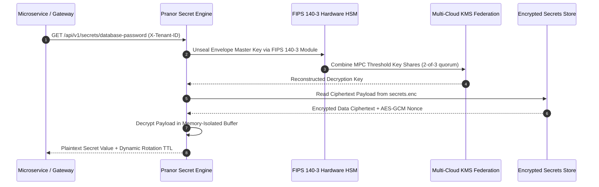

# Pranor Secret — Secret & Credential Management

`Pranor Secret` is the centralized secrets, credentials, and configuration protection engine for the **Pranor** ecosystem. It provides tenant-isolated secret storage encrypted at rest using AES-GCM (Galois/Counter Mode).

## Features

- **Centralized Encrypted Storage**: Encrypts all stored secrets using a 32-byte master key.
- **Tenant Isolation**: Organizes secrets dynamically per tenant context.
- **Microservice Ready**: Plugs directly into `Pranor Core` middleware for authentication, tracing, and rate limiting.
- **Graceful Shutdown**: Stops safely without corrupting the encrypted local storage file.

---

## Architecture

```mermaid
graph TD
    classDef client fill:#1e293b,stroke:#38bdf8,stroke-width:2px,color:#fff;
    classDef engine fill:#0f172a,stroke:#0d9488,stroke-width:2px,color:#fff;
    classDef storage fill:#1e1b4b,stroke:#6366f1,stroke-width:2px,color:#fff;
    classDef monitor fill:#1e293b,stroke:#64748b,stroke-width:1px,color:#fff;

    subgraph Interface ["🌐 Secrets Access Protocol"]
        API["REST Secret Engine API<br/><i>(:8091)</i>"] :::client
        CLI["secretctl Secret CLI"] :::client
    end

    subgraph Core ["⚡ Cryptographic Key & Secret Engine"]
        AESGCM["AES-256-GCM Envelope Encryption Engine"] :::engine
        FIPS140["FIPS 140-3 Cryptographic HSM Adapter<br/><i>(Enterprise EE)</i>"] :::engine
        KMSFed["Multi-Cloud KMS Federation Sync<br/><i>(AWS / GCP / Azure EE)</i>"] :::engine
        MPC["Zero-Knowledge MPC Key Splitter<br/><i>(Enterprise EE)</i>"] :::engine
    end

    subgraph Persistence ["💾 Encrypted Secret Storage"]
        FileStore["Encrypted Local Store<br/><i>(secrets.enc)</i>"] :::storage
        VaultStore["Pranor Vault Encrypted Key Store"] :::storage
    end

    API --> AESGCM
    CLI --> AESGCM
    AESGCM --> FIPS140
    FIPS140 --> KMSFed
    KMSFed --> MPC
    MPC --> FileStore
    MPC --> VaultStore
```

### Cryptographic Secret Envelope & Key Unsealing Sequence Flow



### Ecosystem Cross-Module Integration

Pranor Secret provides master key management and secret protection across all Pranor modules:

- **Pranor Gate**: Dynamically provisions and auto-rotates TLS server certificates and client mTLS credentials without restarting proxy instances.
- **Pranor Auth**: Secures private RSA/ECDSA JWT signing keys, WebAuthn passkey seeds, and OIDC client secrets.
- **Pranor Vault**: Stores client-side envelope encryption keys and S3 cloud storage access credentials.
- **Pranor Console**: Renders the visual Secret Management Webview, unsealing vaults and inspecting rotation policies securely.

---

### Local Development

1. **Provide a Master Key**: Define the 32-byte master key as a hex-encoded string in the environment:
   ```bash
   # Example hex key (32 bytes)
   export PRANOR_SECRET_MASTER_KEY="000102030405060708090a0b0c0d0e0f101112131415161718191a1b1c1d1e1f"
   ```
   *Note: If no master key is supplied, a temporary random key will be generated at startup, and stored secrets will not persist across restarts.*

2. **Run the Service**:
   ```bash
   go run main.go --port 8091 --file secrets.enc
   ```

---

## API Documentation

All endpoints support standard header authentication and `X-Tenant-ID` routing (integrated with `Pranor Core`).

### 1. Set or Update a Secret
* **Endpoint**: `POST /api/v1/secrets`
* **Headers**:
  * `X-Tenant-ID`: tenant-a
  * `Authorization`: Bearer `<token>`
* **Request Body**:
  ```json
  {
    "key": "database-password",
    "value": "super-secret-passphrase"
  }
  ```
* **Response (201 Created)**:
  ```json
  {
    "key": "database-password",
    "value": "super-secret-passphrase"
  }
  ```

### 2. Get a Secret
* **Endpoint**: `GET /api/v1/secrets/{key}`
* **Response (200 OK)**:
  ```json
  {
    "key": "database-password",
    "value": "super-secret-passphrase"
  }
  ```

### 3. List Stored Secret Keys
* **Endpoint**: `GET /api/v1/secrets`
* **Response (200 OK)**:
  ```json
  {
    "keys": ["database-password"]
  }
  ```

### 4. Delete a Secret
* **Endpoint**: `DELETE /api/v1/secrets/{key}`
* **Response (200 OK)**:
  ```json
  {
    "status": "deleted",
    "key": "database-password"
  }
  ```

---

## License

This project is licensed under Apache 2.0 - see the [LICENSE](https://github.com/vyuvaraj/pranor/blob/main/LICENSE) file for details.
