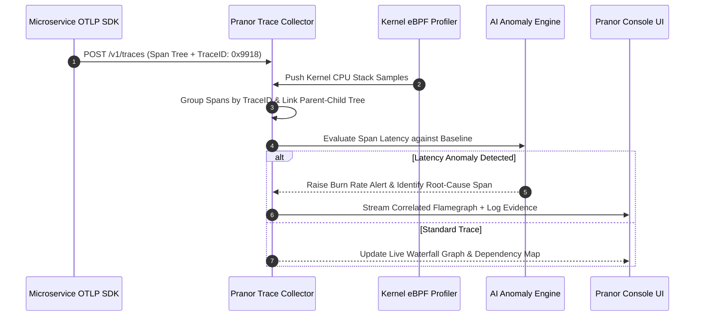

# Pranor Trace

```bash
docker run -p 8090:8090 ghcr.io/vyuvaraj/pranor-trace:latest
```

`Pranor Trace` is the distributed tracing and continuous profiling service for the **Pranor** ecosystem. It ingests OTLP-format traces, assembles waterfall hierarchies, provides SLO burn rate alerting, and delivers eBPF-powered flamegraph profiling with automatic OTel correlation.

---

## Table of Contents
- [Key Features](#key-features)
- [Architecture](#architecture)
- [API Endpoints](#api-endpoints)
- [SLO Burn Rate Alerting](#slo-burn-rate-alerting)
- [Flamegraph Profiling](#flamegraph-profiling)
- [Getting Started](#getting-started)

---

## Key Features

### 📡 OTLP Ingestion & Span Assembly
- **OTLP/HTTP ingestion**: Standard `/v1/traces` endpoint compatible with all OpenTelemetry SDKs and collectors
- **Trace reassembly**: Groups spans by trace ID, links parent-child relationships, calculates absolute and relative duration offsets
- **Waterfall hierarchy tree**: Full span waterfall with nested children, duration bars, and critical path highlighting
- **Configurable in-memory store**: Thread-safe store with oldest-first trace eviction at configurable capacity

### 🔥 eBPF Flamegraph Profiling
- **Continuous eBPF CPU & memory profiler**: Kernel-level profiling via eBPF — no code instrumentation required
- **OTel trace-to-flamegraph correlator**: Automatically correlates a slow trace span to the flamegraph profile captured during that span's execution window
- **In-browser flamegraph visualization**: Interactive flamegraph rendered in Pranor Console — click to zoom, search symbol names

### 📊 SLO & Error Budget
- **SLO burn rate alert engine**: Configurable SLO targets (e.g. 99.9% availability) with dual burn rate windows
  - **Fast burn window** (1h): Catches sudden spikes consuming error budget rapidly
  - **Slow burn window** (6h/24h): Catches gradual degradation
- **Error budget tracking**: Real-time remaining error budget per service per SLO definition
- **Pranor Console integration**: Live SLO burn rate dashboard with alert status

### 📈 Prometheus Exemplars
- **Exemplar-linked OpenMetrics generator**: Produces Prometheus-compatible OpenMetrics text with `# TYPE` / `# UNIT` annotations and trace exemplar links embedded in histogram observations

### 🗺️ Distributed Dependency Analysis
- **Critical path analyzer**: Identifies the longest-latency path across a distributed trace — pinpoints bottleneck services
- **Distributed dependency map**: Builds a service-call graph from observed trace data; visualized in Pranor Console topology view

---

## Architecture

```mermaid
graph TD
    classDef client fill:#1e293b,stroke:#38bdf8,stroke-width:2px,color:#fff;
    classDef engine fill:#0f172a,stroke:#0d9488,stroke-width:2px,color:#fff;
    classDef storage fill:#1e1b4b,stroke:#6366f1,stroke-width:2px,color:#fff;
    classDef monitor fill:#1e293b,stroke:#64748b,stroke-width:1px,color:#fff;

    subgraph Ingestion ["🌐 Telemetry Ingestion Layer"]
        OTLP["OTLP / gRPC / HTTP Collector<br/><i>(:4317 / :4318)</i>"] :::client
        eBPFProf["Kernel eBPF Continuous Profiler"] :::client
    end

    subgraph Processing ["⚡ Span Reassembly & AI Engine"]
        Reassembly["Span Grouping & Trace ID Linker"] :::engine
        CriticalPath["Critical Path Evaluator"] :::engine
        AIAutoTune["Autonomous AI Anomaly Auto-Tuner<br/><i>(Enterprise EE)</i>"] :::engine
        SLOEngine["SLO Burn Rate Alerting Engine"] :::engine
    end

    subgraph Storage ["💾 In-Memory & SIEM Storage"]
        MemStore["In-Memory Evicting Trace Store"] :::storage
        SIEMStreamer["Encrypted SIEM Streamer<br/><i>(Splunk / Datadog EE)</i>"] :::storage
    end

    OTLP --> Reassembly
    eBPFProf --> Reassembly
    Reassembly --> CriticalPath
    CriticalPath --> AIAutoTune
    AIAutoTune --> SLOEngine
    SLOEngine --> MemStore
    MemStore -.-> SIEMStreamer
```

### Telemetry Processing & Flamegraph Correlation Sequence Flow



### Ecosystem Cross-Module Integration

Pranor Trace serves as the central telemetry and observability hub across the Pranor ecosystem:

- **Pranor Gate**: Ingests W3C `traceparent` headers, attributing gateway latency and AI prompt token costs to backend trace spans.
- **Pranor Flow**: Captures individual workflow step execution spans, linking saga compensation steps to root trace IDs.
- **Pranor Console**: Renders live interactive CPU flamegraphs, distributed service dependency graphs, and SLO burn rate dashboards.
- **Pranor Notify**: Triggers incident notifications to PagerDuty or Slack when SLO burn rates exceed fast/slow window thresholds.

---

## API Endpoints

| Method | Path | Description |
|--------|------|-------------|
| `POST` | `/v1/traces` | OTLP/HTTP trace ingestion (standard OTel endpoint) |
| `GET` | `/api/v1/traces` | List recent traces (filterable by service, status, duration) |
| `GET` | `/api/v1/traces/{traceID}` | Get full trace with span waterfall hierarchy |
| `GET` | `/api/v1/traces/{traceID}/critical-path` | Critical path analysis for a trace |
| `GET` | `/api/v1/services` | List all services seen in ingested traces |
| `GET` | `/api/v1/dependencies` | Distributed service dependency map |
| `GET` | `/api/v1/flamegraph/{service}` | Latest eBPF flamegraph for a service (SVG/JSON) |
| `GET` | `/api/v1/flamegraph/{service}/correlated/{traceID}/{spanID}` | Flamegraph slice correlated to a span |
| `GET` | `/api/v1/slo/{service}/burn-rate` | SLO burn rate for a service |
| `POST` | `/api/v1/slo` | Define an SLO for a service |
| `GET` | `/api/v1/slo` | List all SLO definitions |
| `GET` | `/metrics` | Prometheus OpenMetrics text with exemplar links |
| `GET` | `/healthz` | Liveness probe |

---

## SLO Burn Rate Alerting

Define SLOs with dual burn windows:

```bash
curl -X POST http://pranor-trace:8090/api/v1/slo \
  -d '{
    "service": "orders-api",
    "slo_name": "availability",
    "target_ratio": 0.999,
    "windows": [
      { "name": "fast", "duration": "1h", "burn_rate_threshold": 14.4 },
      { "name": "slow", "duration": "6h", "burn_rate_threshold": 6.0 }
    ]
  }'
```

Query burn rate:
```bash
curl http://pranor-trace:8090/api/v1/slo/orders-api/burn-rate
# → { "slo": "availability", "budget_remaining": 0.82, "burn_rate_1h": 2.1, "burn_rate_6h": 0.8, "alerting": false }
```

---

## Flamegraph Profiling

eBPF profiling runs continuously in the background. Access profiles via:

```bash
# Get current CPU flamegraph for orders-api
curl http://pranor-trace:8090/api/v1/flamegraph/orders-api > flamegraph.svg

# Get flamegraph slice correlated to a specific slow span
curl http://pranor-trace:8090/api/v1/flamegraph/orders-api/correlated/abc123/span456
```

---

## Getting Started

```bash
docker run -p 8090:8090 \
  -e PRANOR_TRACE_MAX_TRACES=50000 \
  -e PRANOR_TRACE_EBPF_ENABLED=true \
  -e PRANOR_TRACE_OTEL_EXPORT=http://collector:4318 \
  ghcr.io/vyuvaraj/pranor-trace:latest
```

Configure your services to send OTLP traces:

```bash
# Go
OTEL_EXPORTER_OTLP_ENDPOINT=http://pranor-trace:8090 ./my-service

# Python
opentelemetry-instrument --exporter-otlp-endpoint http://pranor-trace:8090 python app.py
```

### Environment Variables

| Variable | Default | Description |
|----------|---------|-------------|
| `PRANOR_TRACE_PORT` | `8090` | HTTP listener port |
| `PRANOR_TRACE_MAX_TRACES` | `10000` | Max traces in memory before eviction |
| `PRANOR_TRACE_EBPF_ENABLED` | `false` | Enable eBPF continuous profiling |
| `PRANOR_TRACE_OTEL_EXPORT` | — | Re-export spans to another OTLP collector |
