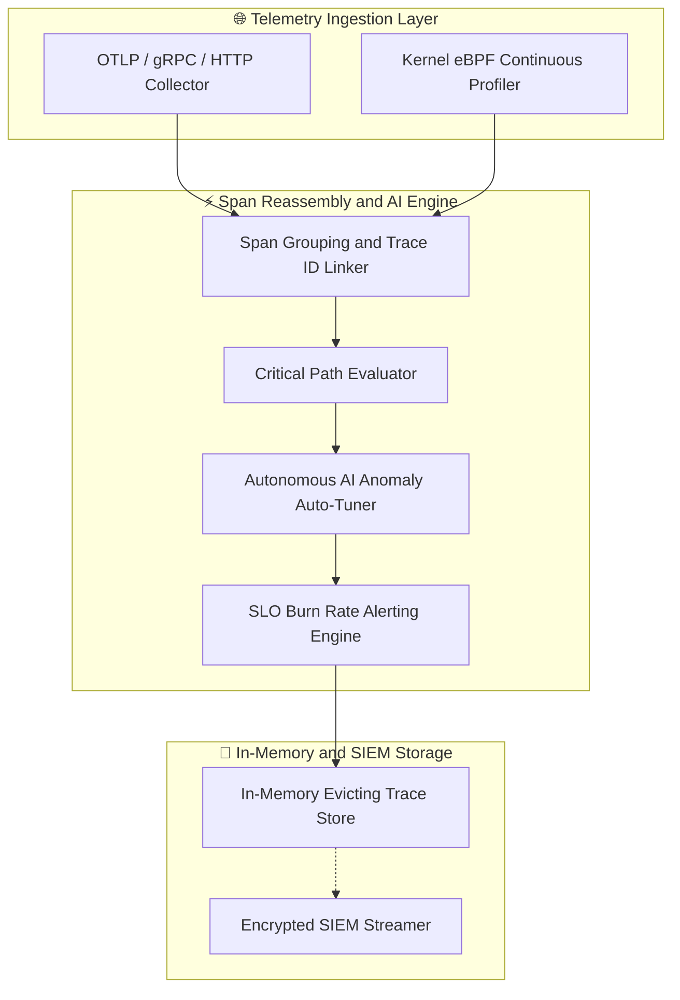
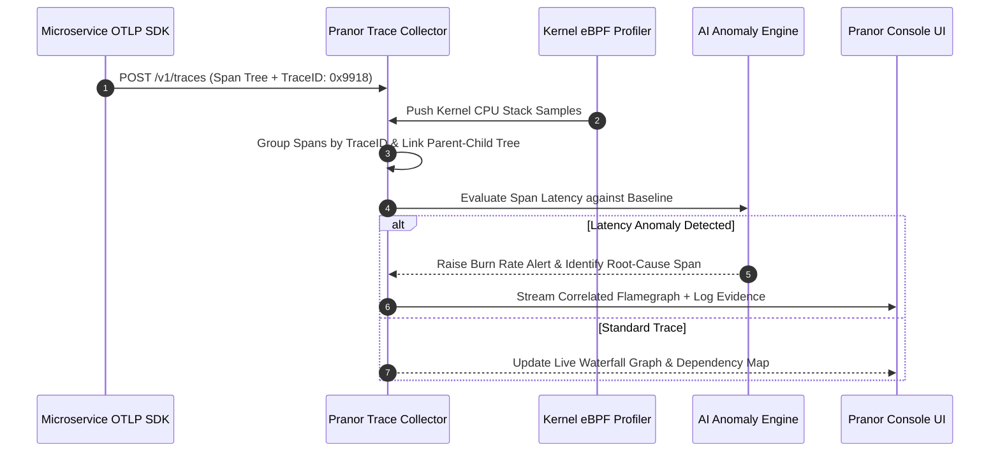

# Pranor Trace — Distributed Tracing & Continuous Profiling

**Version:** 1.0.0  
**Module Path:** `github.com/vyuvaraj/pranor/trace`  
**Default Port:** 8090  
**License:** AGPL-3.0 (OSS) / Enterprise License (EE with AI Anomaly Detection & SIEM Streaming)

---

## Overview

Pranor Trace is the distributed tracing and continuous profiling service for the Pranor ecosystem. It ingests OTLP-format traces, assembles waterfall hierarchies, provides SLO burn rate alerting, delivers eBPF-powered flamegraph profiling with automatic OTel correlation, critical path analysis, and anomaly detection.

Pranor Trace can run as:
- A **standalone binary** accepting OTLP/HTTP traces with in-memory storage
- An **integrated module** within the Pranor ecosystem with eBPF profiling, Console integration, and SIEM streaming

---

## Key Features

| Feature | Description |
|---------|-------------|
| **OTLP Ingestion** | Standard `/v1/traces` endpoint compatible with all OpenTelemetry SDKs |
| **Span Reassembly** | Groups spans by trace ID, links parent-child relationships |
| **Waterfall UI** | Full span waterfall with nested children and duration bars |
| **SLO Burn Rate** | Dual-window burn rate alerting with error budget tracking |
| **eBPF Flamegraphs** | Kernel-level CPU/memory profiling without code instrumentation |
| **Trace-to-Flamegraph** | Correlate slow spans to flamegraph profiles |
| **Critical Path Analysis** | Identify the longest-latency path across distributed traces |
| **Prometheus Exemplars** | OpenMetrics with trace exemplar links in histograms |
| **Dependency Map** | Auto-discovered service call graph from trace data |
| **Anomaly Detection** | AI-powered latency anomaly baseline comparison |

---

## Architecture



### Telemetry Processing & Flamegraph Correlation Sequence Flow



### Ecosystem Cross-Module Integration

Pranor Trace serves as the central telemetry and observability hub across the Pranor ecosystem:

- **Pranor Gate**: Ingests W3C `traceparent` headers, attributing gateway latency and AI prompt token costs to backend trace spans.
- **Pranor Flow**: Captures individual workflow step execution spans, linking saga compensation steps to root trace IDs.
- **Pranor Console**: Renders live interactive CPU flamegraphs, distributed service dependency graphs, and SLO burn rate dashboards.
- **Pranor Notify**: Triggers incident notifications to PagerDuty or Slack when SLO burn rates exceed fast/slow window thresholds.

---

## Installation & Deployment

### Binary

```bash
cd pranor/trace
go build -o pranor-trace .
./pranor-trace --port 8090
```

### Docker

```bash
docker run -p 8090:8090 ghcr.io/vyuvaraj/pranor-trace:latest
```

### With eBPF Profiling

```bash
docker run -p 8090:8090 \
  --privileged \
  -e PRANOR_TRACE_EBPF_ENABLED=true \
  -e PRANOR_TRACE_MAX_TRACES=50000 \
  ghcr.io/vyuvaraj/pranor-trace:latest
```

### As Part of Pranor Ecosystem

When running under the Pranor platform, Trace integrates automatically with all services via the `PRANOR_OTLP_ENDPOINT` env var. Console connects for waterfall rendering and flamegraph display.

---

## Configuration

### Environment Variables

| Variable | Default | Description |
|----------|---------|-------------|
| `PRANOR_TRACE_PORT` | `8090` | HTTP listener port |
| `PRANOR_TRACE_MAX_TRACES` | `10000` | Max traces in memory before eviction |
| `PRANOR_TRACE_EBPF_ENABLED` | `false` | Enable eBPF continuous profiling |
| `PRANOR_TRACE_OTEL_EXPORT` | — | Re-export spans to another OTLP collector |
| `PRANOR_TRACE_SLO_ALERT_WEBHOOK` | — | Webhook URL for SLO burn rate alerts |

### YAML Config (`trace.yaml`)

```yaml
port: "8090"
max_traces: 50000
ebpf_enabled: true
otel_export: ""
slo_alert_webhook: "http://pranor-notify:8094/api/v1/send"
```

### CLI Flags

| Flag | Default | Description |
|------|---------|-------------|
| `--port` | `8090` | HTTP listen port |

---

## API Reference

**Base URL:** `http://localhost:8090`

### POST /v1/traces

OTLP/HTTP trace ingestion (standard OpenTelemetry endpoint).

**Request:** Standard OTLP ExportTraceServiceRequest (protobuf or JSON).

**Response (200):**

```json
{}
```

---

### GET /api/v1/traces

List recent traces.

**Query parameters:** `service`, `status`, `min_duration_ms`, `limit`

**Response (200):**

```json
{
  "traces": [
    {
      "trace_id": "abc123def456",
      "root_service": "orders-api",
      "root_operation": "POST /orders",
      "duration_ms": 234,
      "span_count": 8,
      "status": "ok",
      "started_at": "2026-08-01T10:00:00Z"
    }
  ]
}
```

---

### GET /api/v1/traces/{traceID}

Get full trace with span waterfall hierarchy.

**Response (200):**

```json
{
  "trace_id": "abc123def456",
  "spans": [
    {
      "span_id": "span-001",
      "parent_span_id": null,
      "service": "orders-api",
      "operation": "POST /orders",
      "duration_ms": 234,
      "status": "ok",
      "children": [
        {
          "span_id": "span-002",
          "service": "payments-api",
          "operation": "charge",
          "duration_ms": 180
        }
      ]
    }
  ]
}
```

---

### GET /api/v1/traces/{traceID}/critical-path

Critical path analysis for a trace.

**Response (200):**

```json
{
  "trace_id": "abc123def456",
  "critical_path": [
    { "service": "orders-api", "operation": "POST /orders", "self_time_ms": 54 },
    { "service": "payments-api", "operation": "charge", "self_time_ms": 180 }
  ],
  "bottleneck": "payments-api"
}
```

---

### POST /api/v1/slo

Define an SLO for a service.

**Request:**

```json
{
  "service": "orders-api",
  "slo_name": "availability",
  "target_ratio": 0.999,
  "windows": [
    { "name": "fast", "duration": "1h", "burn_rate_threshold": 14.4 },
    { "name": "slow", "duration": "6h", "burn_rate_threshold": 6.0 }
  ]
}
```

**Response (201):**

```json
{
  "status": "created",
  "slo_id": "slo-001"
}
```

---

### GET /api/v1/slo/{service}/burn-rate

SLO burn rate for a service.

**Response (200):**

```json
{
  "slo": "availability",
  "budget_remaining": 0.82,
  "burn_rate_1h": 2.1,
  "burn_rate_6h": 0.8,
  "alerting": false
}
```

---

### GET /api/v1/flamegraph/{service}

Latest eBPF flamegraph for a service.

**Response (200):** SVG or JSON flamegraph data.

---

### GET /healthz

Liveness probe.

```json
{"status":"UP","service":"pranor-trace","version":"1.0.0"}
```

---

## Security

### Standalone Mode

In standalone mode, Trace accepts OTLP spans without authentication. Suitable for development and internal networks.

### Ecosystem Mode (Full Auth Stack)

When running within the Pranor ecosystem:

1. **JWT Auth** — management APIs require Bearer token
2. **OTel ingestion** — `/v1/traces` can be optionally auth-gated
3. **Tenant Isolation** — traces scoped per tenant
4. **SIEM Streaming** — encrypted export to external SIEM systems
5. **Data Retention** — configurable max traces with oldest-first eviction

### eBPF Security

eBPF profiling requires `--privileged` Docker flag or `CAP_SYS_ADMIN` + `CAP_BPF` capabilities. In production, use a dedicated profiling sidecar with minimal permissions.

---

## Observability

### Prometheus Metrics

| Metric | Type | Description |
|--------|------|-------------|
| `pranor_trace_spans_ingested_total` | Counter | Total spans received |
| `pranor_trace_traces_stored` | Gauge | Traces currently in memory |
| `pranor_trace_slo_burn_rate` | Gauge | Current burn rate per service/SLO |
| `pranor_trace_slo_alerts_fired_total` | Counter | SLO alert triggers |
| `pranor_trace_flamegraph_samples_total` | Counter | eBPF stack samples collected |
| `pranor_trace_evictions_total` | Counter | Traces evicted from memory |

### OpenTelemetry Self-Telemetry

Trace emits its own spans for:
- `trace.ingest` — span ingestion pipeline
- `trace.reassemble` — trace ID grouping
- `trace.slo.evaluate` — burn rate calculation
- `trace.flamegraph.correlate` — span-to-flamegraph correlation

### Logging

Structured JSON logs with fields: `level`, `timestamp`, `trace_id`, `service`, `operation`, `duration_ms`, `alert`.

---

## Enterprise Edition

| Feature | OSS | EE |
|---------|:---:|:--:|
| OTLP/HTTP trace ingestion | ✓ | ✓ |
| Span reassembly & waterfall | ✓ | ✓ |
| SLO burn rate alerting | ✓ | ✓ |
| Critical path analysis | ✓ | ✓ |
| Service dependency map | ✓ | ✓ |
| Prometheus exemplars | ✓ | ✓ |
| In-memory evicting store | ✓ | ✓ |
| eBPF flamegraph profiling | — | ✓ |
| AI anomaly detection auto-tuner | — | ✓ |
| Encrypted SIEM streaming | — | ✓ |
| Trace-to-flamegraph correlation | — | ✓ |
| Multi-cluster trace federation | — | ✓ |

---

## Operational Runbook

### Traces being evicted too quickly

1. Check `pranor_trace_traces_stored` gauge vs `PRANOR_TRACE_MAX_TRACES`
2. Increase `PRANOR_TRACE_MAX_TRACES` or add more memory
3. Consider exporting to external storage via `PRANOR_TRACE_OTEL_EXPORT`
4. Review if unnecessary high-cardinality spans are being ingested

### SLO alerts firing incorrectly

1. Check `pranor_trace_slo_burn_rate` metric for the service
2. Verify SLO definition — is the target ratio correct?
3. Review burn rate window configuration (fast: 1h, slow: 6h)
4. Check if a deployment or incident caused a legitimate spike
5. Adjust thresholds if alerting is too sensitive

### eBPF profiling not producing data

1. Verify `PRANOR_TRACE_EBPF_ENABLED=true`
2. Check container has `--privileged` or necessary capabilities
3. Verify kernel version supports BPF (Linux 4.15+)
4. Check `pranor_trace_flamegraph_samples_total` metric
5. Review logs for BPF program load errors

### High span ingestion latency

1. Monitor span ingestion rate vs processing capacity
2. Check `pranor_trace_spans_ingested_total` rate
3. If store is full, eviction adds overhead — increase capacity
4. Consider sampling at the SDK level to reduce volume
5. Review if SIEM streaming is creating backpressure

## v2.0 OTLP Span Schema (std/trace)

In v2.0, Pranor Trace defines a canonical span name hierarchy and mandatory attributes for all ecosystem modules.

### Canonical Span Names
| Constant | Span Name | Module |
|----------|-----------|--------|
| SpanAgentExecution | pranor.agent_execution | — |
| SpanGateInspect | pranor.gate.inspect | gate |
| SpanGraphContext | pranor.graph.context | graph |
| SpanGraphCache | pranor.graph.cache | graph |
| SpanGraphSQL | pranor.graph.sql | graph |
| SpanDecisionEvaluate | pranor.decision.evaluate | decision |
| SpanDecisionAuth | pranor.decision.auth | decision |
| SpanDecisionBudget | pranor.decision.budget | decision |
| SpanDecisionRisk | pranor.decision.risk | decision |
| SpanDecisionRules | pranor.decision.rules | decision |
| SpanDecisionLearn | pranor.decision.learn | decision |
| SpanFlowSaga | pranor.flow.saga | flow |
| SpanFlowStep | pranor.flow.step | flow |
| SpanLearnPredict | pranor.learn.predict | learn |

### Mandatory Span Attributes
| Attribute | Key | Description |
|-----------|-----|-------------|
| Agent ID | pranor.agent_id | Executing agent identifier |
| User ID | pranor.user_id | Authenticated user |
| Tenant ID | pranor.tenant_id | Tenant/org isolation |
| Request ID | pranor.request_id | Correlation ID across modules |
| Module | pranor.module | Emitting module name |
| Outcome | pranor.outcome | ALLOW / DENY / APPROVE / TRANSFORM / ERROR |

### Fault Contract
- Span emission is **best-effort and non-blocking** (fire-and-forget goroutine)
- Failed writes log a warning to stderr and continue — never on the critical path
- OSS: JSON lines to stderr via `stdoutEmitter`; EE: full OTLP export to Pranor Trace collector
- Attribute values truncated to 256 bytes per `TruncateAttr(v string) string`

