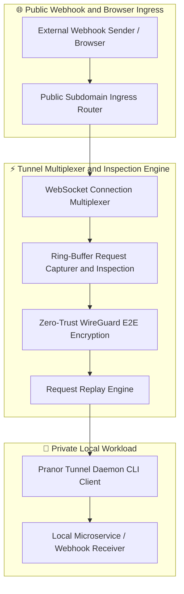
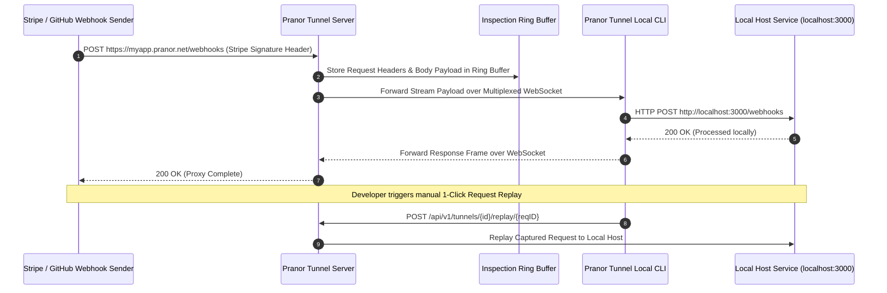

# Pranor Tunnel — Secure Dev Tunneling

**Version:** 0.1.0  
**Module Path:** `github.com/vyuvaraj/pranor/tunnel`  
**Default Port:** 8443  
**License:** AGPL-3.0 (OSS) / Enterprise License (EE with WireGuard E2E & Custom Domains)

---

## Overview

Pranor Tunnel is a secure, instant tunneling service for exposing local services to the internet during development and testing. One command creates a public URL that forwards requests to your local machine via WebSocket multiplexing — ideal for webhook testing, OAuth callbacks, mobile app dev, and sharing work in progress.

Pranor Tunnel can run as:
- A **server** (relay) accepting incoming public traffic and routing to connected clients
- A **client** (daemon) running on developer machines, connecting to the relay and forwarding to localhost

---

## Key Features

| Feature | Description |
|---------|-------------|
| **Subdomain Routing** | Each tunnel gets a unique subdomain (e.g., `myapp.pranor.net`) |
| **WebSocket Multiplexing** | Binary-framed streams over a single WebSocket connection |
| **Request Inspection** | Ring-buffer captures all requests/responses for debugging |
| **Request Replay** | Replay any captured request with one API call |
| **JWT Auth Gating** | Require valid JWT to open tunnel connections |
| **Shareable URLs** | Time-limited shareable tunnel URLs with auto-expiry |
| **Git Branch Auto-subdomain** | Automatically derives subdomain from current Git branch |
| **Multi-port Tunneling** | Expose multiple local ports with a single config file |
| **Custom Domains** | Map custom domains to tunnels (DNS CNAME) |
| **OTel Propagation** | `traceparent` headers forwarded through the tunnel |
| **Reconnection** | Persistent reconnect with exponential backoff and jitter |

---

## Architecture



### Public Webhook Proxying & Request Replay Sequence Flow



### Ecosystem Cross-Module Integration

Pranor Tunnel provides secure localhost exposure across the Pranor platform:

- **Pranor Gate**: Relays public HTTPS ingress routes into multiplexed WebSocket tunnels for dev preview environments.
- **Pranor Trace**: Generates `traceparent` OpenTelemetry headers, tracing requests from public webhooks through tunnels into local code.
- **Pranor Deploy**: Exposes ephemeral branch preview environments securely without public IP addresses.
- **Pranor Console**: Renders the visual Request Inspector UI, enabling 1-click webhook replays and live packet inspection.

---

## Installation & Deployment

### Server (Self-hosted Relay)

```bash
cd pranor/tunnel
go build -o pranor-tunnel .
./pranor-tunnel server --port 8443 --domain pranor.net
```

### Docker (Server)

```bash
docker run -p 8443:8443 \
  -e PRANOR_TUNNEL_DOMAIN=pranor.net \
  -e PRANOR_TUNNEL_JWT_SECRET=my-secret \
  ghcr.io/vyuvaraj/pranor-tunnel:latest server
```

### Client (Local Machine)

```bash
# Install
go install github.com/vyuvaraj/pranor/tunnel@latest

# Expose local port 3000
pranor-tunnel client 3000 --relay ws://tunnel.pranor.net:8443/ws/connect --subdomain myapp
```

### Multi-port Config File

```yaml
# tunnel.yaml
relay: "ws://tunnel.pranor.net:8443/ws/connect"
token: "my-auth-token"
tunnels:
  - port: "3000"
    subdomain: "frontend"
  - port: "8080"
    subdomain: "api"
  - port: "5432"
    subdomain: "db-admin"
```

```bash
pranor-tunnel client --config tunnel.yaml
```

---

## Configuration

### Server Environment Variables

| Variable | Default | Description |
|----------|---------|-------------|
| `PRANOR_TUNNEL_ADDR` | `:8443` | Server listen address |
| `PRANOR_TUNNEL_DOMAIN` | `localhost` | Base domain for subdomains |
| `PRANOR_TUNNEL_JWT_SECRET` | — | JWT signing secret for auth gating |
| `PRANOR_TUNNEL_MAX_RING_BUFFER` | `100` | Max captured requests per tunnel |
| `PRANOR_TUNNEL_OTEL_ENDPOINT` | — | OpenTelemetry collector URL |
| `PRANOR_TUNNEL_TLS_CERT` | — | TLS certificate path |
| `PRANOR_TUNNEL_TLS_KEY` | — | TLS key path |

### Client Environment Variables

| Variable | Default | Description |
|----------|---------|-------------|
| `PRANOR_TUNNEL_RELAY` | `ws://localhost:8443/ws/connect` | Relay WebSocket URL |
| `PRANOR_TUNNEL_TOKEN` | — | Authentication token |

### YAML Config (`tunnel.yaml`)

```yaml
# Server config
addr: ":8443"
domain: "pranor.net"
jwt_secret: "my-secret"
max_ring_buffer: 100
tls_cert: "/certs/tunnel.crt"
tls_key: "/certs/tunnel.key"
otel_endpoint: "http://pranor-trace:8090"
```

### CLI Flags (Server)

| Flag | Default | Description |
|------|---------|-------------|
| `--port`, `-p` | `8443` | Listen port |
| `--domain`, `-d` | `localhost` | Base domain for subdomains |

### CLI Flags (Client)

| Flag | Default | Description |
|------|---------|-------------|
| `--relay`, `-r` | `ws://localhost:8443/ws/connect` | Relay WebSocket URL |
| `--subdomain`, `-s` | (auto-generated) | Requested subdomain |
| `--custom-domain`, `-c` | — | Custom domain mapping |
| `--token`, `-t` | — | Authentication token |
| `--inspect-port`, `-i` | `4040` | Local inspection web UI port |
| `--share-auth`, `-a` | — | Basic auth to protect public tunnel |
| `--config` | — | Path to YAML config file |

---

## API Reference

**Base URL:** `http://localhost:8443`

### POST /api/v1/tunnels

Create a new tunnel (server-side).

**Request:**

```json
{
  "subdomain": "myapp",
  "target": "localhost:3000",
  "auth_required": true
}
```

**Response (201):**

```json
{
  "id": "tun-abc-123",
  "url": "https://myapp.pranor.net",
  "status": "active",
  "created_at": "2026-08-01T10:00:00Z"
}
```

---

### GET /api/v1/tunnels/{id}/requests

Browse captured requests from ring buffer.

**Response (200):**

```json
{
  "requests": [
    {
      "id": "req-001",
      "method": "POST",
      "path": "/webhooks",
      "status": 200,
      "latency_ms": 43,
      "timestamp": "2026-08-01T10:01:00Z"
    }
  ]
}
```

---

### POST /api/v1/tunnels/{id}/replay/{reqID}

Replay a captured request to the local service.

**Response (200):**

```json
{
  "status": "replayed",
  "response_status": 200,
  "latency_ms": 38
}
```

---

### POST /api/v1/tunnels/{id}/share

Generate a shareable URL with expiry.

**Request:**

```json
{
  "expires_in": "1h",
  "one_time": false
}
```

**Response (200):**

```json
{
  "url": "https://myapp.pranor.net?token=xyz789",
  "expires_at": "2026-08-01T11:00:00Z"
}
```

---

### GET /healthz

Liveness probe.

```json
{"status":"UP","service":"pranor-tunnel","version":"0.1.0"}
```

### GET /readyz

Readiness probe.

```json
{"status":"UP","service":"pranor-tunnel","version":"0.1.0"}
```

---

## Security

### Authentication

- **JWT auth gating**: Set `PRANOR_TUNNEL_JWT_SECRET` to require valid JWT for tunnel connections
- **API key**: Pass a static token via `--token` flag or `Authorization: Bearer <token>` header
- **Basic auth protection**: Use `--share-auth usr:pwd` to add HTTP Basic Auth to the public tunnel URL

### Shareable URLs

- Time-limited URLs with configurable expiry
- One-time access tokens that invalidate after first use
- Shareable links include embedded auth tokens

### TLS

Configure TLS for encrypted public-facing connections:
- Set `PRANOR_TUNNEL_TLS_CERT` and `PRANOR_TUNNEL_TLS_KEY`
- Wildcard certificate recommended for `*.pranor.net`

### DNS Configuration

Configure a wildcard DNS record: `*.pranor.net → tunnel-server-ip`

---

## Observability

### Prometheus Metrics

| Metric | Type | Description |
|--------|------|-------------|
| `pranor_tunnel_active_connections` | Gauge | Active WebSocket tunnel connections |
| `pranor_tunnel_requests_proxied_total` | Counter | Total requests forwarded |
| `pranor_tunnel_request_latency_ms` | Histogram | End-to-end proxy latency |
| `pranor_tunnel_reconnections_total` | Counter | Client reconnection events |
| `pranor_tunnel_ring_buffer_size` | Gauge | Captured requests in buffer |

### OpenTelemetry Tracing

Tunnel propagates `traceparent` and `tracestate` headers through the tunnel. Additionally emits:
- `tunnel.proxy` — request proxy span
- `tunnel.replay` — request replay span
- `tunnel.connect` — WebSocket connection establishment

### Logging

Real-time request log in terminal client:
```
[2026-08-01 11:42:00] POST /webhook/payment    200  43ms
[2026-08-01 11:42:01] GET  /api/orders/123     200  12ms
[2026-08-01 11:42:03] POST /webhook/payment    500  89ms  ← error
```

---

## Enterprise Edition

| Feature | OSS | EE |
|---------|:---:|:--:|
| Subdomain-based routing | ✓ | ✓ |
| WebSocket multiplexing | ✓ | ✓ |
| Request inspection & replay | ✓ | ✓ |
| JWT / API key auth gating | ✓ | ✓ |
| Shareable URLs with expiry | ✓ | ✓ |
| Git branch auto-subdomain | ✓ | ✓ |
| Multi-port tunneling (config file) | ✓ | ✓ |
| Persistent reconnect with backoff | ✓ | ✓ |
| WireGuard end-to-end encryption | — | ✓ |
| Custom domain mapping | — | ✓ |
| Team tunnel sharing (RBAC) | — | ✓ |
| Rate limiting per tunnel | — | ✓ |
| Request throttling | — | ✓ |

---

## Operational Runbook

### Client cannot connect to relay

1. Verify relay URL is correct (`--relay ws://...`)
2. Check if JWT token is required and valid
3. Verify network allows WebSocket connections (port 8443)
4. Check if firewall/proxy is stripping `Upgrade: websocket` headers
5. Try with explicit `--subdomain` to rule out auto-generation issues

### Tunnel URL returning 502

1. Verify local service is running on the specified port
2. Check client terminal for connection errors
3. Verify WebSocket connection is active (not reconnecting)
4. Check ring buffer for request/response details
5. Review local service logs for errors

### Requests not appearing in inspection buffer

1. Check `PRANOR_TUNNEL_MAX_RING_BUFFER` isn't set to 0
2. Verify inspection port is accessible (default: 4040)
3. Old requests may have been evicted (buffer is fixed-size ring)
4. Ensure the request went through the tunnel (not direct)

### Reconnection loop (client keeps disconnecting)

1. Check server logs for auth rejection
2. Verify token hasn't expired
3. Check network stability between client and relay
4. Review reconnection backoff settings (max retries, max delay)
5. If the server restarted, subdomain may have been reassigned
