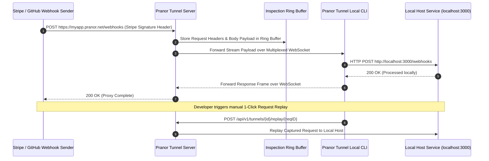

# Pranor Tunnel

```bash
pranor-tunnel client --port 3000 --server tunnel.pranor.net
# → Exposes local port 3000 at https://abc123.tunnel.pranor.net
```

```bash
docker run -p 8092:8092 ghcr.io/vyuvaraj/pranor-tunnel:latest
```

`Pranor Tunnel` is a secure, instant tunneling service for exposing local Pranor services to the internet during development and testing. One command creates a public URL that forwards requests to your local machine — ideal for webhook testing, OAuth callbacks, mobile app dev, and sharing work in progress.

---

## Table of Contents
- [Key Features](#key-features)
- [Architecture](#architecture)
- [API Endpoints](#api-endpoints)
- [Getting Started](#getting-started)
- [Request Inspection & Replay](#request-inspection--replay)
- [Authentication & Access Control](#authentication--access-control)
- [Resilience & Reconnection](#resilience--reconnection)
- [Configuration](#configuration)

---

## Key Features

### 🌐 Core Tunneling
- **Subdomain-based routing**: Each tunnel gets a unique subdomain (e.g., `myapp.pranor.net`)
- **WebSocket transport**: Firewall-friendly tunneling over WebSocket — no special network configuration required
- **WebSocket connection multiplexing**: Binary-framed multiplexed streams (`4-byte StreamID + 1-byte Type + 4-byte PayloadLen`) allow multiple simultaneous requests over a single WebSocket connection
- **OTel traceparent propagation**: `traceparent` and `tracestate` headers forwarded natively through the tunnel for distributed tracing continuity

### 🔍 Request Inspection & Replay
- **Full request & response body capture**: Ring-buffer captures all requests and responses for debugging
- **Replay-on-demand**: Replay any captured request to your local service with one API call
- **Real-time request log**: Colorful terminal output with status codes, latency, and method — like a local dev proxy

### 🔒 Authentication & Access Control
- **JWT auth gating**: Require a valid JWT token to open a tunnel connection — prevents unauthorized forwarding
- **API-key auth**: Alternative to JWT; pass a static API key in the `Authorization` header
- **Shareable tunnel URLs with expiry**: Generate a time-limited shareable URL (e.g., valid for 1h) — auto-expires after
- **One-time access tokens**: Single-use tunnel URLs that invalidate after first use

### 🔄 Resilience & Reconnection
- **Persistent reconnect with exponential backoff**: Client auto-reconnects on disconnect; configurable max retries, initial delay, max delay, and jitter multiplier
- **Connection state recovery**: In-flight requests are retried on reconnect within configurable grace window
- **Health & readiness probes**: Standard `/healthz` and `/readyz` endpoints for container orchestration

---

## Architecture

```mermaid
graph TD
    classDef client fill:#1e293b,stroke:#38bdf8,stroke-width:2px,color:#fff;
    classDef engine fill:#0f172a,stroke:#0d9488,stroke-width:2px,color:#fff;
    classDef storage fill:#1e1b4b,stroke:#6366f1,stroke-width:2px,color:#fff;
    classDef monitor fill:#1e293b,stroke:#64748b,stroke-width:1px,color:#fff;

    subgraph ExternalIngress ["🌐 Public Webhook & Browser Ingress"]
        PublicClient["External Webhook Sender / Browser"] :::client
        SubdomainRouter["Public Subdomain Ingress Router<br/><i>(*.pranor.net)</i>"] :::client
    end

    subgraph TunnelServer ["⚡ Tunnel Multiplexer & Inspection Engine"]
        WSMux["WebSocket Connection Multiplexer<br/><i>(StreamID Framing)</i>"] :::engine
        Inspections["Ring-Buffer Request Capturer & Inspection"] :::engine
        E2EEncryption["Zero-Trust WireGuard E2E Encryption<br/><i>(Enterprise EE)</i>"] :::engine
        ReplayEngine["Request Replay Engine"] :::engine
    end

    subgraph LocalMachine ["💾 Private Local Workload"]
        TunnelClient["Pranor Tunnel Daemon CLI Client"] :::storage
        LocalSvc["Local Microservice / Webhook Receiver<br/><i>(http://localhost:3000)</i>"] :::storage
    end

    PublicClient --> SubdomainRouter
    SubdomainRouter --> WSMux
    WSMux --> Inspections
    Inspections --> E2EEncryption
    E2EEncryption --> ReplayEngine
    ReplayEngine --> TunnelClient
    TunnelClient --> LocalSvc
```

### Public Webhook Proxying & Request Replay Sequence Flow



### Ecosystem Cross-Module Integration

Pranor Tunnel provides secure localhost exposure across the Pranor platform:

- **Pranor Gate**: Relays public HTTPS ingress routes into multiplexed WebSocket tunnels for dev preview environments.
- **Pranor Trace**: Generates `traceparent` OpenTelemetry headers, tracing requests from public webhooks through tunnels into local code.
- **Pranor Deploy**: Exposes ephemeral branch preview environments (`feature-x.preview.pranor.net`) securely without public IP addresses.
- **Pranor Console**: Renders the visual Request Inspector UI, enabling 1-click webhook replays and live packet inspection.

---

---

## API Endpoints

| Method | Path | Description |
|--------|------|-------------|
| `POST` | `/api/v1/tunnels` | Create a new tunnel |
| `GET` | `/api/v1/tunnels` | List active tunnels |
| `DELETE` | `/api/v1/tunnels/{id}` | Close a tunnel |
| `GET` | `/api/v1/tunnels/{id}/requests` | Browse captured requests (ring buffer) |
| `POST` | `/api/v1/tunnels/{id}/replay/{reqID}` | Replay a captured request |
| `POST` | `/api/v1/tunnels/{id}/share` | Generate a shareable URL with expiry |
| `GET` | `/healthz` | Liveness probe |
| `GET` | `/readyz` | Readiness probe |

---

## Getting Started

### Server (self-hosted)

```bash
docker run -p 8092:8092 \
  -e PRANOR_TUNNEL_DOMAIN=pranor.net \
  -e PRANOR_TUNNEL_JWT_SECRET=my-secret \
  -e PRANOR_TUNNEL_OTEL_ENDPOINT=http://pranor-trace:4318 \
  ghcr.io/vyuvaraj/pranor-tunnel:latest
```

### Client (local machine)

```bash
# Install client
go install github.com/vyuvaraj/pranor/Pranor Tunnel/cmd/pranor-tunnel@latest

# Expose local port 3000 to a public URL
pranor-tunnel --server wss://tunnel.pranor.net --local http://localhost:3000

# Output:
# ✓ Tunnel active: https://abc123.pranor.net
# Forwarding: https://abc123.pranor.net → http://localhost:3000
# Press Ctrl+C to close tunnel
```

---

## Request Inspection & Replay

All requests are captured in a ring buffer:

```bash
# View captured requests
curl http://localhost:8092/api/v1/tunnels/tun-abc/requests

# Replay a specific captured request
curl -X POST http://localhost:8092/api/v1/tunnels/tun-abc/replay/req-001
```

The terminal client shows real-time request logs:

```
[2026-07-26 11:42:00] POST /webhook/payment    200  43ms
[2026-07-26 11:42:01] GET  /api/orders/123     200  12ms
[2026-07-26 11:42:03] POST /webhook/payment    500  89ms  ← error highlighted
```

---

## Authentication & Access Control

```bash
# Create a tunnel with JWT auth requirement
pranor-tunnel --server wss://tunnel.pranor.net \
  --local http://localhost:3000 \
  --auth jwt \
  --jwt-token eyJhbGciOi...

# Generate a shareable URL (expires in 1 hour)
curl -X POST http://localhost:8092/api/v1/tunnels/tun-abc/share \
  -d '{"expires_in": "1h", "one_time": false}'
# → { "url": "https://abc123.pranor.net?token=xyz789", "expires_at": "..." }
```

---

## Resilience & Reconnection

Configure reconnect behavior in the client:

```bash
pranor-tunnel \
  --server wss://tunnel.pranor.net \
  --local http://localhost:3000 \
  --reconnect-max-retries 10 \
  --reconnect-initial-delay 500ms \
  --reconnect-max-delay 30s \
  --reconnect-jitter 0.2
```

---

## Configuration

### Server Environment Variables

| Variable | Default | Description |
|----------|---------|-------------|
| `PRANOR_TUNNEL_PORT` | `8092` | HTTP/WebSocket listener port |
| `PRANOR_TUNNEL_DOMAIN` | — | Base domain for subdomains (e.g. `pranor.net`) |
| `PRANOR_TUNNEL_JWT_SECRET` | — | JWT signing secret for auth gating |
| `PRANOR_TUNNEL_MAX_RING_BUFFER` | `100` | Max captured requests per tunnel |
| `PRANOR_TUNNEL_OTEL_ENDPOINT` | — | OpenTelemetry collector URL |
| `PRANOR_TUNNEL_TLS_CERT` | — | TLS certificate path |
| `PRANOR_TUNNEL_TLS_KEY` | — | TLS key path |

### Wildcard DNS
Configure your DNS provider with a wildcard A/CNAME record pointing `*.pranor.net` to the Pranor Tunnel server IP.
