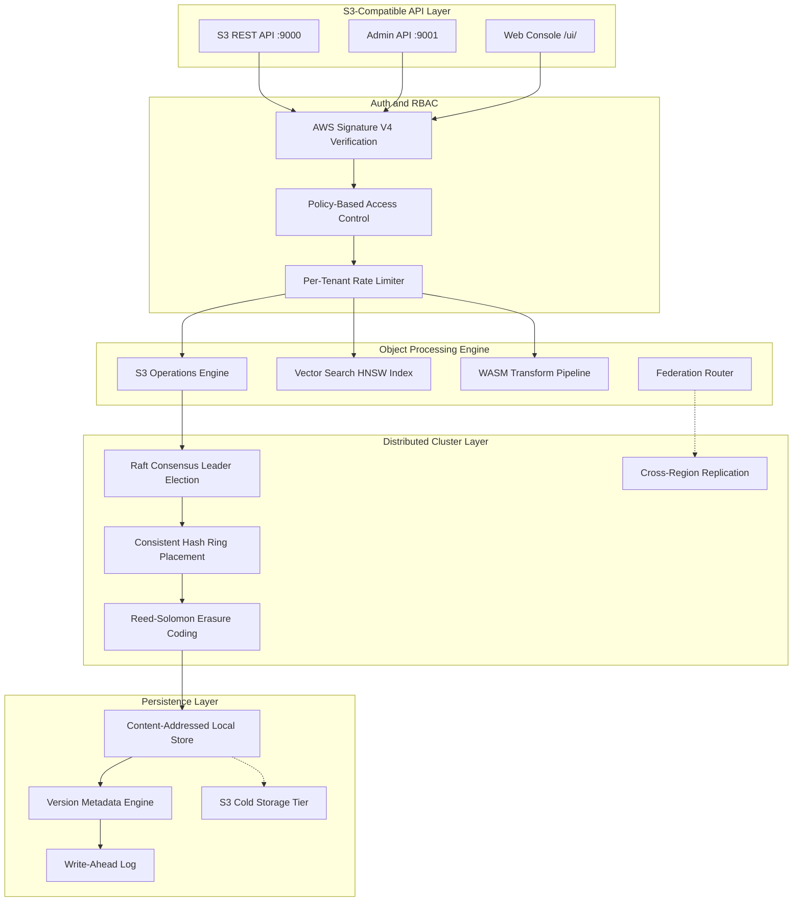
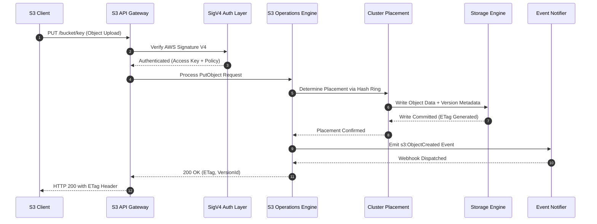

# Pranor Vault — S3-Compatible Object Storage

**Version:** 2.0.0  
**Module Path:** `github.com/vyuvaraj/pranor/vault`  
**Default Ports:** 9000 (S3 API), 9001 (Admin Console)  
**License:** AGPL-3.0 (OSS) / Enterprise License (EE with Multi-Region Replication, CoW Branching, Envelope Encryption)

---

## Overview

Pranor Vault is a production-grade S3-compatible object storage engine with embedded vector search, time-travel versioning, erasure coding, bucket branching, WASM transform pipelines, tiered cold storage, and a full admin console. It implements the AWS S3 API specification enabling drop-in compatibility with existing S3 clients, SDKs, and tools.

Pranor Vault can run as:
- A **standalone daemon** (`pranor-vaultd`) with zero external dependencies
- An **integrated module** within the Pranor ecosystem with mTLS, RBAC, OTel tracing, and Console visibility
- A **Kubernetes-native store** via CSI driver and Helm charts
- A **distributed cluster** with Raft consensus, consistent hashing, and erasure coding

---

## Table of Contents

- [Key Features](#key-features)
- [Architecture](#architecture)
- [Installation & Deployment](#installation--deployment)
- [Configuration](#configuration)
- [API Reference](#api-reference)
- [S3 Compatibility](#s3-compatibility)
- [Storage Engine](#storage-engine)
- [Security](#security)
- [Observability](#observability)
- [Client Libraries & CLI](#client-libraries--cli)
- [Enterprise Edition](#enterprise-edition)
- [Operational Runbook](#operational-runbook)

---

## Key Features

| Feature | Description |
|---------|-------------|
| **Full S3 API** | GET, PUT, DELETE, HEAD, ListBuckets, ListObjects, Multipart Upload, S3 Select. |
| **Vector Search** | Embedded HNSW index for semantic similarity search over stored objects. |
| **Time-Travel Versioning** | Access any historical version of an object — full version history with delete markers. |
| **Erasure Coding** | Reed-Solomon data/parity sharding across cluster nodes for fault tolerance. |
| **Bucket Branching** | Copy-on-Write (CoW) branch terabyte buckets instantly for sandbox development. |
| **WASM Pipelines** | Transform objects in-flight using WebAssembly modules (resize, transcode, redact). |
| **Tiered Cold Storage** | Automatic lifecycle rules sweeping objects to cold storage tier. |
| **Object Locking (WORM)** | Immutable object retention for compliance — legal hold and governance modes. |
| **Bucket Lifecycle** | Configurable expiration and transition rules per bucket. |
| **S3 Select** | Query object content with SQL (CSV, JSON, Parquet). |
| **Event Notifications** | Webhook and STOMP-based notifications on object create/delete events. |
| **Batch Operations** | Bulk copy, delete, and tag operations across large object sets. |
| **Object Tagging** | Key-value metadata tags on objects for classification and lifecycle filtering. |
| **Geo-Placement** | Per-bucket geographic data residency placement policies. |
| **Federation** | Cross-cluster bucket routing via pattern-based federation rules. |
| **Rate Limiting** | Per-tenant token-bucket rate limiting with Retry-After headers. |
| **SQL Metadata Query** | Query bucket metadata using SQL syntax. |
| **Conversational Query** | Natural language "ask" interface for semantic object discovery. |
| **CSI Driver** | Kubernetes Container Storage Interface for pod-mounted object storage. |
| **Helm Charts** | Production Helm charts for Kubernetes deployment. |
| **Access Audit Logging** | Structured access logs stored in `system-access-logs` bucket. |
| **Console Web UI** | Built-in admin console for bucket management and monitoring. |
| **Static Site Hosting** | Serve any bucket as a static website with MIME detection and index fallback. |

---

## Architecture



### Object Lifecycle Sequence Flow



### Ecosystem Cross-Module Integration

Pranor Vault serves as the primary data persistence layer across the Pranor platform:

- **Pranor Pulse**: Receives closed WAL segments offloaded to S3 buckets for cold archive retention. Vault also emits object event notifications to Pulse topics.
- **Pranor Auth**: Validates JWT tokens and enforces RBAC bucket policies. OIDC and LDAP integration for enterprise environments.
- **Pranor Trace**: Every S3 operation generates an OTel span with trace context propagation across cluster nodes.
- **Pranor Console**: Provides bucket management dashboard, storage capacity monitoring, and object browsing UI.
- **Pranor Hub**: Uses Vault as the backing store for package artifacts (tarballs, WASM modules, metadata).
- **Pranor Secret**: Fetches encryption keys for server-side object encryption (SSE-KMS mode).

---

## Installation & Deployment

### Binary

```bash
cd pranor/vault
CGO_ENABLED=0 go build -o pranor-vaultd ./cmd/pranor-vaultd
CGO_ENABLED=0 go build -o pranor-vault ./cmd/pranor-vault
./pranor-vaultd -port :9000 -admin-port :9001
```

### Docker

```bash
docker run -p 9000:9000 -p 9001:9001 -v vault-data:/data \
  ghcr.io/vyuvaraj/pranor-vault:latest
```

### Docker Compose

```yaml
services:
  vault:
    image: ghcr.io/vyuvaraj/pranor-vault:latest
    ports:
      - "9000:9000"
      - "9001:9001"
    volumes:
      - vault-data:/data
    environment:
      - AWS_ACCESS_KEY_ID=minioadmin
      - AWS_SECRET_ACCESS_KEY=minioadmin
volumes:
  vault-data:
```

### Kubernetes (Helm)

```bash
helm install pranor-vault ./deploy/helm \
  --set storage.size=100Gi \
  --set replication.factor=3 \
  --set erasure.enabled=true
```

### CSI Driver

```yaml
apiVersion: storage.k8s.io/v1
kind: StorageClass
metadata:
  name: pranor-vault-csi
provisioner: vault.csi.pranor.io
parameters:
  bucket: my-app-data
  endpoint: http://pranor-vault:9000
```

### As Part of Pranor Ecosystem

When running under the Pranor platform, Vault integrates automatically with Auth (JWT/mTLS), Secret (encryption keys), Trace (OTel spans), Pulse (event notifications), and Console (dashboard visibility).

---

## Configuration

### JSON Config (`config.json`)

```json
{
  "addr": ":9000",
  "admin_addr": ":9001",
  "data_dir": "./data",
  "enable_web_admin": true,
  "default_buckets": ["default-bucket"]
}
```

### Environment Variables

| Variable | Default | Description |
|----------|---------|-------------|
| `AWS_ACCESS_KEY_ID` | `minioadmin` | S3 access key for authentication |
| `AWS_SECRET_ACCESS_KEY` | `minioadmin` | S3 secret key for authentication |
| `PORT` | `:9000` | S3 API listening port |
| `ADMIN_PORT` | `:9001` | Admin console listening port |
| `PRANOR_OTLP_ENDPOINT` | — | OpenTelemetry collector URL |
| `PRANOR_VAULT_DATA_DIR` | `./data` | Storage data directory |

### CLI Flags

| Flag | Default | Description |
|------|---------|-------------|
| `-port` | `:9000` | S3 API listening port |
| `-admin-port` | `:9001` | Admin console listening port |
| `-config` | `config.json` | Path to configuration file |
| `-version` | — | Show version and exit |

---

## API Reference

### S3-Compatible API (Port 9000)

Pranor Vault implements the AWS S3 REST API. All standard S3 clients work without modification.

**Authentication:** AWS Signature V4 (compatible with `aws-cli`, boto3, MinIO client).

---

#### GET / — List Buckets

```xml
<?xml version="1.0" encoding="UTF-8"?>
<ListAllMyBucketsResult>
  <Owner>
    <ID>pranor-vault-owner</ID>
    <DisplayName>Pranor Vault Admin</DisplayName>
  </Owner>
  <Buckets>
    <Bucket>
      <Name>my-bucket</Name>
      <CreationDate>2026-01-15T10:00:00Z</CreationDate>
    </Bucket>
  </Buckets>
</ListAllMyBucketsResult>
```

---

#### PUT /{bucket} — Create Bucket

```bash
aws s3 mb s3://my-bucket --endpoint-url http://localhost:9000
```

---

#### DELETE /{bucket} — Delete Bucket

```bash
aws s3 rb s3://my-bucket --endpoint-url http://localhost:9000
```

---

#### GET /{bucket} — List Objects

Query parameters: `prefix`, `delimiter`, `max-keys`, `continuation-token`

```bash
aws s3 ls s3://my-bucket/ --endpoint-url http://localhost:9000
```

---

#### PUT /{bucket}/{key} — Put Object

```bash
aws s3 cp ./file.txt s3://my-bucket/path/file.txt --endpoint-url http://localhost:9000
```

Response includes `ETag` and optional `x-amz-version-id`.

---

#### GET /{bucket}/{key} — Get Object

```bash
aws s3 cp s3://my-bucket/path/file.txt ./file.txt --endpoint-url http://localhost:9000
```

Query param `?versionId=` retrieves a specific historical version.

---

#### DELETE /{bucket}/{key} — Delete Object

Creates a delete marker (versioned) or permanently removes (unversioned).

---

#### HEAD /{bucket}/{key} — Head Object

Returns metadata without body (Content-Type, Content-Length, ETag, version headers).

---

#### Multipart Upload

For large objects (>5MB recommended):

```bash
# Initiate
POST /{bucket}/{key}?uploads

# Upload parts
PUT /{bucket}/{key}?uploadId={id}&partNumber={n}

# Complete
POST /{bucket}/{key}?uploadId={id}

# Abort
DELETE /{bucket}/{key}?uploadId={id}
```

---

#### POST /{bucket}/{key}?select — S3 Select

Query object contents with SQL:

```json
{
  "Expression": "SELECT s.name, s.age FROM S3Object s WHERE s.age > 30",
  "InputSerialization": {"JSON": {"Type": "LINES"}},
  "OutputSerialization": {"JSON": {}}
}
```

---

#### PUT /{bucket}?versioning — Enable Versioning

```xml
<VersioningConfiguration>
  <Status>Enabled</Status>
</VersioningConfiguration>
```

#### GET /{bucket}?versions — List Object Versions

Returns all versions including delete markers for time-travel access.

---

#### PUT /{bucket}/{key}?lock — Object Lock (WORM)

Enable immutable retention on an object.

---

#### PUT /{bucket}/{key}?tagging — Object Tagging

```xml
<Tagging>
  <TagSet>
    <Tag><Key>environment</Key><Value>production</Value></Tag>
  </TagSet>
</Tagging>
```

---

#### PUT /{bucket}?lifecycle — Bucket Lifecycle Rules

Configure expiration and tier transitions:

```xml
<LifecycleConfiguration>
  <Rule>
    <ID>expire-old-logs</ID>
    <Status>Enabled</Status>
    <Expiration><Days>90</Days></Expiration>
    <Filter><Prefix>logs/</Prefix></Filter>
  </Rule>
</LifecycleConfiguration>
```

---

#### PUT /{bucket}?cold-tier — Configure Cold Tier

Set up tiered storage for infrequently accessed objects.

#### POST /{bucket}?cold-tier&sweep — Run Cold Sweep

Manually trigger cold storage sweep for a bucket.

---

#### PUT /{bucket}?notification — Event Notifications

```json
{
  "bucket": "uploads",
  "events": ["s3:ObjectCreated:*", "s3:ObjectRemoved:*"],
  "webhook": "https://myapp.com/hook"
}
```

---

#### PUT /{bucket}?triggers — Bucket Triggers

Configure WASM triggers that execute on object events.

---

#### PUT /{bucket}?geo-placement — Geo-Placement Policy

Set geographic data residency requirements per bucket.

---

#### POST /{bucket}?pipeline — WASM Pipeline

Execute a WASM transform pipeline on objects in a bucket.

---

#### POST /{bucket}/{key}?transform&target-key={output} — WASM Transform

Transform a single object using a registered WASM module.

---

#### POST /{bucket}?delete — Batch Delete

Delete multiple objects in a single request:

```xml
<Delete>
  <Object><Key>file1.txt</Key></Object>
  <Object><Key>file2.txt</Key></Object>
</Delete>
```

---

#### GET /{bucket}?ask={query} — Conversational Query

Natural language semantic search over bucket contents:

```
GET /my-bucket?ask=find+all+invoices+from+2024
```

---

#### GET /{bucket}?sql={query} — SQL Metadata Query

Query bucket metadata using SQL syntax.

---

### Admin API (Port 9001)

#### GET /api/v1/health

```json
{
  "status": "UP",
  "version": "2.0.0",
  "uptime_sec": 3600.5,
  "bucket_count": 5,
  "daemon": "pranor-vaultd"
}
```

---

#### GET /api/v1/buckets

List all bucket names.

```json
["default-bucket", "uploads", "archive"]
```

#### POST /api/v1/buckets

Create a bucket.

```json
{"name": "new-bucket"}
```

---

#### POST /api/v1/events/subscribe

Subscribe to bucket event webhooks.

```json
{
  "bucket": "uploads",
  "events": ["s3:ObjectCreated:*"],
  "webhook": "https://myapp.com/hook"
}
```

---

#### GET /ui/

Built-in web console for bucket management, object browsing, and monitoring.

---

#### GET /metrics

Prometheus-compatible metrics endpoint.

---

#### POST /admin/backup/restore

Trigger a backup restore operation.

#### POST /admin/federation

Register a federation routing rule.

#### POST /admin/batch

Create a batch operations job (bulk copy, delete, tag).

#### GET /admin/batch/{jobId}

Check batch job status.

---

#### POST /console/login

Authenticate to the web console.

#### POST /console/logout

End console session.

#### GET /console/session

Validate current console session.

---

## S3 Compatibility

### Supported Operations

| Operation | Status | Notes |
|-----------|--------|-------|
| ListBuckets | ✓ | Full support |
| CreateBucket | ✓ | Full support |
| DeleteBucket | ✓ | Must be empty |
| HeadBucket | ✓ | Full support |
| ListObjects (v1/v2) | ✓ | Prefix, delimiter, pagination |
| PutObject | ✓ | With ETag, versioning |
| GetObject | ✓ | Range requests, version selection |
| DeleteObject | ✓ | Delete markers for versioned buckets |
| HeadObject | ✓ | Full metadata |
| CopyObject | ✓ | Cross-bucket copy |
| Multipart Upload | ✓ | Initiate, Upload Part, Complete, Abort |
| Object Versioning | ✓ | Enable/Suspend, list versions |
| Object Tagging | ✓ | Put, Get, Delete tags |
| Object Lock (WORM) | ✓ | Governance and compliance modes |
| Bucket Lifecycle | ✓ | Expiration, transitions |
| S3 Select | ✓ | SQL on JSON/CSV/Parquet |
| Batch Delete | ✓ | Multi-object delete |
| Bucket Notifications | ✓ | Webhook + STOMP |
| Pre-signed URLs | ✓ | Standard AWS signature |

### Compatible Clients

- **AWS CLI** — `aws s3 --endpoint-url http://localhost:9000`
- **boto3** (Python) — set `endpoint_url` parameter
- **MinIO Client** (`mc`) — `mc alias set vault http://localhost:9000 minioadmin minioadmin`
- **Go AWS SDK** — custom endpoint configuration
- **s3cmd** — configure with Vault endpoint
- **rclone** — S3-compatible provider

---

## Storage Engine

### Local Storage (Default)

Content-addressed object storage on the local filesystem. Objects are stored in a PebbleDB-backed engine with:
- B-tree indexed metadata
- Content-addressable deduplication
- Atomic write guarantees
- Crash-safe recovery

### Erasure Coding

Reed-Solomon erasure coding distributes data across cluster nodes:

```
Default: 2 data shards + 1 parity shard
```

Any 2 of 3 shards can reconstruct the original object. Configured via:

```go
NewGateway(store, auth, raftNode, clusterMgr, replicationFactor, erasureEnabled, dataShards, parityShards)
```

### Consistent Hash Ring

Objects are placed on cluster nodes using a consistent hash ring. The ring determines:
- Which nodes own a given object (bucket/key hash)
- Replication targets (next N nodes on ring)
- Request routing (proxy to owner if not local)

### Raft Consensus

Leader election and log replication for strong consistency of bucket-level operations (create, delete, versioning config).

### Time-Travel Versioning

When versioning is enabled, every PUT creates a new version. Previous versions remain accessible by `versionId`:

```
PUT /bucket/key → version v1
PUT /bucket/key → version v2 (v1 still accessible)
DELETE /bucket/key → delete marker (v1, v2 still accessible)
GET /bucket/key?versionId=v1 → returns original content
```

### Cold Storage Tiering

Lifecycle rules automatically move infrequently accessed objects to a cold storage tier:

```
Hot tier (SSD/local) → 30 days → Cold tier (S3-compatible remote)
```

---

## Security

### AWS Signature V4 Authentication

Standard S3 authentication using access key / secret key pairs:

```bash
export AWS_ACCESS_KEY_ID=minioadmin
export AWS_SECRET_ACCESS_KEY=minioadmin
```

### RBAC Authorization

Role-based access control with per-bucket and per-action policies. Evaluated after authentication.

### Rate Limiting

Per-tenant token-bucket rate limiting:

```
X-Pranor-Vault-Namespace: tenant-a
→ Rate limited independently per tenant
→ 429 Too Many Requests with Retry-After header on exhaustion
```

### Object Lock (WORM)

Immutable object retention for regulatory compliance:
- **Governance mode** — privileged users can override
- **Compliance mode** — no one can delete until retention expires
- **Legal hold** — indefinite immutability flag

### Access Audit Logging

Every S3 operation is logged to the `system-access-logs` bucket:

```json
{
  "request_id": "trace-id-abc",
  "timestamp": "2026-01-15T10:00:00Z",
  "requester": "admin",
  "bucket": "uploads",
  "key": "data/file.csv",
  "operation": "GET",
  "source_ip": "10.0.1.5:54321",
  "status": 200
}
```

### TLS / mTLS

Configure TLS for the S3 API endpoint. In ecosystem mode, mTLS is available for service-to-service communication.

### Console Authentication

The web admin console has its own session-based login separate from S3 credentials.

---

## Observability

### Prometheus Metrics

| Metric | Type | Description |
|--------|------|-------------|
| `pranor_vault_http_requests_total` | Counter | Total S3 API requests (method, path, status) |
| `pranor_vault_request_duration_seconds` | Histogram | Request latency distribution |
| `pranor_vault_inflight_requests` | Gauge | Currently processing requests |
| `pranor_vault_objects_total` | Gauge | Total stored objects |
| `pranor_vault_storage_bytes` | Gauge | Total storage consumed |

### OpenTelemetry Tracing

Every S3 operation generates an OTel span with:
- `http.method`, `http.route`, `http.status_code`
- Trace ID propagation via `traceparent` header
- Child spans for cluster operations, erasure coding, WASM transforms

### Structured JSON Logging

All requests are logged with structured fields:

```json
{
  "level": "INFO",
  "msg": "Request completed",
  "method": "PUT",
  "path": "/uploads/file.txt",
  "status": 200,
  "duration": "12.3ms",
  "trace_id": "abc123"
}
```

### Web Console Dashboard

Access `/ui/` on the admin port for real-time monitoring:
- Bucket list with object counts
- Upload/download throughput
- Cluster node health
- Storage capacity utilization

---

## Client Libraries & CLI

### AWS CLI

```bash
# Configure
aws configure
# Access Key: minioadmin
# Secret Key: minioadmin
# Region: us-east-1

# Create bucket
aws s3 mb s3://my-bucket --endpoint-url http://localhost:9000

# Upload
aws s3 cp ./data.csv s3://my-bucket/data/file.csv --endpoint-url http://localhost:9000

# Download
aws s3 cp s3://my-bucket/data/file.csv ./local.csv --endpoint-url http://localhost:9000

# List
aws s3 ls s3://my-bucket/ --endpoint-url http://localhost:9000

# Delete
aws s3 rm s3://my-bucket/data/file.csv --endpoint-url http://localhost:9000

# Sync directory
aws s3 sync ./local-dir s3://my-bucket/backup/ --endpoint-url http://localhost:9000
```

### MinIO Client (mc)

```bash
mc alias set vault http://localhost:9000 minioadmin minioadmin
mc mb vault/my-bucket
mc cp ./file.txt vault/my-bucket/
mc ls vault/my-bucket/
mc cat vault/my-bucket/file.txt
```

### Python (boto3)

```python
import boto3

s3 = boto3.client('s3',
    endpoint_url='http://localhost:9000',
    aws_access_key_id='minioadmin',
    aws_secret_access_key='minioadmin'
)

# Create bucket
s3.create_bucket(Bucket='my-bucket')

# Upload
s3.put_object(Bucket='my-bucket', Key='data/file.json', Body=b'{"hello":"world"}')

# Download
response = s3.get_object(Bucket='my-bucket', Key='data/file.json')
content = response['Body'].read()

# List objects
response = s3.list_objects_v2(Bucket='my-bucket', Prefix='data/')
for obj in response.get('Contents', []):
    print(obj['Key'], obj['Size'])

# Vector search
response = s3.select_object_content(
    Bucket='my-bucket',
    Key='embeddings.jsonl',
    Expression="SELECT * FROM S3Object WHERE similarity > 0.8",
    ExpressionType='SQL',
    InputSerialization={'JSON': {'Type': 'LINES'}},
    OutputSerialization={'JSON': {}}
)
```

### Go

```go
import (
    "github.com/aws/aws-sdk-go-v2/config"
    "github.com/aws/aws-sdk-go-v2/service/s3"
)

cfg, _ := config.LoadDefaultConfig(context.TODO(),
    config.WithEndpointResolver(aws.EndpointResolverFunc(
        func(service, region string) (aws.Endpoint, error) {
            return aws.Endpoint{URL: "http://localhost:9000"}, nil
        },
    )),
)

client := s3.NewFromConfig(cfg)
_, err := client.PutObject(context.TODO(), &s3.PutObjectInput{
    Bucket: aws.String("my-bucket"),
    Key:    aws.String("data/file.txt"),
    Body:   strings.NewReader("hello world"),
})
```

### Pranor CLI

```bash
pranor vault buckets list
pranor vault buckets create my-bucket
pranor vault upload ./file.txt my-bucket/path/file.txt
pranor vault download my-bucket/path/file.txt ./local.txt
pranor vault ls my-bucket/path/
pranor vault bench --bucket test-bucket --objects 10000
pranor vault import --source s3://existing/data --target local-bucket
pranor vault serve-static --bucket my-site --port 3000
```

### cURL (Direct S3 API)

```bash
# List buckets (requires proper AWS Sig V4 — simplified with mc or aws-cli)
curl http://localhost:9000/ \
  -H "Authorization: AWS4-HMAC-SHA256 ..."

# Health check (no auth required)
curl http://localhost:9000/healthz
```

---

## Enterprise Edition

| Feature | OSS | EE |
|---------|:---:|:--:|
| Full S3 API | ✓ | ✓ |
| Local storage engine | ✓ | ✓ |
| Object versioning & time-travel | ✓ | ✓ |
| Multipart upload | ✓ | ✓ |
| Object tagging | ✓ | ✓ |
| Bucket lifecycle rules | ✓ | ✓ |
| S3 Select (SQL queries) | ✓ | ✓ |
| WASM transform pipelines | ✓ | ✓ |
| Event notifications (webhook/STOMP) | ✓ | ✓ |
| Batch operations | ✓ | ✓ |
| Rate limiting | ✓ | ✓ |
| Prometheus metrics & OTel tracing | ✓ | ✓ |
| Console Web UI | ✓ | ✓ |
| CSI driver & Helm charts | ✓ | ✓ |
| Vector search (HNSW) | ✓ | ✓ |
| Federation routing | ✓ | ✓ |
| Static site hosting | ✓ | ✓ |
| Immutable object access audit trail | — | ✓ |
| Active-active multi-region replication | — | ✓ |
| Copy-on-Write (CoW) bucket branching | — | ✓ |
| Sovereign client envelope encryption | — | ✓ |
| Erasure coding cluster | — | ✓ |
| Raft consensus replication | — | ✓ |
| Geo-placement data residency | — | ✓ |

---

## Operational Runbook

### Object not found (404)

1. Verify bucket exists: `aws s3 ls --endpoint-url http://localhost:9000`
2. Check if object was deleted — list versions: `GET /bucket?versions`
3. If versioned, retrieve by version ID: `GET /bucket/key?versionId=v1`
4. Check federation rules — object may be on a remote cluster

### Upload failing (403 Access Denied)

1. Verify credentials: `AWS_ACCESS_KEY_ID` and `AWS_SECRET_ACCESS_KEY`
2. Check RBAC policy allows the operation on this bucket
3. Verify AWS Signature V4 is correctly computed (clock skew can cause failures)
4. Check rate limiting — 429 means tenant budget exhausted

### Cluster node offline

1. Check `/metrics` for cluster health indicators
2. Erasure coding tolerates `parityShards` node failures — data remains accessible
3. The consistent hash ring automatically routes to surviving owners
4. New writes target remaining healthy nodes
5. When the node recovers, rebalancing syncs missed data

### High latency on large objects

1. Use multipart upload for objects > 5MB
2. Check erasure coding overhead — encoding adds CPU time
3. Verify cold tier sweep isn't running (blocks I/O during sweep)
4. Review OTel traces for bottleneck identification

### Storage capacity approaching limit

1. Review lifecycle rules — ensure expiration is configured
2. Run cold tier sweep: `POST /bucket?cold-tier&sweep`
3. Check for orphaned multipart uploads: list and abort incomplete uploads
4. Review object versioning — old versions consume space

### Bucket deletion failing

1. Bucket must be empty before deletion
2. Use batch delete to remove all objects first
3. Check for object lock (WORM) — locked objects cannot be deleted
4. Verify no active multipart uploads on the bucket

### Federation routing not working

1. Check registered federation rules: `GET /admin/federation`
2. Verify remote cluster is reachable from this node
3. Pattern matching is prefix-based — verify bucket name matches rule
4. Check auth credentials for cross-cluster communication

### Console login issues

1. Console auth is separate from S3 credentials
2. Check session cookie validity
3. Verify admin port (9001) is accessible
4. Review console session endpoint: `GET /console/session`

---

## Versioning & Compatibility

- S3 API follows AWS S3 specification (2006-03-01 namespace)
- Admin API is versioned at `/api/v1/`
- Storage format is forward-compatible within major versions
- Object data is portable — can be migrated via standard S3 tools
- CSI driver follows CSI spec v1.x
- Helm charts follow Helm 3 conventions
